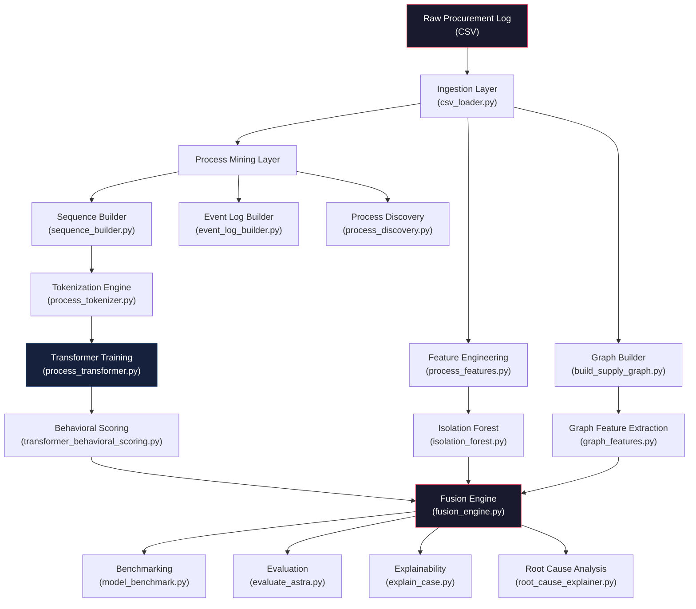
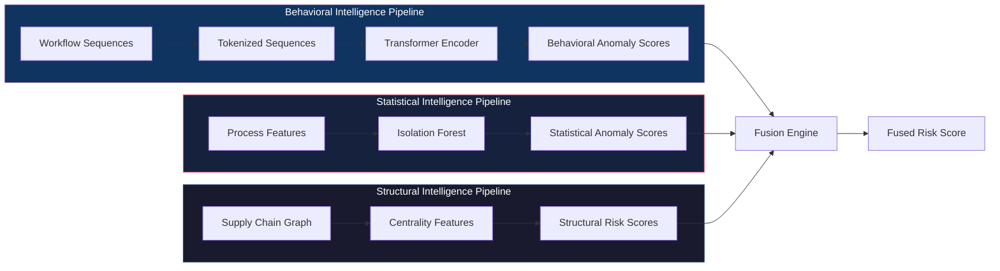
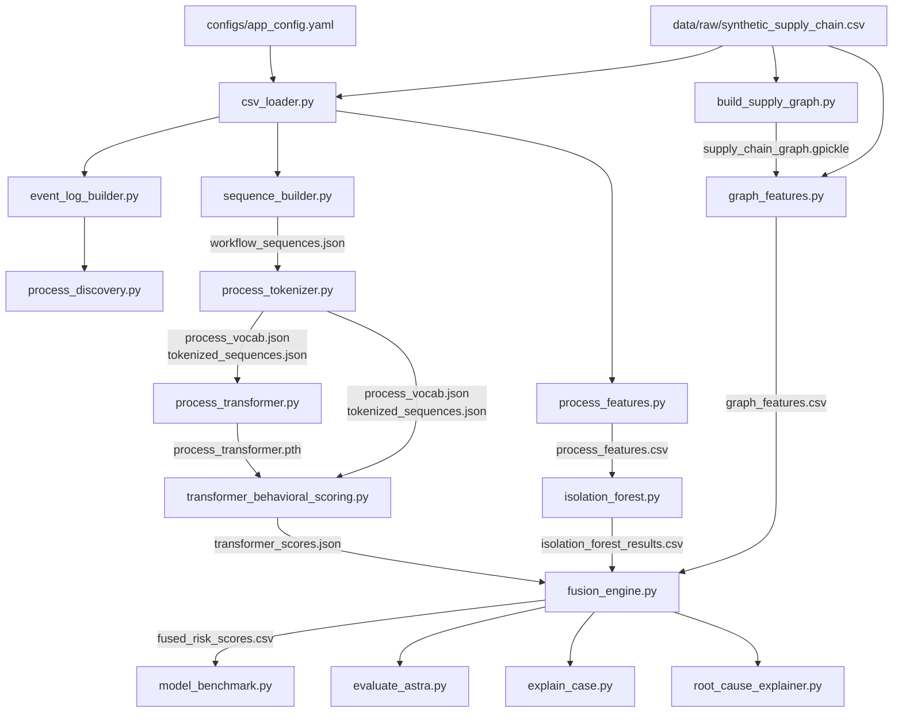
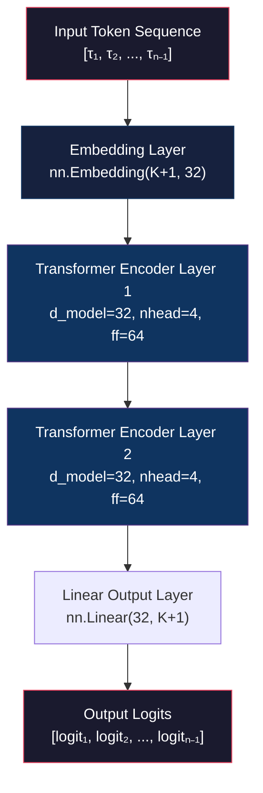
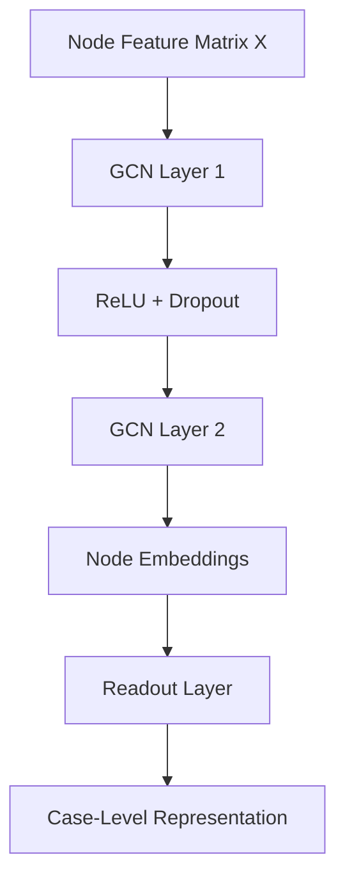
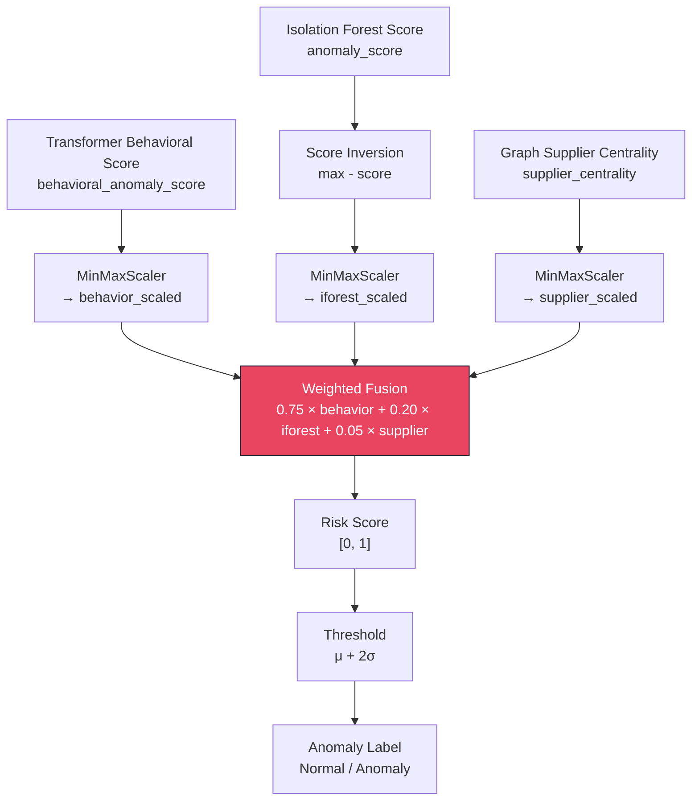
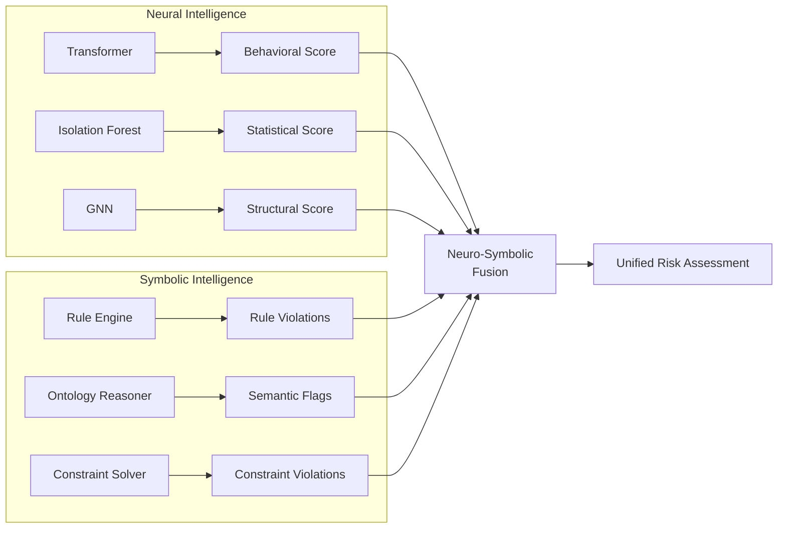
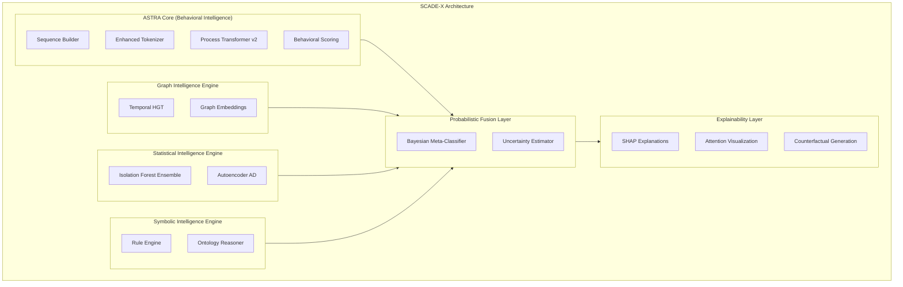
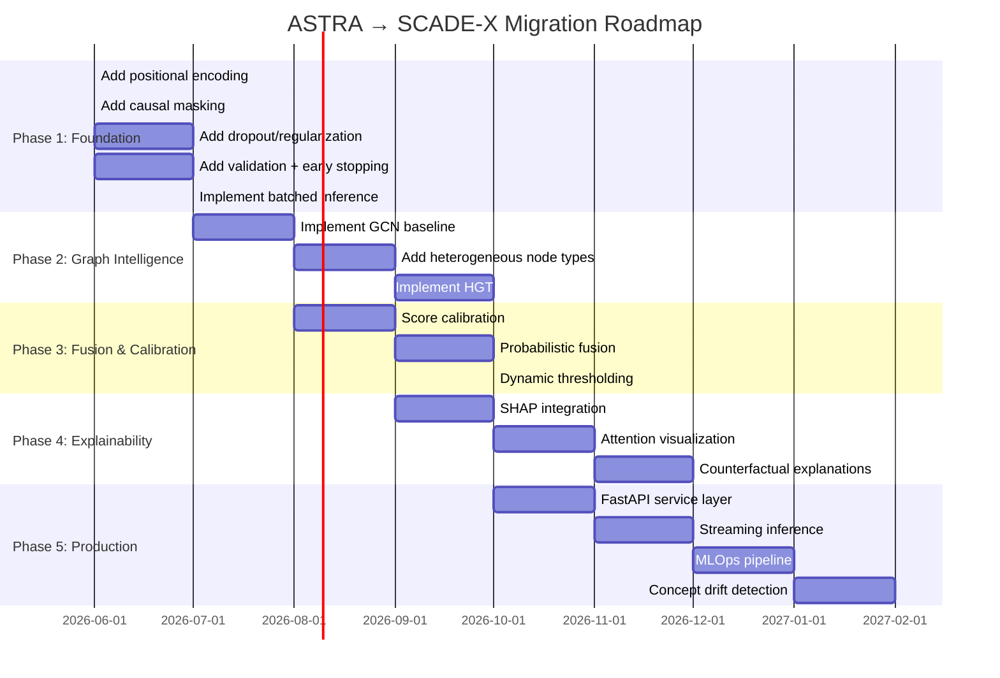

# ASTRA — Advanced Supply-chain Threat Recognition Architecture

## Complete Architectural Specification & Technical Reference

---

**Document Classification:** Internal Engineering Architecture Bible / Research System Specification / Implementation Reference

**Version:** 1.0.0

**System Version:** ASTRA v0.1.0

**Last Updated:** 2026-05-22

**Target Audience:** Senior ML Researchers · Anomaly Detection Engineers · Process Mining Researchers · Systems Architects · Cybersecurity Researchers · Supply Chain Intelligence Researchers

**Document Scope:** End-to-end architectural specification covering system design philosophy, complete pipeline architecture, mathematical foundations, subsystem specifications, performance analysis, adversarial failure modes, engineering limitations, and evolutionary roadmap.

---

## Table of Contents

- [Part 1 — System Purpose & Design Philosophy](#part-1--system-purpose--design-philosophy)
- [Part 2 — Complete System Architecture](#part-2--complete-system-architecture)
- [Part 3 — Data Model & Input Specification](#part-3--data-model--input-specification)
- [Part 4 — Workflow Sequence Builder](#part-4--workflow-sequence-builder)
- [Part 5 — Tokenization Engine](#part-5--tokenization-engine)
- [Part 6 — Transformer Behavioral Engine](#part-6--transformer-behavioral-engine)
- [Part 7 — Transformer Behavioral Scoring](#part-7--transformer-behavioral-scoring)
- [Part 8 — Graph Intelligence Engine](#part-8--graph-intelligence-engine)
- [Part 9 — Isolation Forest Engine](#part-9--isolation-forest-engine)
- [Part 10 — Fusion Engine](#part-10--fusion-engine)
- [Part 11 — Benchmarking Framework](#part-11--benchmarking-framework)
- [Part 12 — Explainability Layer](#part-12--explainability-layer)
- [Part 13 — Performance & Complexity](#part-13--performance--complexity)
- [Part 14 — Limitations of ASTRA](#part-14--limitations-of-astra)
- [Part 15 — What Should Be Improved](#part-15--what-should-be-improved)
- [Part 16 — ASTRA → SCADE-X Migration Analysis](#part-16--astra--scade-x-migration-analysis)

---

# Part 1 — System Purpose & Design Philosophy

## 1.1 Why ASTRA Exists

Modern enterprise supply chains are governed by procurement workflows—sequences of operational activities such as purchase order creation, managerial approval, shipment initiation, inventory reconciliation, and payment execution. These workflows encode institutional knowledge, regulatory compliance requirements, and operational best practices into process structures that are expected to follow predictable patterns.

Traditional process monitoring relies on **deterministic conformance checking**: a reference process model is defined (manually or via process discovery), and every executed trace is compared against this model to detect deviations. This approach suffers from three fundamental weaknesses:

1. **Brittleness to process variability.** Real-world procurement processes exhibit legitimate variability. A rigid reference model generates excessive false positives when confronted with acceptable process variants, leading to alert fatigue and eventual abandonment of the monitoring system.

2. **Inability to detect latent behavioral anomalies.** Rule-based systems detect only violations that have been explicitly encoded. They cannot identify novel threat patterns—subtle behavioral deviations that are structurally valid (i.e., they pass conformance checks) but are operationally abnormal. For example, a workflow where payment precedes shipment may be structurally valid in a poorly specified reference model, but is behaviorally anomalous in the context of learned normal operations.

3. **Absence of contextual intelligence.** Conformance systems treat each trace in isolation. They do not model the relational context—which suppliers are involved, which users are executing activities, how entities are connected in the broader procurement network. Structural anomalies (e.g., a supplier suddenly connected to an unusual set of approvers) are invisible to sequence-only analysis.

ASTRA was designed to address these gaps. It is a **behavioral anomaly detection engine** that learns what constitutes normal operational behavior from historical procurement data, and then identifies deviations from this learned normalcy using three complementary intelligence modalities:

- **Behavioral Intelligence** (transformer-based sequence modeling): Learns the sequential grammar of procurement workflows.
- **Structural Intelligence** (graph-based feature extraction): Models the relational topology of suppliers, users, and procurement cases.
- **Statistical Intelligence** (isolation forest anomaly detection): Identifies outliers in engineered process feature distributions.

These three modalities are fused into a unified risk score that reflects the aggregate anomaly likelihood of each procurement case.

## 1.2 Behavioral Anomaly Detection vs. Rule-Based Systems

The distinction between ASTRA's approach and traditional rule-based detection is not merely architectural—it represents a fundamentally different epistemological stance toward anomaly detection.

### 1.2.1 Rule-Based Detection

Rule-based systems operate on the **closed-world assumption**: the set of anomalous patterns is finite and known. A domain expert encodes detection rules such as:

```
IF payment_date < shipment_date THEN flag_anomaly
IF approval_count > 1 THEN flag_duplicate
IF cost > threshold THEN flag_cost_anomaly
```

**Strengths:**
- Interpretable: every detection has an explicit, auditable rule.
- Deterministic: identical inputs always produce identical outputs.
- Low computational overhead.

**Weaknesses:**
- **Completeness gap:** Only known threat patterns are detectable. Novel anomalies evade detection entirely.
- **Maintenance burden:** As the threat landscape evolves, rules must be manually updated. This creates a perpetual lag between emerging threats and detection capability.
- **Context blindness:** Rules operate on individual features. They cannot capture interactions between sequential events, relational structures, or latent patterns that emerge only in high-dimensional behavioral space.
- **Threshold fragility:** Numeric thresholds (e.g., cost > $15,000) are arbitrary and require constant recalibration as operational distributions shift.

### 1.2.2 ASTRA's Behavioral Detection

ASTRA operates on the **open-world assumption**: the set of anomalous patterns is unbounded and continuously evolving. Rather than encoding what is anomalous, ASTRA learns what is **normal** and flags deviations from normalcy.

This is achieved through **representation learning**: the transformer encoder learns a latent representation of procurement behavior. Normal workflows cluster in dense regions of the latent space, while anomalous workflows occupy sparse, peripheral regions. The system does not need to know *what* a specific anomaly looks like—it only needs to recognize that a workflow *doesn't look like* normal behavior.

**Strengths:**
- **Novel anomaly detection:** Can identify previously unseen threat patterns.
- **Adaptive:** Retraining on updated data automatically adapts the normalcy model.
- **Context-aware:** Transformer attention mechanisms capture long-range dependencies between activities.
- **Multi-modal:** Combines behavioral, structural, and statistical signals.

**Weaknesses (addressed in Part 14):**
- Reduced interpretability compared to rule-based systems.
- Sensitivity to training data quality and distributional assumptions.
- Threshold selection remains a critical challenge.

## 1.3 Process Intelligence Philosophy

ASTRA is grounded in the philosophy of **process intelligence**—the discipline of extracting operational insight from event data generated by business processes. Process intelligence extends beyond process mining (which focuses on discovery, conformance, and enhancement) to encompass predictive and prescriptive analytics.

ASTRA specifically implements **behavioral process intelligence**: the use of learned behavioral models to identify operationally significant deviations in process execution. This is distinct from:

- **Process discovery** (discovering a process model from event logs)
- **Conformance checking** (comparing executed traces against a reference model)
- **Process enhancement** (enriching models with performance data)

While ASTRA includes process discovery capabilities (via PM4Py integration in `process_discovery.py`), these serve a diagnostic purpose rather than functioning as the primary detection mechanism. The core detection logic resides in the transformer behavioral engine.

## 1.4 Latent Behavioral Learning

The central insight driving ASTRA's architecture is that **procurement behavior can be modeled as a language**. Each procurement case is a "sentence" composed of "words" (activities). The transformer encoder learns the "grammar" of this language—the statistical regularities governing which activities follow which, in what order, and with what probability.

Formally, let:
- $\mathcal{A} = \{a_1, a_2, \ldots, a_K\}$ be the alphabet of procurement activities
- $\sigma = \langle a_{i_1}, a_{i_2}, \ldots, a_{i_n} \rangle$ be a procurement trace (ordered sequence of activities)
- $P(\sigma)$ be the probability of observing trace $\sigma$ under the learned behavioral model

ASTRA learns a conditional probability distribution:

$$P(\sigma) = \prod_{t=2}^{n} P(a_{i_t} | a_{i_1}, a_{i_2}, \ldots, a_{i_{t-1}})$$

This is the **autoregressive factorization** of the trace probability. The transformer is trained to maximize $P(\sigma)$ over the training corpus of normal workflows. At inference time, traces with low $P(\sigma)$ are flagged as behaviorally anomalous.

The key advantage of this approach is that it learns a **continuous latent representation** of behavior. Each trace is embedded into a dense vector space where semantic similarity corresponds to geometric proximity. This enables:

1. **Soft anomaly detection:** Rather than binary conformance (pass/fail), ASTRA produces continuous anomaly scores reflecting the degree of behavioral deviation.
2. **Sensitivity to subtle deviations:** Small perturbations in activity order (e.g., approval before creation) produce measurable changes in the latent representation.
3. **Generalization:** The model can assess traces it has never seen during training by leveraging learned sequential patterns.

## 1.5 Design Assumptions

ASTRA's architecture rests on several foundational assumptions:

| # | Assumption | Implication | Risk if Violated |
|---|-----------|-------------|-----------------|
| DA-1 | Procurement workflows are sequential | Traces are ordered sequences of activities | Concurrent activities are lost; parallel gateways are flattened |
| DA-2 | Temporal ordering is reliable | Events are ordered by timestamp within each case | Clock skew or logging delays corrupt sequence integrity |
| DA-3 | Normal behavior is the majority class | Anomalies comprise ≤30% of training data | Model learns anomalous patterns as normal if contamination is too high |
| DA-4 | Activity vocabulary is closed | All activities are known at tokenization time | Unknown activities at inference time receive no meaningful embedding |
| DA-5 | Stationarity of normal behavior | The distribution of normal workflows is approximately stationary | Concept drift causes calibrated thresholds to become invalid |
| DA-6 | Case independence | Each procurement case is an independent process instance | Correlated cases (e.g., same purchase order split across multiple cases) violate this assumption |
| DA-7 | Graph topology encodes meaningful structure | Supplier-user-activity relationships carry anomaly-relevant information | If the graph is too sparse or dense, centrality metrics lose discriminative power |

## 1.6 Detection Philosophy

ASTRA implements a **defense-in-depth** detection philosophy using three independent but complementary detection modalities:

1. **Behavioral layer (Transformer):** Detects sequential anomalies—unusual orderings, missing steps, unexpected activities.
2. **Statistical layer (Isolation Forest):** Detects distributional anomalies—unusual combinations of activity count, duration, cost, and missing steps.
3. **Structural layer (Graph features):** Detects relational anomalies—unusual supplier centrality patterns and user involvement.

These layers operate on **orthogonal feature spaces**, which provides two critical properties:

- **Complementarity:** Each layer detects anomaly types that are invisible to the others. A sequential anomaly (wrong order) may not be a statistical anomaly (normal cost/duration), and vice versa.
- **Redundancy:** When multiple layers flag the same case, the confidence in the anomaly detection is multiplicatively higher.

The fusion engine combines these signals using a weighted linear combination (see Part 10).

## 1.7 Why Representation Learning Matters

Traditional anomaly detection in procurement typically operates on **handcrafted tabular features**: activity count, total cost, duration, number of unique users, etc. While these features capture some aspects of process behavior, they suffer from the **feature engineering bottleneck**: the quality of detection is limited by the ingenuity and domain expertise of the feature engineer.

Representation learning—specifically, the use of transformer encoders to learn embeddings from raw activity sequences—addresses this bottleneck by:

1. **Automatic feature extraction:** The transformer learns relevant features directly from data, including features that a human engineer might not consider (e.g., subtle correlations between the 2nd and 4th activities in a trace).
2. **Compositional understanding:** Through self-attention, the transformer builds compositional representations where the meaning of each activity is contextualized by its neighbors.
3. **Transfer potential:** Learned representations can potentially be transferred to related tasks (e.g., process prediction, case duration estimation) without retraining from scratch.
4. **Handling variable-length sequences:** Unlike fixed-size feature vectors, transformers natively handle sequences of varying length through padding and masking.

## 1.8 Comparative Positioning

The following table positions ASTRA against alternative approaches:

| Approach | Strengths | Weaknesses | ASTRA's Advantage |
|----------|-----------|------------|-------------------|
| **Tabular anomaly detection** (e.g., Isolation Forest on handcrafted features) | Simple, fast, interpretable | Loses sequential information; limited to engineered features | ASTRA preserves full sequential context via transformer; uses Isolation Forest as a complementary layer |
| **Process mining conformance** (e.g., PM4Py alignment-based) | Rigorous formal foundations; alignment guarantees | Requires a reference model; binary detection; no soft scoring | ASTRA learns the reference model implicitly; produces continuous anomaly scores |
| **Rules-based fraud detection** | Deterministic; auditable; low latency | Cannot detect novel patterns; high maintenance burden | ASTRA detects novel patterns via learned behavioral representations |
| **Autoencoder anomaly detection** | Learns compressed representations; reconstruction error as anomaly score | Reconstruction objective may not align with anomaly sensitivity; blurry latent spaces | ASTRA's next-token prediction objective directly models sequential transition probabilities, providing sharper anomaly signals |
| **GNN-based detection** | Captures relational structure natively; message passing enables multi-hop reasoning | Requires graph construction; computationally expensive; complex training | ASTRA uses graph features as a lightweight proxy; GNN migration is planned (see Part 15) |

---

# Part 2 — Complete System Architecture

## 2.1 Full System Architecture

ASTRA is organized as a modular, multi-stage pipeline with clear subsystem boundaries and well-defined artifact interfaces. The system processes raw procurement event logs through a sequence of transformations, culminating in fused risk scores with forensic explanations.

### 2.1.1 High-Level Pipeline



### 2.1.2 Three Intelligence Pipelines



## 2.2 Subsystem Interactions

The ASTRA pipeline defines strict data flow contracts between subsystems. Each module reads from and writes to well-defined artifact files, enabling loose coupling and independent testing.

### 2.2.1 Dependency Graph



## 2.3 Training Pipeline

The training pipeline is executed once (or periodically for retraining) and produces persistent model artifacts.

| Stage | Module | Input Artifact | Output Artifact | Description |
|-------|--------|---------------|-----------------|-------------|
| 1 | `synthetic_data_generator.py` | None (parametric) | `data/raw/synthetic_supply_chain.csv` | Generates synthetic procurement event log with controlled anomaly injection |
| 2 | `csv_loader.py` | Raw CSV + `app_config.yaml` | In-memory DataFrame | Loads, validates, deduplicates, and normalizes raw data |
| 3 | `sequence_builder.py` | In-memory DataFrame | `data/processed/workflow_sequences.json` | Groups events by case, orders by timestamp, extracts activity sequences |
| 4 | `process_tokenizer.py` | `workflow_sequences.json` | `process_vocab.json` + `tokenized_sequences.json` | Builds vocabulary mapping and converts sequences to integer tokens |
| 5 | `process_transformer.py` | `tokenized_sequences.json` + `process_vocab.json` | `models_store/process_transformer.pth` | Trains the ProcessTransformer via next-token prediction |
| 6 | `process_features.py` | In-memory DataFrame | `data/processed/process_features.csv` | Engineers tabular features: activity_count, duration_hours, cost, missing_steps |
| 7 | `isolation_forest.py` | `process_features.csv` | `data/processed/isolation_forest_results.csv` | Fits Isolation Forest and produces anomaly scores/labels |
| 8 | `build_supply_graph.py` | Raw CSV | `data/processed/supply_chain_graph.gpickle` | Constructs directed supply chain graph |
| 9 | `graph_features.py` | `supply_chain_graph.gpickle` + Raw CSV | `data/processed/graph_features.csv` | Extracts degree centrality features per case |

## 2.4 Inference Pipeline

The inference pipeline uses pre-trained models and pre-computed features to score new procurement cases.

| Stage | Module | Input | Output |
|-------|--------|-------|--------|
| 1 | `transformer_behavioral_scoring.py` | Trained model + tokenized sequences | `transformer_scores.json` |
| 2 | `fusion_engine.py` | Transformer scores + Isolation Forest results + Graph features | `fused_risk_scores.csv` |
| 3 | `evaluate_astra.py` | Fused results + Ground truth | `astra_evaluation.txt` |
| 4 | `explain_case.py` | Fused results + Process features + Raw data | `explainability_report.txt` |
| 5 | `root_cause_explainer.py` | Fused results + Raw data | `root_cause_report.txt` |

## 2.5 Module Dependency Matrix

| Module | pandas | torch | sklearn | networkx | pm4py | yaml | json |
|--------|--------|-------|---------|----------|-------|------|------|
| `csv_loader.py` | ✓ | | | | | ✓ | |
| `sequence_builder.py` | | | | | | | ✓ |
| `event_log_builder.py` | | | | | ✓ | | |
| `process_discovery.py` | | | | | ✓ | | |
| `process_tokenizer.py` | | | | | | | ✓ |
| `process_transformer.py` | | ✓ | | | | | ✓ |
| `transformer_behavioral_scoring.py` | | ✓ | | | | | ✓ |
| `process_features.py` | ✓ | | | | | | |
| `isolation_forest.py` | ✓ | | ✓ | | | | |
| `build_supply_graph.py` | ✓ | | | ✓ | | | |
| `graph_features.py` | ✓ | | | ✓ | | | |
| `fusion_engine.py` | ✓ | | ✓ | | | | |
| `model_benchmark.py` | ✓ | | ✓ | | | | |
| `evaluate_astra.py` | ✓ | | ✓ | | | | |
| `explain_case.py` | ✓ | | | | | | |
| `root_cause_explainer.py` | ✓ | | | | | | |

## 2.6 Artifact Flow

All intermediate artifacts are persisted to the filesystem, enabling pipeline stage restarts without re-execution of upstream stages.

```
data/
├── raw/
│   └── synthetic_supply_chain.csv          # Raw event log (source of truth)
├── processed/
│   ├── workflow_sequences.json             # Activity sequences per case
│   ├── process_vocab.json                  # Activity → integer mapping
│   ├── tokenized_sequences.json            # Integer token sequences per case
│   ├── process_features.csv                # Engineered tabular features
│   ├── supply_chain_graph.gpickle          # NetworkX directed graph
│   ├── graph_features.csv                  # Per-case graph centrality features
│   ├── isolation_forest_results.csv        # IF anomaly scores and labels
│   ├── transformer_scores.json             # Transformer behavioral scores
│   ├── fused_risk_scores.csv               # Final fused risk scores
│   ├── model_benchmark.csv                 # Comparative benchmark table
│   ├── astra_evaluation.txt                # Full evaluation report
│   ├── explainability_report.txt           # Case-level explanations
│   └── root_cause_report.txt              # Root cause analysis report
models_store/
└── process_transformer.pth                 # Trained PyTorch model weights
```

## 2.7 Failure Modes per Stage

| Stage | Failure Mode | Symptom | Mitigation |
|-------|-------------|---------|------------|
| Ingestion | Missing CSV file | `FileNotFoundError` | Config validation; path existence check |
| Ingestion | Missing required columns | `ValueError` | Column presence assertion in `csv_loader.py` |
| Ingestion | Timestamp parse failure | `pandas.errors.ParserError` | `pd.to_datetime` with error handling |
| Sequence Builder | Empty groups | Zero-length sequences | Filter cases with < 2 events |
| Tokenizer | Empty vocabulary | Division by zero in model | Assert vocabulary non-empty |
| Transformer Training | CUDA/MPS unavailability | CPU fallback (slow) | Device detection with graceful fallback |
| Transformer Training | Loss divergence | NaN loss values | Learning rate reduction; gradient clipping |
| Behavioral Scoring | Model-vocabulary mismatch | Index out of range | Vocabulary version pinning |
| Graph Builder | Disconnected graph components | Centrality distortion | Connected component analysis |
| Isolation Forest | Insufficient features | Degenerate splits | Feature count validation |
| Fusion | Missing case_id alignment | NaN propagation | Inner join with NaN auditing |
| Benchmarking | Label imbalance | Undefined precision/recall | `zero_division=0` parameter |

---

# Part 3 — Data Model & Input Specification

## 3.1 Procurement Log Schema

ASTRA expects a tabular procurement event log where each row represents a single event (activity execution) within a procurement case (process instance).

### 3.1.1 Formal Schema Definition

$$\mathcal{L} = \{e_1, e_2, \ldots, e_N\}$$

where each event $e_i$ is a tuple:

$$e_i = (\text{case\_id}, \text{activity}, \text{timestamp}, \text{user}, \text{supplier}, \text{cost}, \text{true\_anomaly}, \text{anomaly\_type}, \text{severity})$$

### 3.1.2 Column Specification

| Column | Type | Required | Description | Constraints |
|--------|------|----------|-------------|-------------|
| `case_id` | string | ✓ | Unique identifier for the procurement case (process instance) | Format: `PO{NNNNN}` (e.g., `PO00042`) |
| `activity` | string | ✓ | Name of the executed activity | Must be a member of the activity alphabet $\mathcal{A}$ |
| `timestamp` | datetime | ✓ | ISO 8601 timestamp of activity execution | Must be parseable by `pd.to_datetime()` |
| `user` | string | ✓ | Identifier of the user who executed the activity | Role-prefixed (e.g., `buyer_1`, `manager_2`) |
| `supplier` | string | ✓ | Identifier of the supplier associated with the case | Consistent within a case |
| `cost` | numeric | ✓ | Transaction cost associated with the event | Non-negative integer or float |
| `true_anomaly` | boolean | ✗ | Ground truth anomaly label (for supervised evaluation only) | 0 = normal, 1 = anomalous |
| `anomaly_type` | string | ✗ | Category of injected anomaly | One of: `normal`, `missing_inventory`, `duplicate_approval`, `missing_approval`, `payment_before_shipment`, `workflow_reversal` |
| `severity` | string | ✗ | Severity classification | One of: `none`, `mild`, `severe` |

### 3.1.3 Column Renaming Convention

The `csv_loader.py` module renames columns to XES (eXtensible Event Stream) standard naming:

| Original Column | XES Column | Purpose |
|-----------------|-----------|---------|
| `case_id` | `case:concept:name` | Process instance identifier (XES standard) |
| `activity` | `concept:name` | Activity name (XES standard) |
| `timestamp` | `time:timestamp` | Event timestamp (XES standard) |

This renaming enables compatibility with PM4Py and other process mining frameworks that expect XES-compliant column names.

## 3.2 Activity Alphabet

The current ASTRA deployment uses the following activity alphabet:

$$\mathcal{A} = \{\text{CREATE\_PO}, \text{APPROVE\_PO}, \text{SHIPMENT\_CREATED}, \text{INVENTORY\_UPDATED}, \text{PAYMENT\_COMPLETED}\}$$

The **canonical workflow** (expected normal ordering) is:

$$\sigma_{\text{normal}} = \langle \text{CREATE\_PO} \rightarrow \text{APPROVE\_PO} \rightarrow \text{SHIPMENT\_CREATED} \rightarrow \text{INVENTORY\_UPDATED} \rightarrow \text{PAYMENT\_COMPLETED} \rangle$$

This alphabet is defined in `synthetic_data_generator.py` as `NORMAL_WORKFLOW` and in `process_features.py` as `EXPECTED_WORKFLOW`.

## 3.3 Preprocessing Expectations

### 3.3.1 Timestamp Parsing

All timestamps are converted to `pandas.Timestamp` objects via:

```python
df["timestamp"] = pd.to_datetime(df["timestamp"])
```

**Assumption:** Timestamps are in a format parseable by pandas' automatic inference. No explicit format string is provided, which means the system relies on pandas' heuristic parsing. This creates a failure mode when encountering ambiguous date formats (e.g., `01/02/2026` could be January 2nd or February 1st depending on locale).

### 3.3.2 Sorting

Events are sorted by `(case_id, timestamp)`:

```python
df = df.sort_values(by=["case_id", "timestamp"])
```

This establishes the temporal ordering within each case, which is critical for downstream sequence construction.

### 3.3.3 Deduplication

Exact duplicate rows are removed:

```python
df = df.drop_duplicates()
```

**Limitation:** This only removes exact duplicates. Near-duplicates (e.g., events with slightly different timestamps but identical activity and case_id) are not detected.

## 3.4 Workflow Assumptions

1. **Sequential execution:** Activities within a case are executed sequentially (one at a time). ASTRA does not model concurrent activities or parallel gateways.
2. **Single trace per case:** Each case produces exactly one trace. There is no support for case-level branching or sub-processes.
3. **Homogeneous activity semantics:** All activities have the same semantic weight. There is no distinction between mandatory and optional activities in the sequence representation.

## 3.5 Missing Data Handling

| Data Element | Handling Strategy | Implementation |
|-------------|-------------------|----------------|
| Missing column | Hard failure: `ValueError` raised | Column presence assertion in `csv_loader.py` |
| Missing timestamp | Hard failure during sort | `pd.to_datetime` raises `ParserError` |
| Missing activity name | Silent propagation: empty string or NaN enters vocabulary | **Not handled** — potential failure mode |
| Missing cost | NaN propagation in feature engineering | May cause NaN in Isolation Forest features |
| Missing supplier | NaN propagation in graph construction | May create null nodes in the graph |

## 3.6 Corruption Recovery

ASTRA's current implementation has **no explicit corruption recovery mechanisms.** The following corruptions would cause silent or noisy failures:

| Corruption Type | Impact | Recovery (Not Implemented) |
|-----------------|--------|---------------------------|
| Garbled timestamps | Incorrect sequence ordering | Timestamp validation against expected ranges |
| Injected activities (not in $\mathcal{A}$) | Token assigned to `<UNK>` (not implemented) or KeyError | Unknown token handling in tokenizer |
| Duplicate case_ids across different processes | Case conflation | Case ID namespace validation |
| Negative costs | Feature distribution distortion | Value range assertions |
| Empty cases (0 events) | Empty sequences | Minimum sequence length filter |

## 3.7 Synthetic Data Generation

The `synthetic_data_generator.py` module generates controlled procurement data with parameterized anomaly injection. This is critical for ASTRA development because real-world procurement data is typically proprietary and unavailable for open research.

### 3.7.1 Generation Parameters

| Parameter | Default | Description |
|-----------|---------|-------------|
| `n_cases` | 10,000 | Number of procurement cases to generate |
| `anomaly_ratio` | 0.30 | Fraction of cases that are anomalous |
| `seed` | 42 | Random seed for reproducibility |

### 3.7.2 Anomaly Injection Distribution

The generator injects anomalies with the following probability distribution:

| Anomaly Type | Probability | Severity | Description |
|-------------|------------|----------|-------------|
| `normal` | 0.70 | none | Standard 5-step workflow |
| `missing_inventory` | 0.10 | mild | `INVENTORY_UPDATED` step removed |
| `duplicate_approval` | 0.05 | mild | `APPROVE_PO` duplicated at position 2 |
| `missing_approval` | 0.05 | mild | `APPROVE_PO` step removed |
| `payment_before_shipment` | 0.05 | severe | Reordered to: CREATE → PAYMENT → SHIPMENT |
| `workflow_reversal` | 0.05 | severe | Entire workflow reversed |

### 3.7.3 Supplier Risk Profiles

| Supplier | Delay Factor | Cost Multiplier | Risk |
|----------|-------------|----------------|------|
| `supplier_A` | 1.0× | 1.0× | 0.02 |
| `supplier_B` | 1.8× | 1.1× | 0.08 |
| `supplier_C` | 1.3× | 2.2× | 0.05 |
| `supplier_D` | 2.5× | 1.4× | 0.15 |

### 3.7.4 Cost Amplification for Anomalies

Anomalous cases have their base cost multiplied by a random integer in $[2, 5]$:

$$\text{cost}_{\text{anomaly}} = \text{cost}_{\text{base}} \times \text{cost\_multiplier}_{\text{supplier}} \times \text{uniform}(2, 5)$$

This deliberate cost inflation ensures that anomalous cases are partially detectable via statistical features, testing whether the fusion engine correctly leverages multi-modal signals.

---

# Part 4 — Workflow Sequence Builder

## 4.1 Purpose and Position in Pipeline

The Sequence Builder (`sequence_builder.py`) is the first transformation stage after data ingestion. Its function is to convert the flat, event-level representation of the procurement log into a **case-level sequential representation** where each case is represented by its ordered activity sequence.

This transformation is foundational: it converts tabular data into the sequential format required by the transformer behavioral engine.

## 4.2 Mathematical Formulation

### 4.2.1 Trace Extraction

Given the event log $\mathcal{L} = \{e_1, e_2, \ldots, e_N\}$, define the set of unique cases:

$$\mathcal{C} = \{\text{case\_id}(e) \mid e \in \mathcal{L}\}$$

For each case $c \in \mathcal{C}$, define the case-filtered log:

$$\mathcal{L}_c = \{e \in \mathcal{L} \mid \text{case\_id}(e) = c\}$$

Order the events within $\mathcal{L}_c$ by timestamp:

$$\mathcal{L}_c^{\text{ordered}} = \text{sort}(\mathcal{L}_c, \text{key}=\text{timestamp})$$

Extract the activity trace:

$$\sigma_c = \langle \text{activity}(e) \mid e \in \mathcal{L}_c^{\text{ordered}} \rangle$$

### 4.2.2 Sequence Generation

The full set of workflow sequences is:

$$\Sigma = \{(c, \sigma_c) \mid c \in \mathcal{C}\}$$

Each element of $\Sigma$ is a pair of case identifier and activity trace.

## 4.3 Implementation Details

```python
def build_sequences():
    df = load_csv_data()
    grouped = df.groupby("case:concept:name")
    sequences = []
    for case_id, group in grouped:
        ordered_group = group.sort_values(by="time:timestamp")
        sequence = list(ordered_group["concept:name"])
        sequences.append({"case_id": case_id, "sequence": sequence})
    # ... save to workflow_sequences.json
    return sequences
```

### 4.3.1 Input

- In-memory DataFrame from `csv_loader.py` with XES-renamed columns.

### 4.3.2 Output

- `data/processed/workflow_sequences.json`: JSON array of objects, each with:
  - `case_id`: string identifier
  - `sequence`: ordered list of activity names

**Example output:**
```json
[
    {"case_id": "PO00001", "sequence": ["CREATE_PO", "APPROVE_PO", "SHIPMENT_CREATED", "INVENTORY_UPDATED", "PAYMENT_COMPLETED"]},
    {"case_id": "PO00002", "sequence": ["CREATE_PO", "PAYMENT_COMPLETED", "SHIPMENT_CREATED"]}
]
```

## 4.4 Case Partitioning

The `groupby("case:concept:name")` operation partitions the event log into disjoint subsets, one per case. This relies on the assumption that `case:concept:name` is a reliable partition key—i.e., each event belongs to exactly one case.

**Potential violation:** If case IDs are reused across different procurement cycles (e.g., recycled PO numbers), events from unrelated processes will be conflated into a single trace.

## 4.5 Ordering Assumptions

Events within each case are ordered by `time:timestamp`. This assumes:

1. **Clock reliability:** Timestamps are generated by a reliable clock. In distributed systems where events are logged by different services, clock synchronization errors (clock skew) can corrupt the ordering.

2. **Unique timestamps:** If two events within the same case have identical timestamps, `sort_values` produces a non-deterministic ordering (depending on the sort algorithm's stability and the original data order). This is a latent source of non-reproducibility.

3. **Causal ordering corresponds to temporal ordering:** ASTRA assumes that the temporal order of events reflects their causal/logical order. This is not always true—some systems log events with delays, and the logging timestamp may differ from the actual execution timestamp.

## 4.6 Edge Cases

| Edge Case | Current Handling | Risk |
|-----------|-----------------|------|
| Case with 0 events | Impossible (groupby requires at least 1 event) | None |
| Case with 1 event | Valid single-element sequence created | Downstream: tokenizer produces 1 token; transformer requires ≥2 tokens for next-token prediction |
| Case with duplicate timestamps | Non-deterministic ordering | Sequence may differ across runs |
| Case with 100+ events | Full sequence extracted | Memory and compute impact on transformer |
| Empty activity name | Empty string included in sequence | Tokenizer creates entry for empty string |

## 4.7 Limitations

1. **No temporal features preserved.** The sequence builder extracts only the activity names. Inter-event durations, absolute timestamps, and other temporal features are discarded. This means the transformer operates on purely categorical sequences without temporal context.

2. **No attribute enrichment.** User, supplier, cost, and other attributes are not included in the sequence. The sequence is a projection onto the activity dimension only.

3. **No case filtering.** All cases are included regardless of completeness or quality. Cases with missing activities, extreme durations, or other quality issues are not filtered.

4. **Linear sequence assumption.** The builder produces linear sequences. It cannot represent process structures with parallelism, choice, or loops in their native form—these are all flattened into a single linear trace.

---

# Part 5 — Tokenization Engine

## 5.1 Purpose

The Tokenization Engine (`process_tokenizer.py`) converts human-readable activity sequences into integer-valued token sequences suitable for input to the transformer model. This is the standard NLP preprocessing step adapted for process mining.

## 5.2 Vocabulary Construction

### 5.2.1 Algorithm

1. Iterate over all workflow sequences in `workflow_sequences.json`.
2. Collect all unique activity names into a set $\mathcal{A}_{\text{unique}}$.
3. Sort $\mathcal{A}_{\text{unique}}$ lexicographically.
4. Assign integer indices starting from 1 (0 is implicitly reserved for padding).

### 5.2.2 Formal Definition

Let $\mathcal{A}_{\text{unique}} = \{a_1, a_2, \ldots, a_K\}$ be the sorted set of unique activities. The vocabulary mapping $V: \mathcal{A} \rightarrow \mathbb{N}^+$ is:

$$V(a_k) = k \quad \text{for } k = 1, 2, \ldots, K$$

The inverse mapping $V^{-1}: \mathbb{N}^+ \rightarrow \mathcal{A}$ recovers the activity name from a token index.

### 5.2.3 Implementation

```python
vocabulary = {
    activity: idx + 1
    for idx, activity in enumerate(sorted(unique_activities))
}
```

### 5.2.4 Current Vocabulary

For the standard ASTRA activity alphabet (lexicographically sorted):

| Activity | Token ID |
|----------|---------|
| `APPROVE_PO` | 1 |
| `CREATE_PO` | 2 |
| `INVENTORY_UPDATED` | 3 |
| `PAYMENT_COMPLETED` | 4 |
| `SHIPMENT_CREATED` | 5 |

Vocabulary size: $K = 5$.

## 5.3 Token Encoding

Each workflow sequence $\sigma = \langle a_{i_1}, a_{i_2}, \ldots, a_{i_n} \rangle$ is converted to a token sequence:

$$\tau = \langle V(a_{i_1}), V(a_{i_2}), \ldots, V(a_{i_n}) \rangle$$

**Example:**
```
Sequence: ["CREATE_PO", "APPROVE_PO", "SHIPMENT_CREATED", "INVENTORY_UPDATED", "PAYMENT_COMPLETED"]
Tokens:   [2, 1, 5, 3, 4]
```

## 5.4 Padding

ASTRA uses **zero-padding** to handle variable-length sequences in batched training. Padding is performed in the `collate_fn` function during DataLoader batch construction, not in the tokenizer itself.

The `collate_fn` uses PyTorch's `pad_sequence`:

```python
def collate_fn(batch):
    return nn.utils.rnn.pad_sequence(batch, batch_first=True)
```

This pads shorter sequences with 0s to match the length of the longest sequence in the batch. The padding value 0 is implicitly treated as a "no-activity" token.

### 5.4.1 Mathematical Definition

For a batch of $B$ sequences with lengths $\{n_1, n_2, \ldots, n_B\}$, the padded batch has shape $(B, n_{\max})$ where $n_{\max} = \max(n_1, \ldots, n_B)$.

$$\tau_i^{\text{padded}} = [\tau_{i,1}, \tau_{i,2}, \ldots, \tau_{i,n_i}, \underbrace{0, 0, \ldots, 0}_{n_{\max} - n_i}]$$

## 5.5 Masking

**ASTRA does not implement explicit attention masking for padded positions.** This is a significant architectural limitation. Without a padding mask, the transformer's self-attention mechanism attends to pad tokens as if they were real activities, which can distort the learned representations.

In standard NLP practice, a `src_key_padding_mask` is passed to the transformer encoder to prevent attention to padded positions. ASTRA omits this, meaning:

$$\text{Attention}(Q, K, V) = \text{softmax}\left(\frac{QK^T}{\sqrt{d_k}}\right) V$$

is computed over all positions, including padding. The attention weights assigned to padded positions dilute the signal from real positions.

**Impact:** This introduces noise into the behavioral embeddings, potentially degrading anomaly detection performance. The severity depends on the variance in sequence lengths: if all sequences have similar lengths, padding impact is minimal; if lengths vary widely, the impact can be substantial.

## 5.6 Unknown Token Handling

**ASTRA does not implement unknown token (`<UNK>`) handling.** If a new activity appears at inference time that was not present during vocabulary construction, the tokenizer will raise a `KeyError`.

This represents a closed-vocabulary assumption: the set of possible activities is fully determined at training time. Any vocabulary extension requires re-running the tokenizer and retraining the transformer.

## 5.7 Positional Encoding Preparation

The tokenizer does not add explicit positional encodings. Positional information is injected by the transformer's embedding layer. However, unlike standard NLP transformers (which use sinusoidal or learned positional encodings), **ASTRA's ProcessTransformer uses PyTorch's `nn.TransformerEncoderLayer` which does NOT include built-in positional encoding.**

This means ASTRA operates **without positional encoding**: the transformer treats the input as a bag-of-tokens rather than an ordered sequence. This is a critical architectural limitation (discussed further in Part 6 and Part 14).

## 5.8 Mathematics of Token Embeddings

The embedding layer maps each token $\tau_t \in \{0, 1, \ldots, K\}$ to a dense vector:

$$\mathbf{e}_t = \mathbf{W}_E[\tau_t] \in \mathbb{R}^{d_{\text{embed}}}$$

where $\mathbf{W}_E \in \mathbb{R}^{(K+1) \times d_{\text{embed}}}$ is the embedding matrix. The row at index 0 corresponds to the padding token.

In the current ASTRA configuration:
- $K = 5$ (vocabulary size)
- $d_{\text{embed}} = 32$ (embedding dimension)
- $\mathbf{W}_E \in \mathbb{R}^{6 \times 32}$

The embedding is initialized randomly and learned during training. There is no pre-trained initialization (unlike NLP where pre-trained word embeddings like GloVe or Word2Vec are common).

## 5.9 Output Artifacts

| Artifact | Format | Description |
|----------|--------|-------------|
| `data/processed/process_vocab.json` | JSON object | Activity-to-integer mapping. E.g., `{"APPROVE_PO": 1, ...}` |
| `data/processed/tokenized_sequences.json` | JSON array | Array of `{case_id, tokens}` objects |

---

# Part 6 — Transformer Behavioral Engine

## 6.1 Architectural Overview

The Transformer Behavioral Engine is the core of ASTRA's behavioral intelligence pipeline. It uses a transformer encoder architecture to learn a probabilistic model of procurement workflow behavior via **next-token prediction** (autoregressive language modeling).

The model is implemented in `process_transformer.py` as the `ProcessTransformer` class.

## 6.2 Model Architecture

### 6.2.1 Architecture Diagram



### 6.2.2 Hyperparameters

| Hyperparameter | Value | Rationale |
|---------------|-------|-----------|
| `vocab_size` | 5 (dynamic) | Determined by number of unique activities |
| `embed_dim` | 32 | Compact embedding for small vocabulary; prevents overfitting |
| `num_heads` | 4 | 4 attention heads with head dimension $d_k = 32/4 = 8$ |
| `hidden_dim` | 64 | Feed-forward network inner dimension (2× embedding dim) |
| `num_layers` | 2 | Two stacked encoder layers; sufficient for short sequences |
| `batch_size` | 32 | Standard mini-batch size |
| `learning_rate` | 0.001 | Adam optimizer default |
| `epochs` | 10 | Fixed training duration |

### 6.2.3 Layer-by-Layer Specification

**Layer 1: Token Embedding**

$$\mathbf{E} = \text{Embedding}(\tau) \in \mathbb{R}^{n \times d_{\text{embed}}}$$

Maps each token index to a $d_{\text{embed}}$-dimensional learned vector. The embedding matrix has shape $(K+1) \times d_{\text{embed}} = 6 \times 32$.

**Layer 2-3: Transformer Encoder Layers (×2)**

Each encoder layer consists of:

1. **Multi-Head Self-Attention:**

$$\text{MultiHead}(Q, K, V) = \text{Concat}(\text{head}_1, \ldots, \text{head}_h) W^O$$

where each head is:

$$\text{head}_i = \text{Attention}(QW_i^Q, KW_i^K, VW_i^V)$$

$$\text{Attention}(Q, K, V) = \text{softmax}\left(\frac{QK^T}{\sqrt{d_k}}\right) V$$

With $h = 4$ heads and $d_k = d_{\text{embed}} / h = 32/4 = 8$:

$$W_i^Q, W_i^K, W_i^V \in \mathbb{R}^{32 \times 8}, \quad W^O \in \mathbb{R}^{32 \times 32}$$

2. **Add & Layer Norm (Post-attention):**

$$\mathbf{X}' = \text{LayerNorm}(\mathbf{X} + \text{MultiHead}(\mathbf{X}, \mathbf{X}, \mathbf{X}))$$

3. **Position-wise Feed-Forward Network:**

$$\text{FFN}(\mathbf{X}') = \text{ReLU}(\mathbf{X}' W_1 + b_1) W_2 + b_2$$

where $W_1 \in \mathbb{R}^{32 \times 64}$, $W_2 \in \mathbb{R}^{64 \times 32}$.

4. **Add & Layer Norm (Post-FFN):**

$$\mathbf{X}'' = \text{LayerNorm}(\mathbf{X}' + \text{FFN}(\mathbf{X}'))$$

**Layer 4: Linear Output**

$$\text{logits} = \mathbf{X}'' W_{\text{out}} + b_{\text{out}}$$

where $W_{\text{out}} \in \mathbb{R}^{32 \times 6}$, producing logits over the vocabulary (including padding token 0).

## 6.3 Self-Attention in Detail

The self-attention mechanism is the key innovation that distinguishes transformers from previous sequential models. For ASTRA, it enables each activity in a procurement workflow to "attend" to every other activity, capturing long-range dependencies.

### 6.3.1 Attention Weight Computation

For input sequence $\mathbf{X} = [\mathbf{x}_1, \mathbf{x}_2, \ldots, \mathbf{x}_n] \in \mathbb{R}^{n \times d}$:

$$\alpha_{ij} = \frac{\exp(s_{ij})}{\sum_{k=1}^{n} \exp(s_{ik})}$$

where:

$$s_{ij} = \frac{\mathbf{q}_i^T \mathbf{k}_j}{\sqrt{d_k}} = \frac{(\mathbf{x}_i W^Q)^T (\mathbf{x}_j W^K)}{\sqrt{d_k}}$$

### 6.3.2 Attention Interpretation for Procurement

In the procurement context, $\alpha_{ij}$ represents how much activity $i$ "attends to" activity $j$ when forming its contextual representation. High attention weights between non-adjacent activities indicate that the model has learned long-range dependencies. For example:

- High $\alpha_{\text{PAYMENT}, \text{APPROVE}}$ suggests the model has learned that payment behavior is conditioned on approval behavior.
- Anomalous sequences may show disrupted attention patterns—e.g., payment attending strongly to creation (skipping intermediate steps).

## 6.4 Positional Embeddings — Critical Gap

**ASTRA does not use positional encodings.** The standard transformer architecture includes positional encodings (sinusoidal or learned) added to the token embeddings to inject sequence order information:

$$\mathbf{h}_t = \mathbf{e}_t + \mathbf{p}_t$$

where $\mathbf{p}_t$ is the positional encoding for position $t$.

Without positional encodings, the self-attention operation is **permutation-equivariant**: the output is independent of the input order (up to permutation). This means:

$$\text{Transformer}(\langle \text{CREATE, APPROVE, PAY} \rangle) = \text{Transformer}(\langle \text{PAY, APPROVE, CREATE} \rangle)$$

(after permuting the output accordingly)

**This is a fundamental limitation.** ASTRA's claimed ability to detect workflow ordering anomalies is compromised by the absence of positional encodings. The model can learn activity co-occurrence patterns but cannot reliably learn ordering constraints.

**Why it still partially works:** Despite this limitation, the next-token prediction training objective provides *implicit* ordering information. The model is trained to predict $a_{t+1}$ given $a_1, \ldots, a_t$. Since the input is shifted (input = `batch[:, :-1]`, target = `batch[:, 1:]`), the model learns transition probabilities. However, without positional encodings, it cannot distinguish whether an activity is early or late in the sequence.

## 6.5 Training Logic

### 6.5.1 Training Objective

ASTRA trains the transformer using **next-token prediction** (autoregressive language modeling). The training objective is to minimize the cross-entropy loss between predicted and actual next tokens:

$$\mathcal{L} = -\frac{1}{T} \sum_{t=1}^{T-1} \log P(a_{t+1} | a_1, a_2, \ldots, a_t; \theta)$$

where $T$ is the sequence length and $\theta$ represents the model parameters.

### 6.5.2 Input-Target Construction

For each tokenized sequence $\tau = [\tau_1, \tau_2, \ldots, \tau_n]$:

- **Input:** $\tau_{\text{in}} = [\tau_1, \tau_2, \ldots, \tau_{n-1}]$ (all tokens except the last)
- **Target:** $\tau_{\text{tgt}} = [\tau_2, \tau_3, \ldots, \tau_n]$ (all tokens except the first)

This is the standard teacher-forcing setup: at position $t$, the model receives the ground-truth tokens $\tau_1, \ldots, \tau_t$ and must predict $\tau_{t+1}$.

### 6.5.3 Loss Computation

The cross-entropy loss is computed over the flattened output:

```python
loss = criterion(
    outputs.reshape(-1, outputs.shape[-1]),  # (B*(n-1), K+1)
    targets.reshape(-1)                       # (B*(n-1),)
)
```

### 6.5.4 Optimizer

Adam optimizer with learning rate $\eta = 0.001$:

$$\theta_{t+1} = \theta_t - \eta \cdot \frac{\hat{m}_t}{\sqrt{\hat{v}_t} + \epsilon}$$

where $\hat{m}_t$ and $\hat{v}_t$ are the bias-corrected first and second moment estimates.

### 6.5.5 Device Selection

ASTRA uses Apple MPS (Metal Performance Shaders) acceleration with CPU fallback:

```python
device = "mps" if torch.backends.mps.is_available() else "cpu"
```

## 6.6 Inference Logic

At inference time, the trained model processes each tokenized sequence and produces per-position probability distributions over the vocabulary. These probabilities are used by the behavioral scoring module (Part 7) to compute anomaly scores.

The model is loaded in evaluation mode:

```python
model.load_state_dict(torch.load("models_store/process_transformer.pth", map_location=device))
model.eval()
```

With `torch.no_grad()` context to disable gradient computation.

## 6.7 Latent Space Interpretation

The output of the transformer encoder (before the linear output layer) produces a **contextual embedding** for each position in the sequence:

$$\mathbf{h}_t = \text{TransformerEncoder}(\mathbf{e}_1, \mathbf{e}_2, \ldots, \mathbf{e}_n)_t \in \mathbb{R}^{d_{\text{embed}}}$$

This embedding $\mathbf{h}_t$ captures the contextual behavioral meaning of activity $t$ within its sequence context. Normal workflows produce embeddings that cluster in specific regions of the latent space; anomalous workflows produce embeddings in sparse regions.

**Note:** ASTRA does not currently extract or visualize these intermediate embeddings. The latent space is used implicitly through the output logits, not explicitly for clustering or visualization.

## 6.8 Comparison with Alternative Architectures

### 6.8.1 RNN (Recurrent Neural Network)

$$\mathbf{h}_t = \tanh(W_{hh} \mathbf{h}_{t-1} + W_{xh} \mathbf{x}_t + \mathbf{b}_h)$$

**Advantages over Transformer:**
- Natural handling of sequential order (no positional encoding needed)
- Lower parameter count for very short sequences

**Disadvantages:**
- Vanishing/exploding gradients limit learning long-range dependencies
- Sequential computation prevents parallelization
- Hidden state bottleneck: all history compressed into a fixed-size vector

### 6.8.2 LSTM (Long Short-Term Memory)

$$\mathbf{f}_t = \sigma(W_f [\mathbf{h}_{t-1}, \mathbf{x}_t] + \mathbf{b}_f) \quad \text{(forget gate)}$$
$$\mathbf{i}_t = \sigma(W_i [\mathbf{h}_{t-1}, \mathbf{x}_t] + \mathbf{b}_i) \quad \text{(input gate)}$$
$$\mathbf{o}_t = \sigma(W_o [\mathbf{h}_{t-1}, \mathbf{x}_t] + \mathbf{b}_o) \quad \text{(output gate)}$$
$$\mathbf{c}_t = \mathbf{f}_t \odot \mathbf{c}_{t-1} + \mathbf{i}_t \odot \tanh(W_c [\mathbf{h}_{t-1}, \mathbf{x}_t] + \mathbf{b}_c)$$
$$\mathbf{h}_t = \mathbf{o}_t \odot \tanh(\mathbf{c}_t)$$

**Advantages over Transformer:**
- Better gradient flow than vanilla RNN
- Explicit gating mechanism for selective memory

**Disadvantages:**
- Still sequential computation (no parallelization)
- Long-range dependencies still partially lost despite gating
- More complex than necessary for the short sequences in procurement

### 6.8.3 HMM (Hidden Markov Model)

$$P(a_t | a_{t-1}) = A_{a_{t-1}, a_t} \quad \text{(first-order Markov assumption)}$$

**Advantages over Transformer:**
- Fully interpretable: transition probabilities are directly readable
- No training instability (analytic solution via Baum-Welch)
- Low computational cost

**Disadvantages:**
- First-order Markov assumption: $P(a_t | a_1, \ldots, a_{t-1}) \approx P(a_t | a_{t-1})$
- Cannot capture long-range dependencies (e.g., correlation between first and last activity)
- Discrete hidden states limit representational capacity

### 6.8.4 Why Transformer Was Selected

The transformer was selected for ASTRA based on the following reasoning:

1. **Parallelizable training.** Unlike RNNs/LSTMs, transformers process all positions simultaneously, enabling efficient GPU/MPS utilization.
2. **Attention-based context.** Self-attention enables each position to directly attend to every other position, theoretically capturing any dependency regardless of distance. (Though this advantage is undermined by the missing positional encoding.)
3. **Proven scalability.** Transformers have demonstrated state-of-the-art performance across NLP, time series, and structured prediction tasks.
4. **Modularity.** PyTorch's `nn.TransformerEncoder` provides a well-tested, production-ready implementation.
5. **Research alignment.** The transformer architecture aligns with the broader SCADE-X vision of using attention-based models for process intelligence.

**However:** Given ASTRA's very short sequences (3-6 tokens) and small vocabulary (5 tokens), simpler models (e.g., n-gram models or HMMs) might achieve comparable performance with lower complexity. The transformer choice is motivated more by future scalability requirements than by current task complexity.

## 6.9 Limitations

1. **No positional encoding.** The model cannot reliably distinguish between activity orderings. This is the most critical architectural limitation.

2. **No causal masking.** Standard autoregressive transformers use a causal mask to prevent attending to future positions. ASTRA uses a bidirectional encoder, meaning each position can attend to positions both before and after it. This creates an information leak: when predicting $a_{t+1}$, the model has already "seen" $a_{t+1}, a_{t+2}, \ldots$ through bidirectional attention. However, this is partially mitigated by the input-target shift (input ends at $a_{n-1}$, so $a_n$ is never in the input).

3. **No dropout or regularization.** The model does not use dropout, weight decay, or any other regularization technique. With 10,000 training cases and a 5-token vocabulary, the model is likely to overfit to the training distribution.

4. **Fixed training duration.** Training runs for exactly 10 epochs with no early stopping, validation monitoring, or learning rate scheduling. The model may underfit (insufficient epochs) or overfit (too many epochs) depending on the dataset.

5. **No padding mask.** Padded positions contribute noise to attention computations (see Part 5.5).

6. **Small model capacity.** The model has approximately $32 \times 6 + 2 \times (4 \times 32 \times 8 \times 3 + 32 \times 32 + 32 \times 64 + 64 \times 32 + 32 \times 4 + 64) + 32 \times 6 \approx 14,000$ parameters. This is extremely small by modern standards and limits the model's capacity to learn complex behavioral patterns in larger-scale deployments.

## 6.10 Scalability Concerns

| Dimension | Current | At Scale | Impact |
|-----------|---------|----------|--------|
| Vocabulary size | 5 | 100-500 | Embedding matrix grows linearly; output layer grows linearly |
| Sequence length | 3-6 | 50-200 | Self-attention is $O(n^2)$; memory grows quadratically |
| Training cases | 10,000 | 1M+ | Training time grows linearly; DataLoader I/O becomes bottleneck |
| Embedding dim | 32 | 128-512 | Parameter count grows quadratically in attention layers |
| Encoder layers | 2 | 6-12 | Training time and memory grow linearly |

---

# Part 7 — Transformer Behavioral Scoring

## 7.1 Anomaly Scoring Logic

The behavioral scoring module (`transformer_behavioral_scoring.py`) uses the trained transformer to assign an anomaly score to each procurement case based on how well the model predicts the case's activity sequence.

The fundamental intuition: **a well-predicted sequence is normal; a poorly predicted sequence is anomalous.**

## 7.2 Score Generation Algorithm

### 7.2.1 Step-by-Step Process

For each tokenized sequence $\tau = [\tau_1, \tau_2, \ldots, \tau_n]$:

1. **Prepare input:** $\tau_{\text{in}} = [\tau_1, \ldots, \tau_{n-1}]$
2. **Forward pass:** $\text{logits} = \text{Model}(\tau_{\text{in}}) \in \mathbb{R}^{(n-1) \times (K+1)}$
3. **Compute probabilities:** $P = \text{softmax}(\text{logits}) \in \mathbb{R}^{(n-1) \times (K+1)}$
4. **Extract confidence scores:** For each position $t \in \{1, \ldots, n-1\}$:

$$c_t = P[t, \tau_{t+1}]$$

This is the model's predicted probability for the actual next token.

5. **Average confidence:**

$$\bar{c} = \frac{1}{n-1} \sum_{t=1}^{n-1} c_t$$

6. **Anomaly score:**

$$s_{\text{behavioral}} = 1 - \bar{c}$$

### 7.2.2 Formal Definition

$$s_{\text{behavioral}}(\sigma) = 1 - \frac{1}{|\sigma|-1} \sum_{t=1}^{|\sigma|-1} P_\theta(a_{t+1} | a_1, \ldots, a_t)$$

where $P_\theta$ is the conditional probability under the trained transformer with parameters $\theta$.

### 7.2.3 Score Interpretation

| Score Range | Interpretation | Confidence |
|-------------|---------------|------------|
| $[0.0, 0.10)$ | Highly normal | Model predicts each next activity with >90% average confidence |
| $[0.10, 0.20)$ | Marginally normal | Some uncertainty in predictions but overall consistent |
| $[0.20, 0.50)$ | Suspicious | Model frequently fails to predict next activities |
| $[0.50, 0.80)$ | Highly anomalous | Most activity transitions are unexpected |
| $[0.80, 1.0]$ | Extreme anomaly | Nearly all transitions violate learned patterns |

## 7.3 Percentile Thresholds

The behavioral scoring module uses a fixed threshold of 0.20 in the benchmarking context:

```python
transformer_threshold = 0.20
transformer_pred = (transformer_scores >= transformer_threshold).astype(int)
```

This threshold is not derived from the score distribution—it is a manually selected constant. This introduces **threshold brittleness**: changes in the training data distribution, model capacity, or training duration can shift the score distribution, rendering the fixed threshold suboptimal.

**Recommendation:** Use a percentile-based threshold (e.g., 95th percentile of training set scores) or a statistical threshold (e.g., $\mu + 2\sigma$).

## 7.4 Confidence Logic

The per-position confidence $c_t$ reflects how well the model has learned the transition from position $t$ to $t+1$. Several factors influence confidence:

1. **Transition frequency:** Frequently observed transitions (e.g., CREATE_PO → APPROVE_PO) produce high confidence.
2. **Contextual conditioning:** The confidence for a transition depends on the entire prefix, not just the immediate predecessor (thanks to the attention mechanism).
3. **Sequence position:** Earlier positions tend to have higher confidence because the model has fewer tokens to condition on (lower entropy).

## 7.5 Minimum Sequence Length Filter

Sequences with fewer than 2 tokens are skipped:

```python
if len(tokens) < 2:
    continue
```

This is necessary because next-token prediction requires at least one input token and one target token. However, this means that cases with only one activity receive no behavioral anomaly score and are silently excluded from the behavioral intelligence pipeline.

## 7.6 Mathematical Properties

### 7.6.1 Score Bounds

$$s_{\text{behavioral}} \in [0, 1]$$

- Lower bound: achieved when the model predicts every next token with probability 1.0 (perfect prediction → perfectly normal sequence).
- Upper bound: achieved when the model assigns probability 0.0 to every actual next token (impossible in practice due to softmax normalization, which assigns non-zero probability to all classes).

In practice, $s_{\text{behavioral}} \in [\epsilon, 1 - \epsilon]$ for some small $\epsilon > 0$.

### 7.6.2 Relationship to Cross-Entropy Loss

The behavioral anomaly score is related to the per-sequence cross-entropy loss:

$$H(\sigma) = -\frac{1}{|\sigma|-1} \sum_{t=1}^{|\sigma|-1} \log P_\theta(a_{t+1} | a_1, \ldots, a_t)$$

The relationship is:

$$s_{\text{behavioral}} = 1 - \exp(-H(\sigma))$$

is NOT exact. The behavioral score uses the raw probability (not the log), so it does not directly correspond to cross-entropy. However, both metrics are monotonically related: higher cross-entropy → higher anomaly score.

### 7.6.3 Sensitivity to Sequence Length

The averaging operation $\bar{c} = \frac{1}{n-1} \sum c_t$ introduces a **length bias**: longer sequences have more terms in the average, which tends to stabilize the score toward the mean. Short sequences (2-3 tokens) have higher variance in their scores because each individual $c_t$ has proportionally greater influence.

## 7.7 Weaknesses

1. **No uncertainty quantification.** The score is a point estimate with no associated confidence interval. There is no way to distinguish between "the model is confidently saying this is anomalous" and "the model is uncertain about everything."

2. **Softmax overconfidence.** Neural network softmax outputs are notoriously overconfident—they assign near-1.0 probability to the most likely class even when the model is uncertain. This means the behavioral score may be artificially low (falsely normal) for many sequences. Temperature scaling or Bayesian approaches would provide better-calibrated probabilities.

3. **No per-position anomaly detection.** The score averages over all positions, losing information about which specific transitions are anomalous. A sequence with one highly anomalous transition and four normal transitions may receive a moderate score, missing the anomalous transition.

4. **Padding contamination.** Since padding tokens are not masked, the model's confidence on padded positions may inflate or deflate the average. (The scoring module avoids this by operating on the original token sequence rather than the padded batch, but the model's learned representations are still contaminated from training on padded sequences.)

## 7.8 Adversarial Failure Modes

1. **Adversarial sequence construction.** An attacker with knowledge of the vocabulary can construct sequences that are anomalous in intent but receive low anomaly scores by following the statistically expected activity ordering while changing non-sequential attributes (e.g., supplier, cost, user).

2. **Data poisoning.** If an attacker injects anomalous workflows into the training data at a rate exceeding the contamination assumption (30%), the model learns these workflows as normal, making them undetectable at inference time.

3. **Vocabulary evasion.** If the attacker introduces a novel activity not in the vocabulary, the tokenizer crashes (KeyError), which could be exploited as a denial-of-service attack.

---

# Part 8 — Graph Intelligence Engine

## 8.1 Procurement Graph Construction

The Graph Intelligence Engine constructs a **directed graph** representing the structural relationships in the procurement ecosystem. This graph captures supplier-activity, user-activity, and activity-activity relationships.

### 8.1.1 Graph Definition

The supply chain graph $G = (V, E)$ is a directed graph where:

**Vertices:** $V = V_{\text{supplier}} \cup V_{\text{user}} \cup V_{\text{activity}}$

- $V_{\text{supplier}} = \{\text{supplier\_A}, \text{supplier\_B}, \text{supplier\_C}, \text{supplier\_D}\}$
- $V_{\text{user}} = \{\text{buyer\_1}, \text{buyer\_2}, \text{buyer\_3}, \text{manager\_1}, \text{manager\_2}, \text{logistics\_1}, \ldots\}$
- $V_{\text{activity}} = \{\text{CREATE\_PO}, \text{APPROVE\_PO}, \text{SHIPMENT\_CREATED}, \ldots\}$

**Edges:** $E = E_{\text{supplier→activity}} \cup E_{\text{user→activity}} \cup E_{\text{activity→activity}}$

For each case $c$ and each event $e$ in case $c$:
- **Supplier → Activity:** $(s_c, \text{activity}(e)) \in E$
- **User → Activity:** $(\text{user}(e), \text{activity}(e)) \in E$
- **Activity → Activity (sequential):** If $e'$ is the predecessor of $e$ in case $c$, then $(\text{activity}(e'), \text{activity}(e)) \in E$

### 8.1.2 Implementation

```python
G = nx.DiGraph()
for case_id, group in df.groupby("case_id"):
    supplier = group["supplier"].iloc[0]
    previous_activity = None
    for _, row in group.iterrows():
        activity = row["activity"]
        user = row["user"]
        G.add_edge(supplier, activity)     # Supplier → Activity
        G.add_edge(user, activity)         # User → Activity
        if previous_activity:
            G.add_edge(previous_activity, activity)  # Activity → Activity
        previous_activity = activity
```

### 8.1.3 Graph Properties

For the standard ASTRA deployment with 10,000 cases:

| Property | Expected Value |
|----------|---------------|
| Node types | 3 (supplier, user, activity) |
| Approximate node count | 4 suppliers + 12 users + 5 activities = ~21 |
| Edge types | 3 (supplier→activity, user→activity, activity→activity) |
| Approximate edge count | ~20-30 unique edges (many cases share the same edges) |
| Directed | Yes |
| Weighted | No (unweighted) |
| Multi-graph | No (duplicate edges collapsed by NetworkX) |

## 8.2 Graph Feature Extraction

### 8.2.1 Degree Centrality

The primary graph feature extracted is **degree centrality** for supplier and user nodes.

**Definition:** For a graph $G = (V, E)$, the degree centrality of node $v$ is:

$$C_D(v) = \frac{\deg(v)}{|V| - 1}$$

where $\deg(v)$ is the degree of node $v$ (number of edges incident to $v$, counting both in-edges and out-edges for directed graphs in NetworkX's implementation).

Degree centrality measures how connected a node is relative to the maximum possible connections. In the procurement context:

- **High supplier centrality:** The supplier is connected to many activities (and transitively to many users). This could indicate a normal high-volume supplier OR an anomalous supplier involved in unusual activity patterns.
- **High user centrality:** The user is involved in many activities, which could indicate a normal multi-role user OR an anomalous user with unauthorized access.

### 8.2.2 Per-Case Feature Aggregation

For each case $c$:

1. **Supplier centrality:** $C_D(\text{supplier}_c)$
2. **Average user centrality:** $\bar{C}_{D,\text{users}} = \frac{1}{|U_c|} \sum_{u \in U_c} C_D(u)$
3. **Number of unique users:** $|U_c|$

where $U_c$ is the set of unique users involved in case $c$.

### 8.2.3 Output Schema

| Column | Type | Description |
|--------|------|-------------|
| `case_id` | string | Case identifier |
| `supplier_centrality` | float (4 dp) | Degree centrality of case's supplier |
| `avg_user_centrality` | float (4 dp) | Mean degree centrality of case's users |
| `num_users` | integer | Count of unique users in case |

## 8.3 Graph Topology Analysis

### 8.3.1 Structural Properties

The ASTRA procurement graph has a distinctive **bipartite-like structure**: entity nodes (suppliers, users) connect to activity nodes, and activity nodes connect to other activity nodes. This creates a heterogeneous graph with typed nodes and edges.

### 8.3.2 Community Structure

With 4 suppliers and role-based user assignment, the graph naturally exhibits community structure. Each supplier tends to connect to a specific subset of users through shared activities. Anomalous cases that deviate from this community structure (e.g., a supplier suddenly connected to an unusual user through a non-standard activity) would be reflected in atypical centrality values.

## 8.4 Mathematical Formulations

### 8.4.1 Adjacency Matrix

The adjacency matrix $\mathbf{A} \in \{0, 1\}^{|V| \times |V|}$ is defined as:

$$A_{ij} = \begin{cases} 1 & \text{if } (v_i, v_j) \in E \\ 0 & \text{otherwise} \end{cases}$$

### 8.4.2 Degree Matrix

$$D_{ii} = \sum_{j} A_{ij} + \sum_{j} A_{ji} \quad \text{(total degree for directed graph)}$$

### 8.4.3 In-Degree and Out-Degree Centrality

$$C_D^{\text{in}}(v) = \frac{\deg^{\text{in}}(v)}{|V| - 1}, \quad C_D^{\text{out}}(v) = \frac{\deg^{\text{out}}(v)}{|V| - 1}$$

**Note:** ASTRA uses `nx.degree_centrality(G)` which computes the undirected degree centrality (sum of in and out degrees divided by $2(|V|-1)$). This means it does not distinguish between nodes that primarily receive connections (targets of many edges) and nodes that primarily send connections (sources of many edges).

### 8.4.4 Other Centrality Measures (Not Implemented)

The following centrality measures could provide complementary structural intelligence:

**Betweenness Centrality:**

$$C_B(v) = \sum_{s \neq v \neq t} \frac{\sigma_{st}(v)}{\sigma_{st}}$$

where $\sigma_{st}$ is the number of shortest paths from $s$ to $t$, and $\sigma_{st}(v)$ is the number that pass through $v$. High betweenness indicates broker nodes—entities that control information/resource flow.

**PageRank:**

$$PR(v) = \frac{1-d}{|V|} + d \sum_{u \in \text{in}(v)} \frac{PR(u)}{|\text{out}(u)|}$$

PageRank would identify influential entities in the procurement network using the random surfer model.

**Closeness Centrality:**

$$C_C(v) = \frac{|V| - 1}{\sum_{u \neq v} d(v, u)}$$

Closeness centrality measures how quickly a node can reach all other nodes. Peripheral nodes with low closeness may represent isolated or unusual entities.

## 8.5 Future GNN Migration Path

The current graph intelligence layer uses **handcrafted graph features** (degree centrality). A future migration to **Graph Neural Networks (GNNs)** would enable learned graph representations.

### 8.5.1 Proposed GNN Architecture



**Graph Convolutional Network (GCN) message passing:**

$$\mathbf{h}_v^{(l+1)} = \sigma\left(\sum_{u \in \mathcal{N}(v) \cup \{v\}} \frac{1}{\sqrt{\hat{d}_u \hat{d}_v}} \mathbf{h}_u^{(l)} W^{(l)}\right)$$

where $\hat{d}_v = 1 + \deg(v)$ and $\mathcal{N}(v)$ is the neighborhood of $v$.

### 8.5.2 GNN Advantages

1. **End-to-end learning:** No manual feature engineering required.
2. **Multi-hop reasoning:** $L$-layer GNN captures $L$-hop structural patterns.
3. **Inductive:** Can generalize to unseen nodes (new suppliers/users).
4. **Heterogeneous:** Heterogeneous GNNs (e.g., HGT) can handle typed nodes and edges natively.

### 8.5.3 GNN Migration Requirements

- Node feature initialization (one-hot encoding of node type, degree features)
- Edge type encoding (supplier→activity vs. user→activity vs. activity→activity)
- Case-level readout function (e.g., mean pooling of node embeddings for case-related nodes)
- Graph batching for mini-batch training
- PyTorch Geometric or DGL integration

## 8.6 Scalability Considerations

| Scale Factor | Current | Impact at Scale |
|-------------|---------|-----------------|
| Unique nodes | ~21 | With 10K suppliers and 50K users: ~60K nodes. Centrality computation is $O(|V| \times |E|)$ for betweenness. |
| Edges | ~30 | With diverse workflows: ~1M edges. Graph storage and traversal become significant. |
| Temporal graph | Static | Real-world graphs evolve over time. Temporal GNNs (e.g., TGN) needed for dynamic topology. |
| Graph density | Sparse | As more entities are added, the graph may become too sparse for meaningful centrality metrics. |

## 8.7 Graph Limitations

1. **Static graph.** The graph is constructed once from all historical data. It does not model temporal evolution of relationships.
2. **Unweighted edges.** Edge frequency (how many times a supplier → activity connection is observed) is not captured. This loses important volumetric information.
3. **Single centrality metric.** Degree centrality provides limited structural intelligence. A comprehensive graph feature set would include betweenness, closeness, PageRank, clustering coefficient, and community membership.
4. **No subgraph analysis.** The system does not analyze per-case subgraphs. Each case's structural risk is approximated by the global centrality of its associated nodes.
5. **Heterogeneous nodes treated homogeneously.** Suppliers, users, and activities are different entity types, but they are all treated as undifferentiated nodes in the centrality computation.

---

# Part 9 — Isolation Forest Engine

## 9.1 Algorithm Overview

The Isolation Forest (`isolation_forest.py`) is an unsupervised anomaly detection algorithm that identifies anomalies by measuring how easily data points can be **isolated** from the rest of the data using random partitions.

The key insight: **anomalies are few and different**. They occupy sparse regions of the feature space and require fewer random splits to isolate than normal points, which are dense and clustered.

## 9.2 Mathematical Foundation

### 9.2.1 Isolation Tree Construction

An isolation tree is a binary tree built by:

1. Randomly selecting a feature $f$ from the feature set $\{f_1, f_2, \ldots, f_d\}$.
2. Randomly selecting a split value $p$ uniformly between the minimum and maximum values of $f$.
3. Partitioning the data into left (values < $p$) and right (values ≥ $p$) branches.
4. Recursing until each leaf contains a single point or the tree reaches maximum depth $\lceil \log_2 n \rceil$.

### 9.2.2 Path Length

The path length $h(\mathbf{x})$ of a point $\mathbf{x}$ is the number of edges from the root to the external node (leaf) that isolates $\mathbf{x}$.

For anomalies: $h(\mathbf{x})$ is short (few splits needed to isolate).
For normal points: $h(\mathbf{x})$ is long (many splits needed to isolate from dense cluster).

### 9.2.3 Average Path Length Normalization

The expected path length for an unsuccessful search in a Binary Search Tree with $n$ nodes is:

$$c(n) = 2H(n-1) - \frac{2(n-1)}{n}$$

where $H(k) = \ln(k) + \gamma$ is the harmonic number and $\gamma \approx 0.5772$ is the Euler-Mascheroni constant.

### 9.2.4 Anomaly Score

The anomaly score for a point $\mathbf{x}$ is:

$$s(\mathbf{x}, n) = 2^{-\frac{E[h(\mathbf{x})]}{c(n)}}$$

where $E[h(\mathbf{x})]$ is the average path length of $\mathbf{x}$ across all trees in the forest.

- $s \approx 1$: anomaly (short average path length)
- $s \approx 0.5$: normal (average path length ≈ $c(n)$)
- $s \approx 0$: highly normal (long average path length)

### 9.2.5 Decision Function

sklearn's `decision_function` returns the negative anomaly score (shifted and negated):

$$\text{decision\_function}(\mathbf{x}) = -s(\mathbf{x}, n) + \text{offset}$$

where the offset is calibrated so that the decision boundary is at 0 when contamination is set.

## 9.3 ASTRA Configuration

### 9.3.1 Feature Set

The Isolation Forest operates on 4 engineered features:

| Feature | Source | Description | Type |
|---------|--------|-------------|------|
| `activity_count` | `process_features.py` | Number of activities in the case | Integer |
| `duration_hours` | `process_features.py` | Duration from first to last event (hours) | Float |
| `cost` | `process_features.py` | Mean cost per event | Float |
| `missing_steps` | `process_features.py` | Number of expected workflow steps not observed | Integer |

### 9.3.2 Hyperparameters

| Parameter | Value | Description |
|-----------|-------|-------------|
| `contamination` | 0.2 | Expected proportion of anomalies in the dataset |
| `random_state` | 42 | Random seed for reproducibility |
| `n_estimators` | 100 (default) | Number of isolation trees |
| `max_samples` | auto (default) | Number of samples to draw: $\min(256, n)$ |

### 9.3.3 Contamination Parameter

The contamination parameter $\rho = 0.2$ assumes that 20% of training cases are anomalous. This is used to set the decision boundary for the `predict` function:

$$\text{predict}(\mathbf{x}) = \begin{cases} +1 & \text{if } \text{decision\_function}(\mathbf{x}) \geq 0 \\ -1 & \text{if } \text{decision\_function}(\mathbf{x}) < 0 \end{cases}$$

**Sensitivity analysis:** The contamination parameter directly controls the false positive / false negative tradeoff. If $\rho$ is too low, the threshold is too conservative (few detections, high false negatives). If $\rho$ is too high, the threshold is too aggressive (many detections, high false positives).

## 9.4 Output

The Isolation Forest produces two outputs per case:

1. **`anomaly_score`:** The raw `decision_function` value. More negative = more anomalous.
2. **`anomaly_label`:** Binary classification: "Normal" (+1) or "Anomaly" (-1), mapped to string labels.

## 9.5 Comparison with Alternative Algorithms

### 9.5.1 Local Outlier Factor (LOF)

$$\text{LOF}_k(\mathbf{x}) = \frac{\sum_{o \in N_k(\mathbf{x})} \frac{\text{lrd}_k(o)}{\text{lrd}_k(\mathbf{x})}}{|N_k(\mathbf{x})|}$$

where $\text{lrd}_k(\mathbf{x})$ is the local reachability density of $\mathbf{x}$.

**Advantages over Isolation Forest:**
- Captures local density variations; can detect anomalies in non-uniform distributions.
- Does not require a contamination parameter.

**Disadvantages:**
- $O(n^2)$ time complexity for distance computations.
- Sensitive to the neighborhood size $k$.
- Performance degrades in high dimensions.

### 9.5.2 One-Class SVM

Solves the optimization:

$$\min_{w, \xi, \rho} \frac{1}{2} \|w\|^2 + \frac{1}{\nu n} \sum_{i=1}^n \xi_i - \rho$$

subject to $w^T \phi(\mathbf{x}_i) \geq \rho - \xi_i$ and $\xi_i \geq 0$.

**Advantages:**
- Rigorous optimization-based formulation.
- Kernel trick enables non-linear decision boundaries.

**Disadvantages:**
- $O(n^2)$ to $O(n^3)$ training time.
- Sensitive to kernel choice and hyperparameters.
- Does not scale to large datasets.

### 9.5.3 Autoencoder Anomaly Detection

$$\text{anomaly\_score}(\mathbf{x}) = \|\mathbf{x} - \text{Dec}(\text{Enc}(\mathbf{x}))\|^2$$

**Advantages:**
- Learns a compressed representation of normal data.
- Flexible architecture (can handle various data types).

**Disadvantages:**
- Requires careful architecture design and training.
- Reconstruction error may not correlate with anomaly severity.
- Autoencoders can sometimes reconstruct anomalies well (if anomalies share features with normal data).

### 9.5.4 Why Isolation Forest Was Chosen

1. **Linear time complexity:** $O(t \cdot n \cdot \log n)$ where $t$ is the number of trees. Efficient for large datasets.
2. **No distance computation:** Unlike LOF and One-Class SVM, Isolation Forest does not compute pairwise distances, avoiding the curse of dimensionality.
3. **Handles mixed feature types:** Works well with the mixture of integer (activity_count, missing_steps) and continuous (duration_hours, cost) features.
4. **Robust to irrelevant features:** Random feature selection in tree construction provides implicit feature robustness.
5. **Simple hyperparameter tuning:** Only contamination and n_estimators need tuning (vs. kernel, gamma, nu for One-Class SVM).

## 9.6 Limitations

1. **Axis-aligned splits only.** Isolation trees split along individual features, which means they cannot detect anomalies that are only apparent in feature combinations (e.g., low cost AND high duration together).

2. **Contamination sensitivity.** The $\rho = 0.2$ assumption directly affects the decision boundary. If the true contamination rate differs significantly, detection performance degrades.

3. **No temporal awareness.** The Isolation Forest operates on static feature vectors. It does not model temporal patterns or trends.

4. **Feature engineering dependency.** The quality of Isolation Forest detection is entirely dependent on the quality of the engineered features. If the features do not capture the relevant anomaly dimensions, the Isolation Forest will miss anomalies.

5. **No confidence calibration.** The anomaly score from `decision_function` is not a calibrated probability. It cannot be directly interpreted as "the probability that this case is anomalous."

---

# Part 10 — Fusion Engine

## 10.1 Purpose

The Fusion Engine (`fusion_engine.py`) combines anomaly signals from three independent detection modalities—behavioral (transformer), statistical (isolation forest), and structural (graph)—into a single unified risk score per procurement case.

## 10.2 Fusion Architecture



## 10.3 Feature Normalization

### 10.3.1 Isolation Forest Score Inversion

The Isolation Forest's `decision_function` returns scores where **higher = more normal** and **lower = more anomalous**. This is inverted to align with the convention **higher = more risky**:

$$\text{iforest\_risk}_i = \max_j(\text{anomaly\_score}_j) - \text{anomaly\_score}_i$$

### 10.3.2 MinMax Scaling

All three signal components are independently scaled to $[0, 1]$ using MinMaxScaler:

$$x_{\text{scaled}} = \frac{x - x_{\min}}{x_{\max} - x_{\min}}$$

**Critical issue:** Each component uses a **separate** MinMaxScaler instance (via `scaler.fit_transform()`), which means each scaler is fit on its respective feature distribution independently. This is correct for normalization but introduces a subtle problem: the scaler is refit for each feature, so `scaler` is reused across features with different fit parameters. In the current implementation:

```python
scaler = MinMaxScaler()
merged["iforest_scaled"] = scaler.fit_transform(merged[["iforest_risk"]])
merged["behavior_scaled"] = scaler.fit_transform(merged[["behavioral_anomaly_score"]])
merged["supplier_scaled"] = scaler.fit_transform(merged[["supplier_centrality"]])
```

This works correctly because `fit_transform` refits the scaler each time. However, it means the scaler's parameters from the last fit are retained, which is a potential source of bugs if the scaler is used later for inverse transformation.

## 10.4 Weighted Risk Aggregation

The fused risk score is a weighted linear combination:

$$\text{risk\_score} = w_b \cdot \text{behavior\_scaled} + w_i \cdot \text{iforest\_scaled} + w_g \cdot \text{supplier\_scaled}$$

with current weights:

| Component | Weight | Percentage |
|-----------|--------|-----------|
| Behavioral (Transformer) | $w_b = 0.75$ | 75% |
| Statistical (Isolation Forest) | $w_i = 0.20$ | 20% |
| Structural (Graph) | $w_g = 0.05$ | 5% |

The weight allocation reflects a design decision that **behavioral intelligence should dominate** the risk assessment, with statistical and structural signals serving as supplementary evidence.

## 10.5 Threshold Computation

The anomaly threshold is computed using a statistical approach:

$$\tau = \mu_{\text{risk}} + 2 \cdot \sigma_{\text{risk}}$$

where $\mu_{\text{risk}}$ and $\sigma_{\text{risk}}$ are the mean and standard deviation of the fused risk scores.

Under the assumption that risk scores are approximately normally distributed, this threshold corresponds to the upper ~2.3% quantile (one-tailed), flagging approximately 2.3% of cases as anomalous.

**Classification:**

$$\text{predicted\_anomaly}(c) = \begin{cases} \text{Anomaly} & \text{if } \text{risk\_score}(c) > \tau \\ \text{Normal} & \text{otherwise} \end{cases}$$

## 10.6 Mathematical Formulation

The complete fusion can be expressed as a function $F: \mathbb{R}^3 \rightarrow [0, 1]$:

$$F(s_b, s_i, s_g) = \sum_{k \in \{b, i, g\}} w_k \cdot \frac{s_k - \min(s_k)}{\max(s_k) - \min(s_k)}$$

subject to $\sum_k w_k = 1$ and $w_k \geq 0$.

This is a **convex combination** of normalized scores, which guarantees that the output lies in $[0, 1]$.

## 10.7 Current Fusion Weaknesses

### 10.7.1 Score Dominance

With $w_b = 0.75$, the behavioral score dominates the fusion. This means:

- **If the transformer fails** (e.g., due to missing positional encodings), 75% of the risk signal is unreliable.
- **Statistical and structural anomalies that are not behaviorally anomalous** receive at most 25% of the maximum risk score, which may be below the threshold.
- **The system has a behavioral bias:** it preferentially detects behavioral anomalies while potentially missing purely statistical or structural ones.

### 10.7.2 Threshold Brittleness

The $\mu + 2\sigma$ threshold assumes:

1. **Approximate normality** of risk score distribution. If the distribution is skewed (which is likely for anomaly scores), this threshold is suboptimal.
2. **Stationarity.** If the data distribution changes, the threshold must be recalculated.
3. **The threshold is computed on the same data being classified.** This is a form of data leakage: the threshold is influenced by the very cases it classifies.

### 10.7.3 Linear Fusion Limitations

Linear combination cannot capture interactions between modalities. For example:

- A case that is **moderately anomalous on all three dimensions** may actually be more suspicious than a case that is **highly anomalous on one dimension but normal on others**. Linear fusion cannot express this.
- Nonlinear interactions (e.g., "high behavioral score AND high graph score together imply fraud") are lost.

### 10.7.4 No Score Calibration

The MinMax-scaled scores are not calibrated probabilities. A behavior_scaled score of 0.5 does not mean "50% probability of being anomalous." This makes it difficult to set principled thresholds or communicate risk levels to downstream consumers.

## 10.8 Alternative Fusion Approaches (Not Implemented)

| Approach | Description | Advantage |
|----------|-------------|-----------|
| **Bayesian fusion** | $P(\text{anomaly} \mid s_b, s_i, s_g) \propto P(s_b, s_i, s_g \mid \text{anomaly}) P(\text{anomaly})$ | Probabilistic; handles uncertainty |
| **Learned fusion** | Train a meta-model (e.g., logistic regression, neural network) on the three scores | Adapts weights to data; captures interactions |
| **Rank fusion** | Combine rankings rather than scores: $\text{rank}_{\text{fused}} = \sum_k w_k \cdot \text{rank}_k$ | Robust to score scale differences |
| **Dempster-Shafer** | Combine evidence from different sources using belief functions | Handles conflicting evidence; formal uncertainty framework |
| **Copula-based** | Model the joint distribution of scores using copulas | Captures non-linear dependencies between modalities |

---

# Part 11 — Benchmarking Framework

## 11.1 Purpose

The Benchmarking Framework (`model_benchmark.py`) provides a standardized evaluation of ASTRA's detection performance by comparing three detection strategies:

1. **Isolation Forest** (standalone statistical detection)
2. **Transformer** (standalone behavioral detection)
3. **ASTRA Fusion** (combined multi-modal detection)

## 11.2 Evaluation Metrics

### 11.2.1 Accuracy

$$\text{Accuracy} = \frac{TP + TN}{TP + TN + FP + FN}$$

**Interpretation:** Fraction of correctly classified cases. **Limitation:** Misleading for imbalanced datasets. If 70% of cases are normal, a naive classifier that always predicts "Normal" achieves 70% accuracy.

### 11.2.2 Precision

$$\text{Precision} = \frac{TP}{TP + FP}$$

**Interpretation:** Of all cases flagged as anomalous, what fraction are truly anomalous? High precision = low false positive rate. **Operational significance:** Low precision means analysts waste time investigating false alarms.

### 11.2.3 Recall (Sensitivity)

$$\text{Recall} = \frac{TP}{TP + FN}$$

**Interpretation:** Of all truly anomalous cases, what fraction are detected? High recall = low miss rate. **Operational significance:** Low recall means real anomalies go undetected.

### 11.2.4 F1 Score

$$F_1 = 2 \cdot \frac{\text{Precision} \cdot \text{Recall}}{\text{Precision} + \text{Recall}} = \frac{2TP}{2TP + FP + FN}$$

**Interpretation:** Harmonic mean of precision and recall. Balances the precision-recall tradeoff. **Limitation:** Assumes equal importance of precision and recall. In practice, the cost of false positives vs. false negatives may differ significantly.

### 11.2.5 ROC-AUC

$$\text{ROC-AUC} = \int_0^1 \text{TPR}(t) \, d\text{FPR}(t)$$

where $\text{TPR}(t) = \frac{TP(t)}{TP(t) + FN(t)}$ and $\text{FPR}(t) = \frac{FP(t)}{FP(t) + TN(t)}$ at threshold $t$.

**Interpretation:** Probability that a randomly chosen anomalous case receives a higher score than a randomly chosen normal case. **Advantage:** Threshold-independent. **Range:** 0.5 (random) to 1.0 (perfect).

## 11.3 Threshold Configuration

Each model uses a different thresholding strategy:

| Model | Threshold | Strategy |
|-------|-----------|----------|
| Isolation Forest | $\mu + 2\sigma$ of inverted scores | Statistical (µ + 2σ) |
| Transformer | 0.20 (fixed) | Manual constant |
| ASTRA Fusion | 0.75 (fixed) | Manual constant |

The inconsistent thresholding strategies across models make comparison imperfect. Ideally, all models should be compared at the same false positive rate (FPR) or using threshold-independent metrics (ROC-AUC, PR-AUC).

## 11.4 Ground Truth

The benchmarking framework uses the `true_anomaly` column from the raw synthetic data as ground truth:

```python
ground_truth = raw_df.groupby("case_id")["true_anomaly"].max().astype(int).reset_index()
```

The `.max()` aggregation means that a case is labeled anomalous if **any** event within the case has `true_anomaly = 1`. This is correct for the current data generation, where all events within a case share the same anomaly status.

## 11.5 Benchmarking Methodology

1. **Load predictions** from each model (Isolation Forest results, Transformer scores, Fused risk scores).
2. **Merge with ground truth** using inner join on `case_id`.
3. **Apply model-specific thresholds** to generate binary predictions.
4. **Compute metrics** using sklearn's metric functions.
5. **Aggregate into comparison table.**

## 11.6 Ablation Possibilities

The benchmarking framework enables the following ablation studies:

| Ablation | What It Tests | How to Execute |
|----------|--------------|----------------|
| Remove transformer | Impact of behavioral intelligence | Set $w_b = 0$ in fusion |
| Remove Isolation Forest | Impact of statistical intelligence | Set $w_i = 0$ in fusion |
| Remove graph features | Impact of structural intelligence | Set $w_g = 0$ in fusion |
| Vary transformer threshold | Threshold sensitivity of behavioral scoring | Sweep 0.05 to 0.50 |
| Vary contamination | Impact of Isolation Forest contamination assumption | Sweep 0.05 to 0.40 |
| Vary fusion weights | Optimal weight allocation | Grid search over $(w_b, w_i, w_g)$ with $\sum = 1$ |
| Remove training epochs | Impact of model underfitting | Train for 1, 2, 5, 10, 20 epochs |
| Vary embedding dimension | Impact of model capacity | Test 8, 16, 32, 64, 128 |

## 11.7 Threshold Sensitivity Analysis

The relationship between threshold $\tau$ and detection performance can be characterized by the **precision-recall curve** and the **F1-threshold curve**:

$$F_1(\tau) = \frac{2 \cdot \text{Precision}(\tau) \cdot \text{Recall}(\tau)}{\text{Precision}(\tau) + \text{Recall}(\tau)}$$

The optimal threshold $\tau^*$ maximizes $F_1$:

$$\tau^* = \arg\max_\tau F_1(\tau)$$

This optimization is not currently performed in ASTRA. Implementing it would replace the fixed thresholds with data-driven optimal thresholds.

---

# Part 12 — Explainability Layer

## 12.1 Architecture

ASTRA's explainability layer consists of two modules:

1. **`explain_case.py`:** Case-level anomaly explanation that synthesizes signals from all detection modalities.
2. **`root_cause_explainer.py`:** Root cause analysis that identifies specific workflow violations and assigns risk priority levels.

## 12.2 Anomaly Interpretation Logic

### 12.2.1 Signal Decomposition

For each case flagged as anomalous, `explain_case.py` decomposes the risk signal into interpretable components:

| Signal Source | Condition | Explanation Text |
|--------------|-----------|-----------------|
| Transformer | `behavioral_anomaly_score > 0.20` | "High behavioral anomaly score detected (workflow deviation)" |
| Isolation Forest | `iforest_scaled > 0.50` | "Statistical anomaly identified by Isolation Forest" |
| Process Features | `missing_steps > 0` | "Workflow missing N expected step(s)" |
| Process Features | `duration_hours > 90th percentile` | "Unusually high process duration" |
| Process Features | `cost > 90th percentile` | "Unusually high transaction cost" |
| Workflow Analysis | Payment index < Shipment index | "Payment occurred before shipment (workflow violation)" |
| Workflow Analysis | `APPROVE_PO` count > 1 | "Duplicate approval step detected" |
| Workflow Analysis | First activity = `PAYMENT_COMPLETED` | "Abnormal workflow ordering detected" |

### 12.2.2 Root Cause Analysis

The `root_cause_explainer.py` module provides deeper forensic analysis:

1. **Behavioral intelligence signal:** Checks if transformer behavioral anomaly score > 0.15.
2. **Statistical anomaly signal:** Checks if isolation forest labels the case as anomalous.
3. **Workflow violation detection:**
   - Missing approval step
   - Missing inventory update
   - Duplicate approval
   - Payment before shipment
   - Complete workflow reversal
4. **Cost anomaly detection:** Cost > $15,000.
5. **Risk priority assignment:**

$$\text{priority} = \begin{cases} \text{HIGH} & \text{if } \text{risk\_score} > 0.75 \\ \text{MEDIUM} & \text{if } 0.45 < \text{risk\_score} \leq 0.75 \\ \text{LOW} & \text{otherwise} \end{cases}$$

## 12.3 Score Decomposition

The explainability layer performs **post-hoc decomposition** of the fused risk score. Rather than explaining *why* the model scored a case as anomalous (which would require model-intrinsic explanations like attention visualization or SHAP values), it identifies *which observable features* of the case are unusual.

This is a **feature-based explanation** approach, not a **model-based explanation** approach. The distinction is important:

- **Feature-based:** "This case has a high cost and missing approval step."
- **Model-based:** "The transformer assigned high attention to the transition between CREATE_PO and PAYMENT_COMPLETED, which is rare in training data."

ASTRA only provides feature-based explanations. Model-based explanations (e.g., attention weight analysis, gradient-based attribution, counterfactual explanations) are not implemented.

## 12.4 Forensic Reasoning

The root cause explainer attempts to reconstruct a **causal narrative** for each anomalous case by combining multiple evidence signals:

```
Case ID: PO00142
==================================================
Risk Score: 0.9234

Root Cause Analysis:
• Transformer detected abnormal workflow behavior
• Isolation Forest detected abnormal process profile
• Payment completed before shipment
• Unusually high transaction cost

Workflow:
CREATE_PO → PAYMENT_COMPLETED → SHIPMENT_CREATED

Transaction Cost:
45000

Recommended Attention:
HIGH
```

This narrative provides actionable intelligence for investigators by:
1. Identifying which detection modalities flagged the case.
2. Specifying which workflow rules were violated.
3. Presenting the actual workflow sequence for visual inspection.
4. Recommending a prioritization level.

## 12.5 Explainability Limitations


### 12.5.1 No Attention Visualization

ASTRA does not extract or visualize transformer attention weights. Attention visualization would show which activities the model focused on when making predictions, providing insight into the model's "reasoning." This is technically straightforward to implement but has not been prioritized.

### 12.5.2 No Counterfactual Explanations

Counterfactual explanations answer: "What would need to change for this case to be classified as normal?" For example: "If the APPROVE_PO step were added between CREATE_PO and SHIPMENT_CREATED, the behavioral anomaly score would decrease from 0.82 to 0.12."

These explanations require intervention-based reasoning, which ASTRA does not implement.

### 12.5.3 No SHAP / LIME Integration

SHAP (SHapley Additive exPlanations) and LIME (Local Interpretable Model-agnostic Explanations) provide feature-importance explanations for individual predictions. ASTRA includes SHAP in its requirements (`shap` in `requirements.txt`) but does not use it in any module.

### 12.5.4 Hardcoded Thresholds in Explanations

The explanation logic uses hardcoded thresholds (e.g., `behavioral_anomaly_score > 0.20`, `cost > 15000`, `iforest_scaled > 0.50`) that are independent of the thresholds used in the actual detection pipeline. This can lead to inconsistencies where the fusion engine classifies a case as anomalous but the explainability module finds no specific explanation (or vice versa).

### 12.5.5 Top-N Limitation

Both `explain_case.py` (top 50) and `root_cause_explainer.py` (top 25) only generate explanations for the highest-risk cases. Cases near the detection boundary—which are often the most interesting from a forensic perspective—may not receive explanations.

---

# Part 13 — Performance & Complexity

## 13.1 Subsystem Complexity Analysis

### 13.1.1 Data Ingestion (`csv_loader.py`)

| Operation | Time Complexity | Space Complexity |
|-----------|----------------|-----------------|
| CSV read | $O(N)$ | $O(N)$ — entire file in memory |
| Column validation | $O(C)$ where $C$ = number of columns | $O(1)$ |
| Timestamp parsing | $O(N)$ | $O(N)$ — new column created |
| Sorting | $O(N \log N)$ | $O(N)$ (pandas sort is out-of-place by default) |
| Deduplication | $O(N)$ | $O(N)$ |
| **Total** | **$O(N \log N)$** | **$O(N)$** |

**Bottleneck:** Sorting dominates for large datasets. For $N = 10^7$ events, the sort operation is the primary performance concern.

### 13.1.2 Sequence Builder (`sequence_builder.py`)

| Operation | Time Complexity | Space Complexity |
|-----------|----------------|-----------------|
| GroupBy | $O(N)$ | $O(N)$ — grouped indices |
| Sort within groups | $O(\sum_{c} n_c \log n_c)$ where $n_c$ = events in case $c$ | $O(\max n_c)$ |
| Sequence extraction | $O(N)$ | $O(N)$ — all sequences |
| JSON serialization | $O(N)$ | $O(N)$ — serialized string |
| **Total** | **$O(N \log n_{\max})$** | **$O(N)$** |

### 13.1.3 Tokenizer (`process_tokenizer.py`)

| Operation | Time Complexity | Space Complexity |
|-----------|----------------|-----------------|
| Vocabulary construction | $O(N)$ (iterate all events) | $O(K)$ where $K$ = unique activities |
| Sorting vocabulary | $O(K \log K)$ | $O(K)$ |
| Token encoding | $O(N)$ | $O(N)$ |
| **Total** | **$O(N)$** | **$O(N)$** |

### 13.1.4 Transformer Training (`process_transformer.py`)

| Operation | Time Complexity | Space Complexity |
|-----------|----------------|-----------------|
| Dataset construction | $O(|\mathcal{C}| \cdot n_{\max})$ | $O(|\mathcal{C}| \cdot n_{\max})$ |
| Forward pass (per batch) | $O(B \cdot n^2 \cdot d + B \cdot n \cdot d^2)$ | $O(B \cdot n \cdot d + n^2 \cdot H)$ |
| Backward pass (per batch) | $O(\text{same as forward})$ | $O(\text{activations for backprop})$ |
| Full training | $O(E \cdot \frac{|\mathcal{C}|}{B} \cdot (n^2 d + n d^2))$ | $O(P + B \cdot n \cdot d)$ |

where:
- $E = 10$ (epochs)
- $B = 32$ (batch size)
- $n$ = max sequence length ($\leq 6$)
- $d = 32$ (embedding dim)
- $H = 4$ (attention heads)
- $P$ = number of parameters ($\approx 14,000$)
- $|\mathcal{C}|$ = number of cases (10,000)

**Practical runtime:** With $n \leq 6$ and $d = 32$, each forward pass is extremely fast. Total training time on MPS: ~10–30 seconds. The $O(n^2)$ self-attention cost is negligible for such short sequences.

### 13.1.5 Behavioral Scoring (`transformer_behavioral_scoring.py`)

| Operation | Time Complexity | Space Complexity |
|-----------|----------------|-----------------|
| Model load | $O(P)$ | $O(P)$ |
| Per-sequence scoring | $O(n^2 d + n d^2)$ | $O(n \cdot d)$ |
| Total scoring | $O(|\mathcal{C}| \cdot (n^2 d + n d^2))$ | $O(n \cdot d)$ (per sequence) |
| **Total** | **$O(|\mathcal{C}| \cdot n^2 d)$** | **$O(P + n \cdot d)$** |

**Note:** Scoring processes sequences individually (batch size = 1), which is suboptimal. Batched inference would reduce overhead from Python loops and CUDA kernel launch latency.

### 13.1.6 Graph Construction (`build_supply_graph.py`)

| Operation | Time Complexity | Space Complexity |
|-----------|----------------|-----------------|
| CSV read | $O(N)$ | $O(N)$ |
| GroupBy iteration | $O(N)$ | $O(|V| + |E|)$ |
| Edge addition | $O(1)$ per edge (amortized, hash-based) | $O(|E|)$ |
| **Total** | **$O(N)$** | **$O(|V| + |E|)$** |

### 13.1.7 Graph Feature Extraction (`graph_features.py`)

| Operation | Time Complexity | Space Complexity |
|-----------|----------------|-----------------|
| Degree centrality | $O(|V| + |E|)$ | $O(|V|)$ |
| Per-case feature extraction | $O(N)$ | $O(|\mathcal{C}|)$ |
| **Total** | **$O(N + |V| + |E|)$** | **$O(N)$** |

### 13.1.8 Isolation Forest (`isolation_forest.py`)

| Operation | Time Complexity | Space Complexity |
|-----------|----------------|-----------------|
| Model fitting | $O(t \cdot \psi \cdot \log \psi)$ | $O(t \cdot \psi)$ |
| Scoring | $O(t \cdot |\mathcal{C}| \cdot \log \psi)$ | $O(|\mathcal{C}|)$ |
| **Total** | **$O(t \cdot \psi \cdot \log \psi)$** | **$O(t \cdot \psi)$** |

where $t = 100$ (trees) and $\psi = \min(256, |\mathcal{C}|)$ (subsample size).

### 13.1.9 Fusion Engine (`fusion_engine.py`)

| Operation | Time Complexity | Space Complexity |
|-----------|----------------|-----------------|
| Data loading (3 CSVs/JSONs) | $O(|\mathcal{C}|)$ | $O(|\mathcal{C}|)$ |
| Merges (2 inner joins) | $O(|\mathcal{C}| \log |\mathcal{C}|)$ | $O(|\mathcal{C}|)$ |
| MinMaxScaling (3×) | $O(|\mathcal{C}|)$ | $O(|\mathcal{C}|)$ |
| Weighted combination | $O(|\mathcal{C}|)$ | $O(|\mathcal{C}|)$ |
| Threshold computation | $O(|\mathcal{C}|)$ | $O(1)$ |
| **Total** | **$O(|\mathcal{C}| \log |\mathcal{C}|)$** | **$O(|\mathcal{C}|)$** |

### 13.1.10 Benchmarking (`model_benchmark.py`)

| Operation | Time Complexity | Space Complexity |
|-----------|----------------|-----------------|
| Data loading | $O(|\mathcal{C}|)$ | $O(|\mathcal{C}|)$ |
| Merges | $O(|\mathcal{C}| \log |\mathcal{C}|)$ | $O(|\mathcal{C}|)$ |
| Metric computation | $O(|\mathcal{C}|)$ per metric, ×5 metrics, ×3 models | $O(|\mathcal{C}|)$ |
| **Total** | **$O(|\mathcal{C}| \log |\mathcal{C}|)$** | **$O(|\mathcal{C}|)$** |

## 13.2 End-to-End Complexity Summary

| Subsystem | Time | Space | Bottleneck |
|-----------|------|-------|-----------|
| Ingestion | $O(N \log N)$ | $O(N)$ | Sorting |
| Sequence Builder | $O(N \log n_{\max})$ | $O(N)$ | Group-level sorting |
| Tokenizer | $O(N)$ | $O(N)$ | Linear scan |
| Transformer Training | $O(E \cdot |\mathcal{C}| \cdot n^2 d / B)$ | $O(P + B \cdot n \cdot d)$ | Self-attention (negligible for small $n$) |
| Behavioral Scoring | $O(|\mathcal{C}| \cdot n^2 d)$ | $O(P)$ | Sequential processing |
| Graph Construction | $O(N)$ | $O(|V| + |E|)$ | Linear scan |
| Graph Features | $O(N)$ | $O(N)$ | Linear scan |
| Isolation Forest | $O(t \cdot \psi \cdot \log \psi)$ | $O(t \cdot \psi)$ | Tree construction |
| Fusion | $O(|\mathcal{C}| \log |\mathcal{C}|)$ | $O(|\mathcal{C}|)$ | Merges |
| **End-to-End** | **$O(N \log N + E \cdot |\mathcal{C}| \cdot n^2 d / B)$** | **$O(N + P)$** | **Sorting + Transformer training** |

## 13.3 Memory Considerations

| Component | Memory Estimate (10K cases) | Memory Estimate (1M cases) |
|-----------|----------------------------|---------------------------|
| Raw DataFrame | ~5 MB | ~500 MB |
| Workflow sequences | ~2 MB | ~200 MB |
| Tokenized sequences | ~1 MB | ~100 MB |
| Transformer model | ~56 KB (14K params × 4 bytes) | ~56 KB (same model) |
| Supply chain graph | ~10 KB | ~50 MB |
| Isolation Forest model | ~1 MB | ~1 MB (subsampled) |
| Fused results DataFrame | ~2 MB | ~200 MB |
| **Total peak memory** | **~15 MB** | **~1.5 GB** |

## 13.4 Scalability Analysis


**Key scaling concern:** The behavioral scoring module processes sequences individually (`batch_size=1`). At 1M cases, this creates a significant bottleneck. Batched inference would provide a ~10-50× speedup.

---

# Part 14 — Limitations of ASTRA

## 14.1 Transformer Weaknesses

### 14.1.1 Missing Positional Encoding (Critical)

As detailed in Part 6.4, ASTRA's transformer does not include positional encodings. This means the model is **permutation-equivariant**: it cannot distinguish between different orderings of the same activities. For a system designed to detect ordering anomalies (e.g., payment before shipment), this is a fundamental architectural flaw.

**Severity:** Critical. The system's primary selling point—behavioral sequence anomaly detection—is undermined by this omission.

**Evidence:** The model may still partially detect ordering anomalies through the next-token prediction training objective, which implicitly provides positional information via the autoregressive factorization. However, this is a weak and unreliable signal compared to explicit positional encodings.

### 14.1.2 No Causal Masking

The transformer encoder uses bidirectional attention, allowing each position to attend to all other positions (including those that come after it in the sequence). In autoregressive language modeling, a causal mask is typically used to prevent information leakage from future positions. ASTRA's omission means:

- During training, when predicting the next token at position $t$, the model has access to information from positions $t+1, t+2, \ldots$ through attention.
- This creates a mismatch between training (where future context is available) and inference (where it is not, if used autoregressively). However, since ASTRA uses teacher-forcing at both training and inference, this mismatch is mitigated.

### 14.1.3 No Regularization

The model uses no dropout, weight decay, label smoothing, or any other regularization technique. With 14,000 parameters and 10,000 training sequences of length 3-6, the model is at significant risk of memorizing the training data.

### 14.1.4 Fixed Training Duration

Training runs for exactly 10 epochs with no:
- Validation set monitoring
- Early stopping
- Learning rate scheduling
- Gradient clipping

This means there is no mechanism to detect underfitting (model has not converged) or overfitting (model has memorized training data).

## 14.2 Behavioral Blind Spots

### 14.2.1 Attribute-Blind Detection

The behavioral pipeline only models activity sequences. It is completely blind to:
- **Who** executes each activity (user information)
- **When** each activity is executed (timing information beyond ordering)
- **How much** each activity costs (cost information)
- **Which supplier** is involved

This means an anomaly that manifests purely in attributes (e.g., an unusually expensive payment executed by an unauthorized user) will not be detected by the behavioral pipeline.

### 14.2.2 Short Sequence Limitation

With sequences of length 3-6, the behavioral model has very limited context to learn from. Many activity transitions are deterministic in the normal workflow (e.g., APPROVE_PO always follows CREATE_PO), which means the model quickly reaches near-perfect prediction accuracy on normal sequences. This makes the anomaly score distribution very peaked near 0, reducing the model's ability to differentiate between mildly and severely anomalous sequences.

### 14.2.3 No Temporal Gap Modeling

The model does not capture temporal gaps between activities. A procurement case where approval happens 5 minutes after creation (suspiciously fast) looks identical to one where approval happens 5 days after creation (normal).

## 14.3 Graph Simplifications

### 14.3.1 Single Centrality Metric

Using only degree centrality provides an extremely limited view of graph structure. Degree centrality cannot capture:
- **Brokerage roles** (betweenness centrality)
- **Influence** (PageRank)
- **Community membership** (modularity-based features)
- **Structural holes** (constraint coefficient)

### 14.3.2 Static Graph

The graph is constructed from all historical data and does not evolve over time. Real-world procurement networks change: new suppliers are onboarded, existing relationships change, and the topology evolves. A static graph cannot capture these dynamics.

### 14.3.3 Homogeneous Node Treatment

Suppliers, users, and activities are different entity types but are treated as identical nodes in the NetworkX graph. This loses important type-specific information and makes centrality metrics less meaningful (e.g., an activity's degree centrality has a different interpretation than a supplier's degree centrality, but they are computed identically).

## 14.4 Threshold Brittleness

### 14.4.1 Multiple Inconsistent Thresholds

ASTRA uses at least 5 different thresholds across its pipeline:

| Component | Threshold | Source |
|-----------|-----------|--------|
| Isolation Forest contamination | 0.20 | Manual |
| Transformer scoring threshold | 0.20 | Manual (benchmarking) |
| Fusion threshold | $\mu + 2\sigma$ | Statistical |
| Fusion benchmark threshold | 0.75 | Manual (benchmarking) |
| Explainability behavioral threshold | 0.20, 0.15 | Manual (two different values in two files) |

These thresholds are not synchronized, creating a fragmented detection boundary.

### 14.4.2 No Threshold Adaptation

All thresholds are static. When the data distribution shifts (concept drift), thresholds become invalid. There is no mechanism for threshold self-adjustment.

## 14.5 Explainability Gaps

As detailed in Part 12.5, ASTRA lacks:
- Model-intrinsic explanations (attention visualization, SHAP)
- Counterfactual explanations
- Confidence-calibrated risk communication
- Explanation coverage (only top 25-50 cases receive explanations)

## 14.6 Calibration Risks

### 14.6.1 Uncalibrated Anomaly Scores

The behavioral anomaly score is derived from softmax probabilities, which are notoriously overconfident. The Isolation Forest decision function is not a probability. The fused risk score is a weighted combination of MinMax-scaled values. None of these are calibrated probabilities.

**Impact:** The risk score of 0.7 does not mean "70% probability of being anomalous." This makes it difficult to set principled thresholds or communicate risk levels to decision-makers.

### 14.6.2 Score Distribution Dependence

MinMax scaling is sensitive to outliers: a single extreme score compresses the range of all other scores. If one case has an anomaly_score of -10 while all others are in [-1, 1], the MinMax scaling will compress the majority of scores into a narrow range near 1.0.

## 14.7 Dataset Sensitivity

### 14.7.1 Synthetic Data Bias

ASTRA is developed and tested exclusively on synthetic data generated by `synthetic_data_generator.py`. The generator has known, controlled anomaly patterns that the detection pipeline is implicitly tuned to detect. Performance on real-world procurement data—which exhibits messier, more subtle, and more diverse anomaly patterns—is unknown.

### 14.7.2 Contamination Mismatch

The training data contains 30% anomalies, but the Isolation Forest assumes 20% contamination. This 10% gap means the Isolation Forest's decision boundary is miscalibrated relative to the true anomaly rate.

### 14.7.3 Small Vocabulary Overfitting

With only 5 unique activities, the model has extremely limited vocabulary diversity. Any real-world deployment would have 50-500 unique activities, requiring significant model capacity increases.

## 14.8 Temporal Instability

### 14.8.1 No Concept Drift Detection

ASTRA has no mechanism to detect when the distribution of normal behavior has shifted (concept drift). If procurement processes change (e.g., a new approval step is added, the workflow is restructured), the model will flag the new normal behavior as anomalous.

### 14.8.2 No Model Staleness Monitoring

There is no mechanism to detect when the trained model has become stale (i.e., its performance has degraded due to distributional shift). There are no model monitoring, alerting, or automatic retraining triggers.

## 14.9 Overfitting Assessment

**Risk factors for overfitting:**
- Small vocabulary (5 tokens)
- Short sequences (3-6 tokens)
- No regularization (dropout, weight decay)
- No validation set
- Fixed 10-epoch training
- 14K parameters vs. 10K training samples (relatively high parameter-to-sample ratio for the effective feature space)

**Mitigating factors:**
- The model is relatively small
- The task is relatively simple (next-token prediction on short sequences)
- 30% of training data is anomalous, providing natural noise that acts as implicit regularization

**Assessment:** The model is likely somewhat overfit to the specific anomaly patterns in the synthetic data. Generalization to real-world data or different anomaly patterns may be poor.

---

# Part 15 — What Should Be Improved

## 15.1 Temporal Variational Autoencoders (Temporal VAEs)

### 15.1.1 Concept

A Temporal VAE would learn a probabilistic latent representation of workflow behavior that captures both sequential patterns and temporal dynamics.

### 15.1.2 Architecture

$$q_\phi(\mathbf{z} | \sigma) = \mathcal{N}(\mu_\phi(\sigma), \sigma_\phi^2(\sigma))$$

$$p_\theta(\sigma | \mathbf{z}) = \prod_{t=1}^{T} p_\theta(a_t | \mathbf{z}, a_{<t})$$

with ELBO objective:

$$\mathcal{L}_{\text{ELBO}} = \mathbb{E}_{q_\phi}[\log p_\theta(\sigma | \mathbf{z})] - D_{\text{KL}}(q_\phi(\mathbf{z} | \sigma) \| p(\mathbf{z}))$$

### 15.1.3 Advantages

- **Calibrated uncertainty:** The latent space distribution provides natural uncertainty quantification.
- **Anomaly detection via likelihood:** $\log p_\theta(\sigma)$ provides a principled anomaly score.
- **Temporal modeling:** Adding temporal deltas as features enables inter-event duration modeling.
- **Generative capability:** Can generate synthetic normal workflows for augmentation.

## 15.2 Process Graph Transformers

### 15.2.1 Concept

A Process Graph Transformer would combine transformer attention with graph structure, enabling the model to attend to both sequential and relational information simultaneously.

### 15.2.2 Architecture

1. Construct a **process graph** where nodes are activities and edges represent sequential transitions, user assignments, and supplier relationships.
2. Apply **graph attention** (GAT) layers to learn node representations that capture both structural and sequential context.
3. Apply **transformer cross-attention** between the graph representation and the activity sequence.

### 15.2.3 Formulation

Graph attention:

$$\alpha_{ij} = \frac{\exp(\text{LeakyReLU}(\mathbf{a}^T [\mathbf{W}\mathbf{h}_i \| \mathbf{W}\mathbf{h}_j]))}{\sum_{k \in \mathcal{N}(i)} \exp(\text{LeakyReLU}(\mathbf{a}^T [\mathbf{W}\mathbf{h}_i \| \mathbf{W}\mathbf{h}_k]))}$$

$$\mathbf{h}_i' = \sigma\left(\sum_{j \in \mathcal{N}(i)} \alpha_{ij} \mathbf{W} \mathbf{h}_j\right)$$

## 15.3 Graph Neural Networks (GNNs)

Replace handcrafted graph features with learned graph representations:

- **GCN** for homogeneous graphs
- **HGT** (Heterogeneous Graph Transformer) for typed nodes/edges
- **TGN** (Temporal Graph Network) for evolving graphs
- **GraphSAGE** for inductive learning on unseen nodes

## 15.4 Dynamic Thresholding

### 15.4.1 Statistical Process Control (SPC)

$$\text{UCL}(t) = \mu_t + k \cdot \sigma_t$$

where $\mu_t$ and $\sigma_t$ are running estimates of the score distribution, and $k$ is a sensitivity parameter.

### 15.4.2 Extreme Value Theory (EVT)

Model the tail of the score distribution using a Generalized Pareto Distribution (GPD):

$$P(X > x | X > u) = \left(1 + \frac{\xi(x - u)}{\tilde{\sigma}}\right)^{-1/\xi}$$

where $u$ is a high threshold, $\xi$ is the shape parameter, and $\tilde{\sigma}$ is the scale parameter. This provides principled threshold selection based on the statistical properties of extreme scores.

### 15.4.3 Adaptive Percentile

$$\tau(t) = \text{quantile}_{1-\alpha}\left(\{s_1, s_2, \ldots, s_t\}\right)$$

with exponential weighting to prioritize recent scores.

## 15.5 Probabilistic Fusion

Replace the deterministic weighted combination with a probabilistic fusion model:

### 15.5.1 Bayesian Fusion

$$P(\text{anomaly} | s_b, s_i, s_g) = \frac{P(s_b | \text{anomaly}) P(s_i | \text{anomaly}) P(s_g | \text{anomaly}) P(\text{anomaly})}{P(s_b, s_i, s_g)}$$

Assuming conditional independence between modalities given the anomaly status.

### 15.5.2 Learned Meta-Classifier

Train a gradient-boosted or neural network meta-classifier that takes the three anomaly scores as input and predicts the final anomaly probability:

$$P(\text{anomaly}) = f_\theta(s_b, s_i, s_g)$$

This captures nonlinear interactions between modalities.

## 15.6 Causal Reasoning

### 15.6.1 Concept

Integrate causal inference techniques to distinguish between:
- **Correlational anomalies:** Cases that are statistically unusual but not causally suspicious.
- **Causal anomalies:** Cases where the observed behavior is caused by an underlying threat.

### 15.6.2 Implementation Path

1. Define a **causal graph** over procurement variables (e.g., supplier → cost → payment behavior).
2. Use **do-calculus** or **structural causal models** to estimate causal effects.
3. Flag cases where observed behavior cannot be explained by normal causal mechanisms (causal outlier detection).

## 15.7 Resilience-Aware Intelligence

### 15.7.1 Concept

Augment anomaly detection with a resilience model that estimates the system's vulnerability to specific threat types. This enables prioritization based not just on anomaly severity but on business impact.

### 15.7.2 Components

- **Threat impact modeling:** Estimate the financial, operational, and reputational impact of each anomaly type.
- **Supply chain criticality analysis:** Identify critical nodes in the supply chain graph whose compromise would have cascading effects.
- **Risk-adjusted scoring:** Weight anomaly scores by threat impact and supply chain criticality.

## 15.8 Hybrid Symbolic Reasoning

### 15.8.1 Concept

Combine ASTRA's neural detection with symbolic reasoning to provide:
- **Rule-based guardrails:** Hard constraints that override neural predictions (e.g., "any case with payment before approval is always anomalous").
- **Ontological reasoning:** Formal models of procurement domain knowledge that enhance neural interpretations.
- **Constraint satisfaction:** Verify that detected anomalies violate known business rules, increasing confidence.

### 15.8.2 Architecture



## 15.9 Additional Immediate Improvements

| Improvement | Priority | Effort | Impact |
|-------------|----------|--------|--------|
| Add positional encoding to transformer | Critical | Low | High — fixes fundamental architectural flaw |
| Add causal masking to transformer | High | Low | Medium — proper autoregressive training |
| Add padding mask to transformer | High | Low | Medium — cleaner attention patterns |
| Add dropout regularization | High | Low | Medium — reduces overfitting |
| Add validation set + early stopping | High | Low | Medium — prevents over/underfitting |
| Implement batched inference | Medium | Low | Medium — ~10x inference speedup |
| Add betweenness centrality | Medium | Low | Low-Medium — richer graph features |
| Implement SHAP explanations | Medium | Medium | Medium — better interpretability |
| Add temporal features to transformer | Medium | Medium | High — enables timing anomaly detection |
| Implement learned fusion | Medium | Medium | Medium — better modality integration |
| Add concept drift detection | Low | High | High — enables production deployment |

---

# Part 16 — ASTRA → SCADE-X Migration Analysis

## 16.1 Migration Context

SCADE-X (Supply Chain Anomaly Detection Engine — Extended) represents the next-generation evolution of ASTRA. The migration from ASTRA to SCADE-X involves:

1. **Preserving** components that are architecturally sound and production-ready.
2. **Redesigning** components that have fundamental limitations.
3. **Deprecating** components that are superseded by superior approaches.
4. **Extending** the architecture with new capabilities.

## 16.2 Component Survival Matrix

| ASTRA Component | SCADE-X Status | Rationale |
|----------------|---------------|-----------|
| **Data Ingestion Layer** | ✅ SURVIVES (enhanced) | Core ingestion logic is sound; needs schema validation hardening and streaming support |
| **Sequence Builder** | ✅ SURVIVES (enhanced) | Trace extraction is fundamental; needs attribute enrichment and temporal feature injection |
| **Tokenizer** | ⚠️ REDESIGNED | Needs `<UNK>`, `<PAD>`, `<BOS>`, `<EOS>` special tokens; BPE or WordPiece for complex activity names |
| **Process Transformer** | ⚠️ REDESIGNED | Needs positional encoding, causal masking, padding masks, dropout, proper training loop |
| **Behavioral Scoring** | ✅ SURVIVES (enhanced) | Core scoring logic is correct; needs batched inference and calibration |
| **Feature Engineering** | ⚠️ REDESIGNED | Needs automated feature discovery, temporal features, and feature store integration |
| **Isolation Forest** | ✅ SURVIVES | Algorithm is appropriate; needs dynamic contamination and ensemble diversity |
| **Graph Builder** | ⚠️ REDESIGNED | Static DiGraph → Temporal heterogeneous graph; NetworkX → PyG/DGL |
| **Graph Features** | 🔴 DEPRECATED | Handcrafted centrality → GNN-learned embeddings |
| **Fusion Engine** | 🔴 DEPRECATED | Linear weighted → Probabilistic Bayesian or learned meta-fusion |
| **Benchmarking** | ✅ SURVIVES (enhanced) | Needs automated hyperparameter optimization, cross-validation, statistical significance testing |
| **Explainability** | ⚠️ REDESIGNED | Needs SHAP integration, attention visualization, counterfactual explanations |
| **Evaluation** | ✅ SURVIVES (enhanced) | Needs PR-AUC, calibration curves, per-class analysis |
| **Synthetic Data Generator** | ✅ SURVIVES (enhanced) | Needs more anomaly types, temporal anomalies, multi-entity anomalies |
| **Config System** | ✅ SURVIVES | YAML config is appropriate; needs environment-specific overrides |
| **Logging** | ✅ SURVIVES (enhanced) | Needs structured logging (JSON), metric emission, trace IDs |

## 16.3 What Gets Redesigned

### 16.3.1 Transformer Architecture

**Current:**
```
Embedding(K+1, 32) → TransformerEncoder(layers=2, heads=4) → Linear(32, K+1)
```

**SCADE-X:**
```
Embedding(K+5, 128) + PositionalEncoding(128) → 
TransformerEncoder(layers=6, heads=8, dropout=0.1, causal_mask=True) →
Linear(128, K+5) + TemperatureScaling
```

Key changes:
- Special tokens: `<PAD>=0, <UNK>=1, <BOS>=2, <EOS>=3, <MASK>=4`
- Sinusoidal positional encoding
- Causal attention mask for proper autoregressive training
- Dropout regularization (0.1)
- Temperature scaling for calibrated probabilities
- Larger model capacity for real-world vocabularies

### 16.3.2 Graph Intelligence

**Current:** Handcrafted degree centrality features from NetworkX DiGraph.

**SCADE-X:** GNN-based graph representation learning:
- Heterogeneous Graph Transformer (HGT) for typed nodes/edges
- Temporal attention for evolving graph topology
- Case-level readout via attention pooling
- End-to-end training with anomaly detection objective

### 16.3.3 Fusion Architecture

**Current:** Fixed weighted linear combination with MinMax scaling.

**SCADE-X:** Learned probabilistic fusion:
- Calibrated probability outputs from each modality
- Bayesian meta-classifier for probability fusion
- Uncertainty-aware risk scoring
- Dynamic weight adjustment based on modality reliability

## 16.4 What Gets Deprecated

### 16.4.1 Handcrafted Graph Features

Degree centrality is insufficient for production-grade structural intelligence. GNN embeddings provide richer, more discriminative graph representations.

### 16.4.2 Static Linear Fusion

The fixed-weight linear combination cannot capture inter-modality interactions and is brittle to score distribution shifts. Learned fusion replaces it entirely.

### 16.4.3 Rule-Based Explainability Thresholds

Hardcoded thresholds in `explain_case.py` and `root_cause_explainer.py` are replaced by model-intrinsic explanations (SHAP, attention) and data-driven thresholds.

## 16.5 ASTRA's Role Inside SCADE-X

In the SCADE-X architecture, ASTRA's components serve as the **behavioral intelligence backbone**:



## 16.6 Component Upgrade Matrix

| Component | ASTRA v0.1 | SCADE-X v1.0 | SCADE-X v2.0 |
|-----------|-----------|-------------|-------------|
| Tokenizer | Integer mapping | + Special tokens + BPE | + Dynamic vocabulary |
| Sequence Model | Encoder-only, no PE | + PE + Causal mask + Dropout | + Temporal VAE |
| Graph Model | Degree centrality | GCN/GAT | HGT + TGN |
| Statistical Model | Isolation Forest | + Autoencoder AD | + Deep SVDD |
| Fusion | Weighted linear | Bayesian meta-classifier | Copula-based fusion |
| Explainability | Rule-based | + SHAP + Attention | + Counterfactuals + Causal |
| Evaluation | Accuracy/F1/AUC | + PR-AUC + Calibration | + Adversarial robustness |
| Deployment | Script-based | FastAPI REST API | Kubernetes + streaming |
| Monitoring | None | Basic metrics | Full MLOps pipeline |

## 16.7 Migration Roadmap



## 16.8 Architectural Evolution Summary

```mermaid
flowchart LR
    subgraph V01["ASTRA v0.1<br/>(Current)"]
        direction TB
        A1["Rule-free behavioral<br/>anomaly detection"]
        A2["Static graph features"]
        A3["Linear fusion"]
        A4["Script-based execution"]
    end
    
    subgraph V10["SCADE-X v1.0<br/>(Target)"]
        direction TB
        B1["Calibrated behavioral<br/>intelligence"]
        B2["GNN structural<br/>intelligence"]
        B3["Probabilistic fusion"]
        B4["API-based service"]
    end
    
    subgraph V20["SCADE-X v2.0<br/>(Vision)"]
        direction TB
        C1["Neuro-symbolic<br/>intelligence"]
        C2["Temporal graph<br/>reasoning"]
        C3["Causal anomaly<br/>detection"]
        C4["Self-adaptive<br/>system"]
    end
    
    V01 -->|"Phase 1-3<br/>(6 months)"| V10 -->|"Phase 4-5<br/>(6 months)"| V20
```



---

# Appendix A — Complete Module Reference

## A.1 Source Tree

```
src/
├── __init__.py
├── main.py                                    # ASTRA entry point
├── ingestion/
│   ├── __init__.py
│   ├── csv_loader.py                          # Data ingestion & validation
│   └── synthetic_data_generator.py            # Synthetic data generation
├── process_mining/
│   ├── __init__.py
│   ├── sequence_builder.py                    # Workflow sequence extraction
│   ├── event_log_builder.py                   # PM4Py event log construction
│   └── process_discovery.py                   # Process tree discovery
├── models/
│   ├── __init__.py
│   └── transformers/
│       ├── __init__.py
│       ├── process_tokenizer.py               # Vocabulary & tokenization
│       └── process_transformer.py             # Transformer model & training
├── inference/
│   ├── transformer_behavioral_scoring.py      # Behavioral anomaly scoring
│   ├── evaluate_transformer_scores.py         # Score evaluation utility
│   └── explain_transformer_predictions.py     # (Empty — placeholder)
├── feature_engineering/
│   └── process_features.py                    # Tabular feature engineering
├── graph_intelligence/
│   ├── __init__.py
│   ├── build_supply_graph.py                  # Supply chain graph construction
│   └── graph_features.py                      # Graph centrality features
├── anomaly_detection/
│   └── isolation_forest.py                    # Isolation Forest detector
├── fusion/
│   ├── __init__.py
│   └── fusion_engine.py                       # Multi-modal risk fusion
├── benchmarking/
│   ├── __init__.py
│   └── model_benchmark.py                     # Comparative benchmarking
├── evaluation/
│   └── evaluate_astra.py                      # Full ASTRA evaluation
├── explainability/
│   ├── explain_case.py                        # Case-level explanations
│   └── root_cause_explainer.py                # Root cause analysis
├── training/                                  # (Empty — placeholder)
├── dashboard/                                 # (Empty — placeholder)
└── utils/
    ├── __init__.py
    ├── config_loader.py                       # YAML config loading
    └── logger.py                              # Structured logging
```

## A.2 Dependency Versions

```
pandas                  # DataFrame operations
numpy                   # Numerical computing
scipy                   # Scientific computing
scikit-learn            # ML algorithms (IsolationForest, metrics)
torch                   # Deep learning (transformer)
torchvision             # Vision utilities
transformers            # HuggingFace (available but unused)
networkx                # Graph construction & analysis
pm4py                   # Process mining
pyyaml                  # Configuration loading
matplotlib              # Plotting
plotly                   # Interactive visualization
streamlit               # Dashboard (planned)
shap                    # Explainability (available but unused)
```

---

# Appendix B — Notation Reference

| Symbol | Meaning |
|--------|---------|
| $\mathcal{L}$ | Event log (set of all events) |
| $\mathcal{C}$ | Set of unique case identifiers |
| $\mathcal{A}$ | Activity alphabet |
| $K$ | Size of activity alphabet ($\|\mathcal{A}\|$) |
| $\sigma$ | Activity trace (ordered sequence of activities) |
| $\Sigma$ | Set of all traces |
| $V(\cdot)$ | Vocabulary mapping (activity → token index) |
| $\tau$ | Tokenized sequence |
| $n$ | Sequence length |
| $d$ | Embedding dimension (= 32) |
| $h$ | Number of attention heads (= 4) |
| $d_k$ | Head dimension ($= d/h = 8$) |
| $B$ | Batch size (= 32) |
| $E$ | Number of training epochs (= 10) |
| $P$ | Number of model parameters (~14,000) |
| $G = (V, E)$ | Supply chain graph |
| $C_D(v)$ | Degree centrality of node $v$ |
| $s(\mathbf{x})$ | Isolation Forest anomaly score |
| $c(n)$ | Expected BST path length |
| $h(\mathbf{x})$ | Isolation tree path length |
| $s_b, s_i, s_g$ | Behavioral, statistical, structural scores |
| $w_b, w_i, w_g$ | Fusion weights (0.75, 0.20, 0.05) |
| $\tau$ | Decision threshold |
| $\rho$ | Contamination parameter |
| $\theta$ | Model parameters |

---

# Appendix C — Configuration Reference

```yaml
# configs/app_config.yaml
project:
  name: ASTRA
  version: 0.1.0
  environment: development

paths:
  raw_data: data/raw
  processed_data: data/processed
  models: models_store
  logs: logs

dataset:
  active_file: synthetic_supply_chain.csv

ml:
  device: mps              # Apple Metal Performance Shaders
  random_seed: 42

process_mining:
  timestamp_column: timestamp
  case_id_column: case_id
  activity_column: activity

dashboard:
  host: localhost
  port: 8501
```

---

**End of Document.**

*ASTRA — Advanced Supply-chain Threat Recognition Architecture*
*Architectural Specification v1.0.0*
*Generated 2026-05-22*
