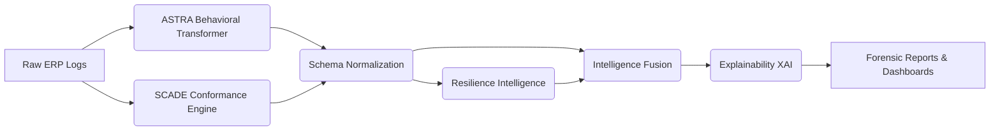

# SCADE-X: Supply Chain Anomaly Detection & Resilience Intelligence


**SCADE-X** is a publication-grade, next-generation framework for supply chain anomaly detection and process resilience. It bridges the critical gap between latent behavioral modeling (transformers) and deterministic process mining (Petri Nets), wrapping them in a mathematically robust intelligence orchestration layer.

---

## 1. Project Overview

Traditional ERP anomaly detection relies on either statistical machine learning (which misses rigid legal process bypasses) or strict conformance checking (which misses subtle behavioral fraud). SCADE-X fuses the **ASTRA** (Advanced Sequential Tracking and Risk Assessment) and **SCADE** (Supply Chain Anomaly Detection Engine) subsystems into a unified platform. 

Rather than just flagging a binary "fraud" alert, SCADE-X evaluates the topological resilience of the supply chain, mapping anomalies to specific disruption severities, calculating cascading vulnerabilities, and emitting human-readable forensic reports.

---

## 2. Core Features

1. **Hybrid Risk-Aware Fusion**: A novel, max-dominant non-linear fusion algorithm bounded by systemic vulnerability. Solves the masking problem of weighted averages and the false-positive avalanches of minimum-score fusion.
2. **Outside-In Orchestration**: Safely executes disparate AI pipelines as isolated microservices, connected purely through rigorous, canonical schema normalization.
3. **Resilience Intelligence Layer**: Computes `Operational Fragility` and `Supplier Dependency Risk` by mathematically blending graph centrality with financial drift.
4. **Explainable AI (XAI)**: Generates strictly deterministic, zero-hallucination Markdown/JSON reports identifying root causes and justifying specific prescriptive actions.
5. **Robust Benchmarking Suite**: Automated head-to-head metric generation, ablation testing, and robustness stress-testing (e.g., simulating a 30% process log sparsity failure).

---

## 3. Architecture


*(For detailed architectural diagrams and data contracts, see `docs/SYSTEM_ARCHITECTURE.md`)*

---

## 4. Execution Instructions

### Prerequisites
- Python 3.10+
- Dependencies listed in `requirements.txt` (pandas, scikit-learn, networkx, pm4py, torch).

### Running the End-to-End Pipeline
SCADE-X orchestrates everything from data ingestion to metric visualization with a single command:
```bash
python main.py
```
*(To run with debug logging: `python main.py --debug`)*

### Outputs
Upon completion, user-facing artifacts are populated in the `outputs/` directory:
- `outputs/final_intelligence/`: The ultimate fused dataset containing severity and action SLAs.
- `outputs/reports/`: Markdown and JSON root-cause files for every flagged transaction.
- `outputs/benchmark/`: Ablation and robustness CSVs.
- `outputs/figures/`: Auto-generated ROC and PR curves.

---

## 5. Research Documentation

SCADE-X is heavily documented for academic peer-review and enterprise auditing. Please refer to the `/docs` directory:
- **[Mathematical Foundation](docs/MATHEMATICAL_FOUNDATION.md)**: The strict equations governing fusion and resilience.
- **[Research Contributions](docs/RESEARCH_CONTRIBUTIONS.md)**: Academic positioning against state-of-the-art process mining.
- **[Benchmarking Methodology](docs/BENCHMARKING_METHOD.md)**: How the framework calculates marginal component utility.
- **[Explainability Engine (XAI)](docs/XAI_ENGINE.md)**: How the reverse-compiler prevents LLM hallucinations.
- **[Limitations & Future Work](docs/LIMITATIONS.md)**: Honest failure modes and the roadmap to Graph Neural Networks (GNNs).

---
*Developed as part of the Advanced Agentic Coding Research Initiative for next-generation intelligence orchestration.*
