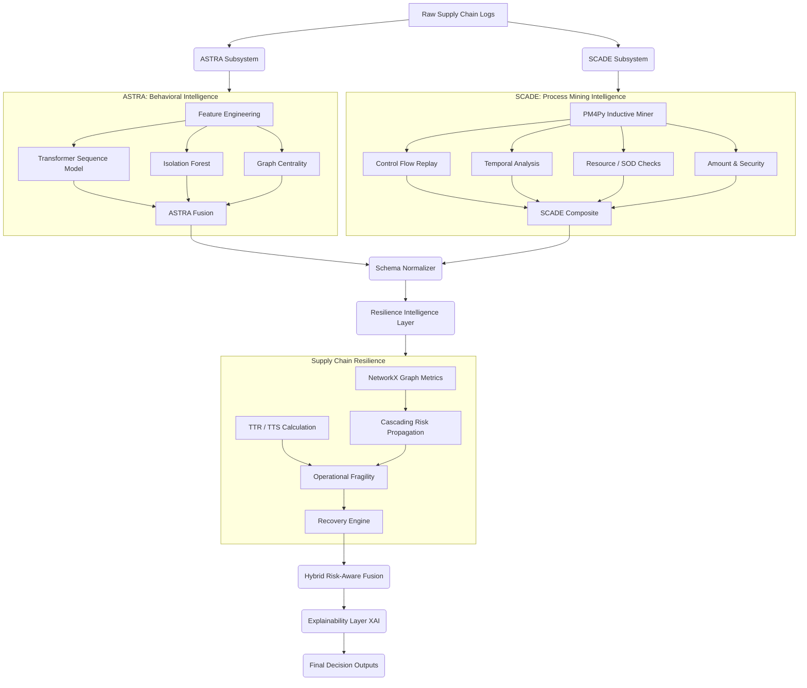

# SCADE-X FINAL SYSTEM ARCHITECTURE

## 1. Execution Pipeline Flow

SCADE-X follows a unified, linear pipeline orchestration model (`scadex_pipeline.py`) built around independent subsystems converging into a single decision engine.

1. **ASTRA Execution**: Deep learning subsystem evaluating behavioural intelligence (Transformers, Isolation Forests, static Graph Centrality).
2. **SCADE Execution**: Process mining subsystem evaluating conformance (Control-Flow Replay, Temporal Baselines, Resource/SOD checks, Amount/Security metrics).
3. **Schema Normalization**: Unifies mismatched dataset outputs, handling divergent Case ID formats (e.g., `PO00000` vs `PO-0001`), and maps subsystem-specific schemas into a canonical intelligence matrix.
4. **Resilience Intelligence**: Computes true supply chain fragility via graph network structures, cascading risk propagation, and survival vs recovery margins.
5. **Intelligence Fusion**: Merges ASTRA anomalies, SCADE non-conformance, and Resilience vulnerability into a final hybrid threat score.
6. **Explainability Generation**: Distils complex multi-dimensional failures into human-readable forensic reports and root-cause summaries.
7. **Benchmarking Framework**: Validates the end-to-end system against ground truth and orchestrates ablation studies.

## 2. Component Interaction & Dependencies

## 3. Resilience Computation Pipeline

The Supply Chain Resilience (SCR) layer transforms static case anomaly scores into systemic risk intelligence.

1. **Graph Engine**: Loads the directed supply chain graph generated by ASTRA. Dynamically computes NetworkX metrics:
   - Degree Centrality (Supplier criticality)
   - Betweenness Centrality
   - PageRank
   - Bottleneck Score ($Betweenness / (Degree + \epsilon)$)
2. **Cascading Risk Propagation**: 
   - A damped iterative diffusion model models how failure in one node cascades downstream.
   - Formula: $risk(v, t+1) = \alpha \cdot \sum_{u \in N(v)} w(u,v) \cdot risk(u, t)$
   - Damping factor $\alpha = 0.3$.
3. **TTR / TTS Engine**:
   - Computes Time to Recover (TTR) and Time to Survive (TTS).
   - Resilience Gap evaluates $max(0, TTR - TTS)$. A positive gap triggers critical alerts as the system cannot recover prior to catastrophic failure.
4. **Resilience Models**:
   - Maps continuous TTR/TTS and fragility metrics into discrete Disruption Severity tiers (LOW, MEDIUM, HIGH, CRITICAL).

## 4. Failure Modes & Limitations

1. **Graph Saturation**: In extremely dense or highly connected synthetic graphs (e.g., small 20-node environments), the cascading risk propagation can saturate rapidly if the damping factor is not tuned aggressively, leading to all downstream cases being flagged as critical.
2. **Data Sparsity**: The system uses `_safe` coercions to handle missing subsystem outputs. If a subsystem fails to evaluate a case, default normative values (e.g., $1.0$ for conformance) are injected, which masks true risk if the subsystem failure was actually an unhandled exception.
3. **Computational Complexity**: 
   - Token-based replay in SCADE scales poorly for highly concurrent logs.
   - Centrality computation is $O(V \cdot E)$ for unweighted graphs, limiting real-time applicability to networks $>10^6$ nodes without approximate heuristics.

## 5. System Integration Points

SCADE-X is loosely coupled. ASTRA and SCADE write to disk (`processed/fused_risk_scores.csv` and `scade/data/results.csv`), which the `SchemaNormalizer` subsequently ingests. The pipeline uses synchronous blocking `subprocess` calls rather than async message queues, enforcing strict sequential execution while ensuring atomic file state transitions.
