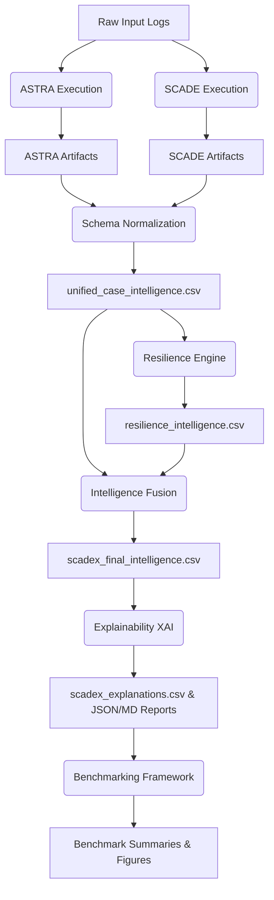

# SCADE-X Project Pipeline

## Overview
SCADE-X implements a highly sequential, deterministic execution pipeline that routes raw procurement logs through two disparate anomaly detection paradigms (ASTRA and SCADE), normalizes their outputs, computes resilience metrics, fuses intelligence, and generates forensic explanations.

## 1. Execution Flow

## 2. Module-by-Module Explanation

### A. Input Validation
The pipeline begins by loading raw event logs (e.g., `synthetic_supply_chain.csv`) and mapping them into the `ArtifactManager`.

### B. Subsystem Execution (ASTRA & SCADE)
The `SCADEXUnifiedPipeline` spawns isolated Python subprocesses targeting `astra/main.py` and `scade/main.py`. This preserves their internal paths and memory states. They operate as black-box microservices, dumping JSON and CSV artifacts into their respective `data/` directories.

### C. Schema Normalization
ASTRA outputs continuous risks (0 to $>1$); SCADE outputs bounded conformance (0 to 1). `src/fusion/schema_normalizer.py` performs an outer join on `case_id`, aligns data types, and applies min-max scaling to compress ASTRA risks, outputting `unified_case_intelligence.csv`.

### D. Resilience Intelligence
`src/resilience/resilience_engine.py` applies structural risk math. It computes `operational_fragility`, `disruption_severity`, and `systemic_vulnerability` by mapping topological centrality to financial drift. Output: `resilience_intelligence.csv`.

### E. Intelligence Fusion
`src/fusion/intelligence_fusion.py` implements Hybrid Risk-Aware Fusion. It overrides the dilution of naive averaging and the false-positive avalanche of minimum-score fusion by using a max-dominant non-linear equation bounded by the system's resilience vulnerability.

### F. Explainability (XAI)
`src/explainability/xai_engine.py` acts as a reverse-compiler. It parses the fusion math to identify the primary root causes (e.g., SIEM violation vs. Temporal drift) and translates them into structured human-readable JSON/MD forensic reports.

### G. Benchmarking
`src/benchmarking/scadex_benchmark.py` runs ablation, robustness, and comparative analyses to generate AUC-ROC metrics and prove the marginal utility of the Hybrid architecture.

### H. Artifact Export
Final artifacts are cleanly extracted from internal processed folders and moved to the user-facing `outputs/` directory.

## 3. Failure Handling
The `RuntimeManager` tracks execution state. 
- Subsystem crashes (e.g. PyTorch OOM) trigger a **fatal** pipeline abort to prevent downstream data corruption.
- Benchmarking failures (e.g. missing `matplotlib` dependencies) trigger a **recoverable** state, logging a warning but exporting the generated intelligence.
