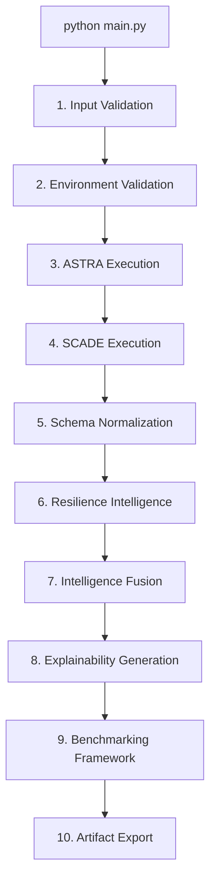

# SCADE-X Unified Runtime & Orchestration Hardening Guide

This document outlines the hardened runtime execution flow, dependency management system, troubleshooting playbook, and orchestration debugging procedures for the unified SCADE-X platform.

---

## 1. Pipeline Execution Flow

The SCADE-X unified pipeline sequentially coordinates raw subsystem data ingestion, latent behavioral models, process conformance checks, non-linear risk fusion, explainability generation, and automated metric benchmarking.



### Stage Summary Table

| Stage # | Stage Name | Purpose | Fatal on Failure? |
| :---: | --- | --- | :---: |
| 1 | `Input Validation` | Asserts existence and formatting of raw data logs | **Yes** |
| 2 | `Environment Validation` | Runs static import checks on all required libraries | **Yes** |
| 3 | `ASTRA Execution` | Coordinates sequential behavioral transformer runs | **Yes** |
| 4 | `SCADE Execution` | Coordinates process conformance checks | **Yes** |
| 5 | `Schema Normalization` | Re-aligns subsystem shapes to standard SCADE-X fields | **Yes** |
| 6 | `Resilience Intelligence` | Computes graph features and systemic fragility scores | **Yes** |
| 7 | `Intelligence Fusion` | Runs non-linear vulnerability risk blending | **Yes** |
| 8 | `Explainability Generation` | Emits zero-hallucination forensic markdown alerts | **Yes** |
| 9 | `Benchmarking` | Runs comparative, ablation, and robustness suites | **No** (Warning emitted) |
| 10 | `Artifact Export` | Populates the user-facing `outputs/` directory | **Yes** |

---

## 2. Environment & Dependency Handling

To prevent silent failures or late-stage runtime crashes, SCADE-X includes a pre-flight dependency check inside `src/orchestration/environment_validator.py`.

### Static Import Verification
Before any subsystem processes are launched, the pipeline attempts static imports of all critical modules:
- **Core ML / Graphs**: `numpy`, `pandas`, `scikit-learn`, `networkx`, `torch`
- **Subsystem Logic**: `pm4py`, `flask`
- **Visualization**: `matplotlib`, `seaborn`
- **Configuration**: `pyyaml`

If any module is missing, the validator logs the exact missing module and prints a **formatted installation script**:
```text
============================================================
CRITICAL ENVIRONMENT VALIDATION FAILURE
============================================================
The following required dependencies are missing: pm4py, seaborn

>>> SUGGESTED FIX:
    Run the following command to install the missing dependencies:
    pip install pm4py seaborn
    
    Or install the complete manifest via:
    pip install -r requirements.txt
============================================================
```

---

## 3. Intelligent Subsystem Orchestration

Subsystem runners (`astra_runner.py` and `scade_runner.py`) utilize robust pathlib-based path resolution, environment scoping, and deterministic fallback searches.

### ASTRA Subsystem Entrypoint Search
ASTRA does not enforce a rigid root-level execution setup. The runner attempts execution using the following fallbacks in order:
1. `astra/main.py`
2. `astra/src/main.py` (running from `astra/` working directory with `PYTHONPATH=src`)
3. Module execution: `python -m src.main` inside `astra/`
4. Nested execution: `main.py` within `astra/src/`

### SCADE Subsystem Entrypoint Search
SCADE execution searches for these files under the `scade/` directory:
1. `scade/main.py`
2. `scade/run.py`
3. `scade/start.py`

Subprocess environment variables are cleanly scoped, and executing directories (`cwd`) are locked onto the correct subsystem root.

---

## 4. Troubleshooting & Subsystem Debugging Playbook

If a subsystem execution fails, SCADE-X emits **Rich Diagnostics Logs** to pinpoint the exact root cause:

```text
============================================================
SCADE SUBSYSTEM EXECUTION FAILED
============================================================
Last Attempted Script : /Library/Frameworks/Python.framework/.../python scade/main.py
Working Directory     : /Users/username/Desktop/ISR Systems/SCADE-X/scade
Exit Code             : 1
------------------------------------------------------------
STDERR:
Traceback (most recent call last):
  File "scade/main.py", line 4, in <module>
    import pm4py
ModuleNotFoundError: No module named 'pm4py'
------------------------------------------------------------
Detected Issue        : Missing dependency: pm4py. Recommended fix: pip install pm4py
Recommended Fix       : Resolve environment issues shown in stderr above.
============================================================
```

### Common Failure Modes & Remediations

#### 1. Missing Subsystem Data logs
*   **Symptom**: Stage `Input Validation` fails immediately with `Critical input log missing`
*   **Resolution**: Verify raw logs are located in `SCADE-X/data/raw/synthetic_supply_chain.csv` and `SCADE-X/data/raw/security.csv`.

#### 2. Virtual Environment Misalignment
*   **Symptom**: `ModuleNotFoundError` during pipeline stages despite local shell packages.
*   **Resolution**: Hardcode/verify that the executed python matches your target virtual environment. Running `python main.py` triggers `sys.executable`, aligning subprocesses to the active shell environment.

#### 3. Data Integrity & NaNs
*   **Symptom**: `ValueError: cannot convert float NaN to integer` in benchmarking.
*   **Resolution**: Ensure `is_ground_truth_anomaly` is filled cleanly via `.fillna(False)` during data normalization and feature alignment.
