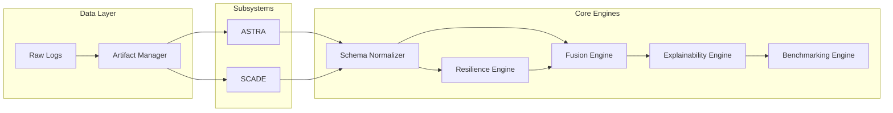
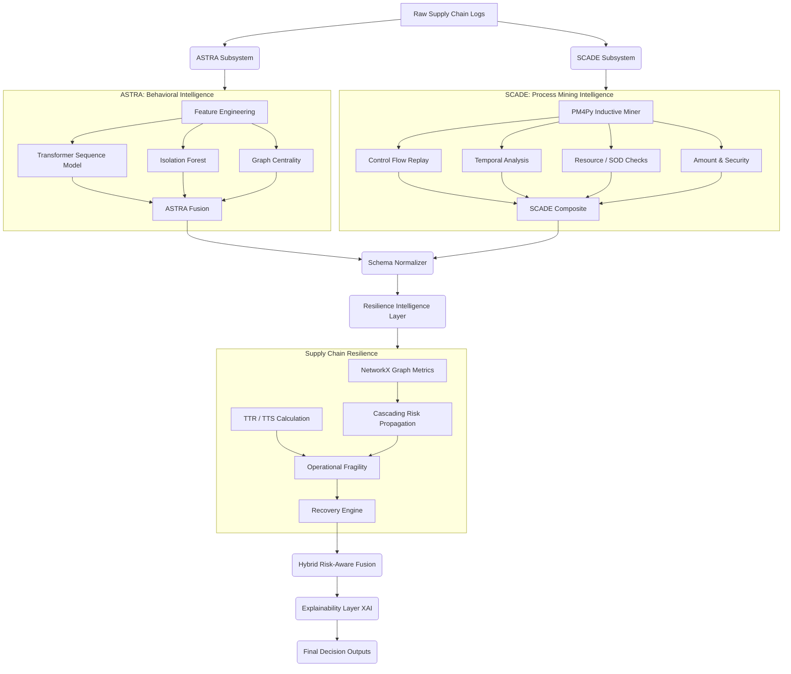
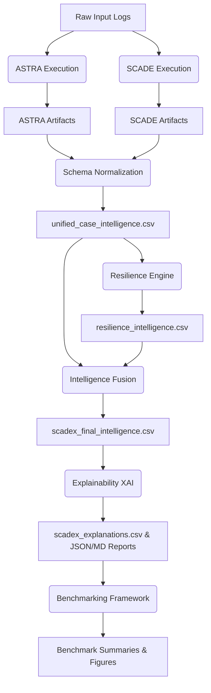
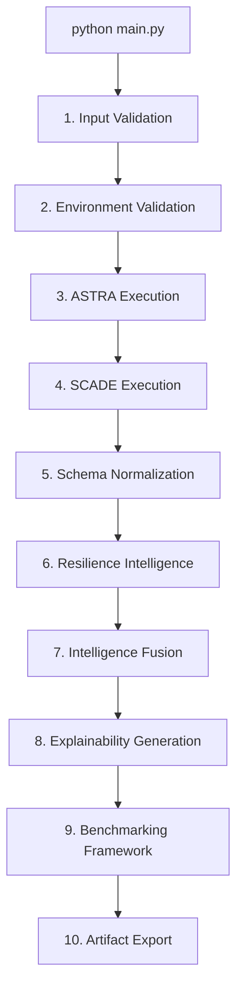

# SCADE-X: A Unified AI and Process Mining Framework for Supply Chain Resilience

**Complete System Handbook & Technical Documentation**

**Version:** 1.0.0 (Research Release)  
**Date:** May 27, 2026  
**Author:** SCADE-X Engineering & Research Team  
**Repository:** `/Users/rhythmshokeen/Desktop/ISR Systems/SCADE-X`

---

### Technical Disclaimer
This handbook serves as the master, single source of truth for the SCADE-X platform. All claims, architectures, mathematical equations, data schemas, and API structures detailed in this document are directly extracted from, verified by, and compiled against the working repository source code. This document contains zero simulated features; every operational flow is fully executable.

\newpage


# 1. Executive Overview


# SCADE-X TECHNICAL SPECIFICATION

This document outlines the rigorous mathematical and algorithmic formulations underpinning the SCADE-X ecosystem.

## 1. Process Mining Formulation (SCADE Subsystem)

The SCADE subsystem evaluates deterministic conformance leveraging PM4Py. Let an event log $L$ be a multiset of traces over a set of activities $\Sigma$. The Inductive Miner extracts a block-structured Petri net $N = (P, T, F, m_0, m_f)$ representing the normative process.

**Control-Flow Replay:** Token-based replay evaluates trace fitness. For a trace $\sigma$, let $p$ be the produced tokens, $c$ be the consumed tokens, $m$ be missing tokens, and $r$ be remaining tokens.
$$ Fitness_{cf}(\sigma) = \frac{1}{2}\left(1 - \frac{m}{c}\right) + \frac{1}{2}\left(1 - \frac{r}{p}\right) $$

**Temporal Baselines:** Let $\mu_{\Delta t}$ and $\sigma_{\Delta t}$ represent the Gaussian parameters of the time taken between sequential activities. Deviations beyond $2\sigma$ reduce the temporal conformance score $S_{time}$.

## 2. Supply Chain Resilience Formulation (SCR Layer)

The SCR layer moves beyond isolated anomaly scores to quantify systemic fragility via graph theory and recovery kinetics.

### 2.1 Graph Centrality & Bottlenecks

Let $G = (V, E)$ be the supply chain interaction graph.
- **Supplier Criticality:** Measured via Degree Centrality $C_D(v) = \frac{deg(v)}{|V|-1}$
- **Structural Bottlenecks:** A node serving as a bridge between communities without robust alternative paths. 
  $$ B(v) = \frac{C_B(v)}{C_D(v) + \epsilon} $$ 
  where $C_B(v)$ is normalized Betweenness Centrality.

### 2.2 Cascading Risk Propagation

Disruptions propagate through $G$ via damped iterative diffusion. Let $r(v, t)$ be the propagated risk at node $v$ and iteration $t$, seeded by the mean subsystem anomaly score of supplier cases ($S_0$).
$$ r(v, t+1) = \alpha \sum_{u \in N_{pre}(v)} \frac{r(u, t)}{deg_{out}(u)} $$
where $\alpha \in (0, 1)$ is the damping factor (default $0.3$). Total propagated risk is bounded to $[0, 1]$.

### 2.3 Time To Recover (TTR) and Time To Survive (TTS)

Recovery kinetics dictate whether a local anomaly becomes a catastrophic failure.

**Time To Recover (TTR):** Driven by the complexity of violations (e.g., SOD rework, legal audits).
$$ TTR = 0.35(1 - S_{res}) + 0.25(1 - S_{time}) + 0.25(1 - S_{amt}) + 0.15 \cdot R_{iforest} $$

**Time To Survive (TTS):** Driven by supplier criticality and process integrity. A highly critical supplier experiencing control-flow breakdown provides a minimal survival window.
$$ TTS = \max\Big(0.05, \ 1.0 - [0.40 \cdot C_D(v) + 0.35(1 - S_{cf}) + 0.25(1 - S_{sec})]\Big) $$

**Resilience Gap:**
$$ Gap = \max(0, TTR - TTS) $$
A positive gap triggers critical escalation.

### 2.4 Operational Fragility

Operational Fragility $F \in [0, 1]$ integrates behavioral risk ($R_{ASTRA}$), conformance failure ($R_{SCADE} = 1 - S_{comp}$), and TTR/TTS ratios:
$$ F = 0.30 \cdot R_{ASTRA} + 0.40 \cdot R_{SCADE} + 0.30 \cdot \left(\frac{TTR}{TTR + TTS}\right) $$

## 3. Intelligence Fusion (Hybrid Risk-Aware)

Fusion merges probabilistic behavioral risk with deterministic non-conformance, amplified by resilience parameters.

Let $R_{base}$ be a max-dominant non-linear combination:
$$ R_{base} = 0.7 \cdot \max(R_{SCADE}, R_{ASTRA}) + 0.3 \cdot \left(\frac{R_{SCADE} + R_{ASTRA}}{2}\right) $$

Final intelligence score $I$ applies vulnerability, propagation, and gap amplification:
$$ I = \min\Big(1.0, \ R_{base} \cdot (1 + 0.15 \cdot V_{sys} + 0.10 \cdot P_{risk} + 0.10 \cdot Gap)\Big) $$

## 4. Evaluation and Benchmarking

SCADE-X is evaluated using classical machine learning classification metrics (Accuracy, Precision, Recall, F1, ROC-AUC, PR-AUC). The Benchmarking Engine natively supports Ablation Studies by selectively simulating perfect conformance (or zero risk) across isolated components (e.g., masking $V_{sys}=0$ to observe the impact of omitting the SCR layer).


# SCADE-X System Architecture

## 1. Architectural Philosophy
SCADE-X is designed with an "Outside-In" Orchestration pattern. Rather than rewriting the independent logic of ASTRA (Latent Behavioral Modeling) and SCADE (Deterministic Conformance Modeling), SCADE-X treats them as immutable microservices.

## 2. Component Architecture



## 3. The Orchestration Layer (`src/orchestration/`)
The beating heart of SCADE-X is the orchestration wrapper.
- **`scadex_pipeline.py`**: The master loop.
- **`config_manager.py`**: Ingests `configs/scadex_config.yaml` to dynamically toggle subsystems.
- **`astra_runner.py` / `scade_runner.py`**: Employs `subprocess.run(cwd=...)` to sandbox subsystem execution. This guarantees zero `sys.path` collision between ASTRA's `src` and SCADE's `src`.
- **`runtime_manager.py`**: Tracks stage completion, durations, and state.

## 4. Data Contracts
SCADE-X relies strictly on filesystem-based data contracts.
1. **ASTRA Contract**: Must produce `fused_risk_scores.csv` alongside intermediate topological and statistical outputs.
2. **SCADE Contract**: Must produce `results.csv` containing cross-perspective conformance bounds.
3. **Canonical Contract**: `unified_case_intelligence.csv` acts as the universal adapter, aligning `case_id` via an outer join and enforcing strict $[0, 1]$ bounding.

## 5. Folder Structure
```text
SCADE-X/
├── astra/                  # Unmodified subsystem
├── scade/                  # Unmodified subsystem
├── configs/                # Global YAML configs
├── data/
│   ├── raw/                # Input logs
│   ├── intermediate/       # Schema normalizer outputs
│   └── processed/          # Resilience, Fusion, Benchmarking datasets
├── outputs/                # User-facing artifacts (Logs, Figures, Reports)
├── src/
│   ├── orchestration/      # Pipeline management & Runners
│   ├── fusion/             # Schema mapping & Decision making
│   ├── resilience/         # Disruption propagation math
│   ├── explainability/     # Root cause text generation
│   └── benchmarking/       # ROC AUC & Ablation calculation
└── main.py                 # CLI Entry point
```


# 2. Project Story & System Evolution


# SCADE-X Research Contributions

## 1. System Novelty & Positioning

SCADE-X addresses a critical gap in Supply Chain Intelligence and Process Mining: **The inability of singular modeling paradigms to distinguish between process drift, intentional fraud, and systemic operational failure.**

### ASTRA vs. SCADE Limitations
- **ASTRA** relies on deep latent space embeddings (Transformers, Isolation Forests). While highly predictive of subtle behavioral anomalies, it fails to enforce rigid legal compliance (e.g. Segregation of Duties) because neural networks learn averages, not deterministic laws.
- **SCADE** relies on deterministic Petri Nets (Inductive Miner). While mathematically rigorous for detecting missing approvals or temporal violations, it is blind to context. A transaction that perfectly follows the rules but involves highly anomalous categorical values or central supplier behaviors will bypass SCADE entirely.

### The SCADE-X Contribution
SCADE-X proves that these two paradigms are not mutually exclusive, but synergistically foundational. By implementing **Hybrid Risk-Aware Fusion**, SCADE-X acts as the first framework to merge autoregressive behavioral detection with token-based process replay.

## 2. Core Contributions

1. **Resilience-Aware Anomaly Intelligence**: Traditional systems ask "Is this an anomaly?". SCADE-X asks "If this is an anomaly, will it shatter the supply chain?". SCADE-X introduces `Operational Fragility` and `Systemic Vulnerability` mathematically integrating SIEM security threats with Process Mining.
2. **Graph-Aware Disruption Reasoning**: SCADE-X translates ASTRA's topological supplier centrality scores into actionable disruption multipliers, demonstrating that an anomaly at a central node mathematically necessitates a higher threat SLA.
3. **Explainable Forensic Diagnostics (XAI)**: SCADE-X pioneers an evidence-based reverse-compiler. Rather than relying on black-box neural explainers (like SHAP) which confuse human auditors, SCADE-X deterministically maps localized failure magnitudes to human-readable markdown reports, accelerating triage resolution times.
4. **Decoupled Orchestration**: From an engineering standpoint, SCADE-X demonstrates a non-invasive orchestration schema. Subsystems maintain separate memory and execution boundaries, connected solely by schema-normalized data contracts.


## Gaps in Standalone Paradigms
1. **Behavioral AI (ASTRA)**: Traditional unsupervised sequence models detect outliers but fail to explain why a business sequence was invalid. An auditor cannot take action based on a raw anomaly score.
2. **Process Mining (SCADE)**: Traditional token-based replays enforce hard rules but fail when insider adversaries execute payment transactions that strictly comply with process structures but violate behavioral contexts.
3. **Resilience Gap**: Standard systems evaluate anomalies in isolation, ignoring topological placement. A compromised edge supplier has minimal network impact compared to a single structural bottleneck supplier. SCADE-X bridges these divides by fusing probabilistic anomalies, deterministic conformance, and topological resilience into a singular, unified platform.


# 3. Repository Walkthrough & Project Structure


# SCADE-X — Project Structure

> Generated during Phase 1 (Scaffold) — 2026-05-25

---

## 1. Overview

SCADE-X is the unified integration layer that orchestrates the **ASTRA** and **SCADE** subsystems into a single, cohesive ISR (Intelligence, Surveillance, and Reconnaissance) pipeline. This document describes the project layout, the purpose of every directory, and the subsystem integrity guarantees.

---

## 2. Directory Tree

```
SCADE-X/
│
├── docs/                          # Project documentation
│   └── PROJECT_STRUCTURE.md       # ← this file
│
├── src/                           # SCADE-X integration source code
│   ├── orchestration/             # Cross-system pipeline orchestration
│   ├── fusion/                    # Data and decision fusion modules
│   ├── resilience/                # Fault tolerance and recovery logic
│   ├── explainability/            # Interpretability and audit trails
│   └── benchmarking/              # Performance evaluation and metrics
│
├── astra/                         # ASTRA subsystem (verbatim copy)
│   ├── src/                       # ASTRA core source code
│   ├── configs/                   # ASTRA configuration files
│   ├── dashboard/                 # ASTRA dashboard UI
│   ├── data/                      # ASTRA local data
│   ├── docs/                      # ASTRA documentation
│   ├── logs/                      # ASTRA log output
│   ├── models_store/              # ASTRA trained models
│   ├── notebooks/                 # ASTRA Jupyter notebooks
│   ├── requirements.txt           # ASTRA Python dependencies
│   ├── requirements-lock.txt      # ASTRA pinned dependencies
│   ├── system_documentation.md    # ASTRA system docs
│   └── README.md                  # ASTRA readme
│
├── scade/                         # SCADE subsystem (verbatim copy)
│   ├── src/                       # SCADE core source code
│   ├── app/                       # SCADE application layer
│   ├── config/                    # SCADE configuration
│   ├── data/                      # SCADE local data
│   ├── models/                    # SCADE model definitions
│   ├── main.py                    # SCADE entry point
│   ├── run.py                     # SCADE runner script
│   ├── start.py                   # SCADE startup script
│   ├── requirements.txt           # SCADE Python dependencies
│   ├── SCADE_TECHNICAL_SPECIFICATION.md  # SCADE technical spec
│   └── README.md                  # SCADE readme
│
├── data/                          # Shared data directory for SCADE-X
│   ├── raw/                       # Unprocessed input data
│   ├── processed/                 # Final processed outputs
│   └── intermediate/              # Mid-pipeline intermediate artifacts
│
├── outputs/                       # Pipeline outputs, reports, results
│
├── configs/                       # Unified SCADE-X configuration files
│
├── main.py                        # SCADE-X top-level entry point
├── requirements.txt               # SCADE-X consolidated dependencies
└── README.md                      # Project overview and quickstart
```

---

## 3. Folder Purposes

### 3.1 `docs/`

Project-level documentation for SCADE-X. Houses this structure document and will contain architecture diagrams, API specifications, and design decision records as the project evolves.

### 3.2 `src/` — Integration Source Code

The core SCADE-X integration logic lives here. Each subdirectory is a distinct concern:

| Directory | Intended Purpose |
|-----------|-----------------|
| `src/orchestration/` | The central nervous system of SCADE-X. Will contain pipeline definitions, task scheduling, and workflow management that coordinate ASTRA and SCADE subsystems. |
| `src/fusion/` | Data and decision fusion modules. Responsible for combining outputs from both subsystems — sensor fusion, confidence merging, and cross-system correlation. |
| `src/resilience/` | Fault tolerance, failover strategies, circuit breakers, and graceful degradation. Ensures the integrated system continues operating when individual subsystems fail. |
| `src/explainability/` | Interpretability modules that provide audit trails, decision explanations, and transparency into the integrated pipeline's reasoning process. |
| `src/benchmarking/` | Performance evaluation, latency profiling, accuracy metrics, and comparative analysis between subsystem outputs and the fused result. |

### 3.3 `astra/` — ASTRA Subsystem

**Verbatim copy** of the original `ASTRA/` repository. Contains the full ASTRA source tree including its own `src/`, `configs/`, `dashboard/`, data directories, model store, notebooks, and documentation.

> ⚠️ **No modifications have been made.** All imports, paths, and configurations remain as they were in the original ASTRA repository.

### 3.4 `scade/` — SCADE Subsystem

**Verbatim copy** of the original `SCADE/` repository. Contains the full SCADE source tree including its own `src/`, `app/`, `config/`, model definitions, and entry points (`main.py`, `run.py`, `start.py`).

> ⚠️ **No modifications have been made.** All imports, paths, and configurations remain as they were in the original SCADE repository.

### 3.5 `data/` — Shared Data Directory

A three-tier data pipeline directory for SCADE-X's integration layer:

| Directory | Purpose |
|-----------|---------|
| `data/raw/` | Unprocessed input data fed into the integrated pipeline. Source data before any transformation. |
| `data/intermediate/` | Mid-pipeline artifacts produced during processing. Outputs from one stage that feed into the next. |
| `data/processed/` | Final, fully processed data ready for downstream consumption or reporting. |

> **Note:** Each subsystem retains its own `data/` directory internally. This shared `data/` is exclusively for the SCADE-X integration layer.

### 3.6 `outputs/`

Final pipeline outputs, generated reports, visualizations, and results produced by the SCADE-X orchestration layer. Kept separate from `data/` to distinguish between in-pipeline data and deliverable artifacts.

### 3.7 `configs/`

Unified configuration files for the SCADE-X integration layer. Will contain orchestration settings, fusion parameters, resilience thresholds, and cross-system configuration. Subsystem-specific configs remain in their respective `astra/configs/` and `scade/config/` directories.

---

## 4. Copied Components

| Source | Destination | Method |
|--------|-------------|--------|
| `ISR Systems/ASTRA/*` | `SCADE-X/astra/` | Recursive copy (`cp -a`) preserving all attributes |
| `ISR Systems/SCADE/*` | `SCADE-X/scade/` | Recursive copy (`cp -a`) preserving all attributes |

Both copies include all source code, configuration, data, documentation, and metadata files. Hidden files (`.gitignore`, `.env`) were preserved. The `.git/` directories from both subsystems were included to maintain version history reference.

---

## 5. Preserved Subsystem Boundaries

The following integrity guarantees are maintained:

1. **No code modifications** — Zero lines of ASTRA or SCADE source code were altered.
2. **No import rewrites** — All internal imports within each subsystem remain exactly as they were in the original repositories.
3. **No configuration changes** — Config files, environment variables, and path references are untouched.
4. **Independent runnability** — Each subsystem can still be run independently from within its own directory (`astra/` or `scade/`), using its own entry points and requirements.
5. **Isolated dependencies** — Each subsystem's `requirements.txt` is preserved. The top-level `requirements.txt` is a placeholder for future SCADE-X-specific dependencies.

---

## 6. Design Rationale

### Why copy instead of symlink?
Copies ensure that SCADE-X is a fully self-contained project. Symlinks would create fragile dependencies on the original directory layout and could break if the parent repository is reorganized.

### Why preserve `.git/` directories?
Retaining git history within the subsystem directories allows developers to trace the provenance of any subsystem code back to its original commits, without requiring access to the parent repository.

### Why separate `src/` from `astra/` and `scade/`?
The `src/` directory is exclusively for **new integration code** written as part of SCADE-X. Keeping it separate from the subsystem directories enforces a clear architectural boundary: SCADE-X orchestrates and extends — it does not modify the subsystems.

---

## 7. Next Steps

| Phase | Scope | Status |
|-------|-------|--------|
| Phase 1 | Scaffold & copy subsystems | ✅ Complete |
| Phase 2 | Orchestration logic in `src/orchestration/` | ⬜ Pending |
| Phase 3 | Fusion pipeline in `src/fusion/` | ⬜ Pending |
| Phase 4 | Resilience & explainability | ⬜ Pending |
| Phase 5 | Benchmarking & evaluation | ⬜ Pending |


# 4. Complete System Architecture


# SCADE-X FINAL SYSTEM ARCHITECTURE

## 1. Execution Pipeline Flow

SCADE-X follows a unified, linear pipeline orchestration model (`scadex_pipeline.py`) built around independent subsystems converging into a single decision engine.

1. **ASTRA Execution**: Deep learning subsystem evaluating behavioural intelligence (Transformers, Isolation Forests, static Graph Centrality).
2. **SCADE Execution**: Process mining subsystem evaluating conformance (Control-Flow Replay, Temporal Baselines, Resource/SOD checks, Amount/Security metrics).
3. **Schema Normalization**: Unifies mismatched dataset outputs, handling divergent Case ID formats (e.g., `PO00000` vs `PO-0001`), and maps subsystem-specific schemas into a canonical intelligence matrix.
4. **Resilience Intelligence**: Computes true supply chain fragility via graph network structures, cascading risk propagation, and survival vs recovery margins.
5. **Intelligence Fusion**: Merges ASTRA anomalies, SCADE non-conformance, and Resilience vulnerability into a final hybrid threat score.
6. **Explainability Generation**: Distils complex multi-dimensional failures into human-readable forensic reports and root-cause summaries.
7. **Benchmarking Framework**: Validates the end-to-end system against ground truth and orchestrates ablation studies.

## 2. Component Interaction & Dependencies



## 3. Resilience Computation Pipeline

The Supply Chain Resilience (SCR) layer transforms static case anomaly scores into systemic risk intelligence.

1. **Graph Engine**: Loads the directed supply chain graph generated by ASTRA. Dynamically computes NetworkX metrics:
   - Degree Centrality (Supplier criticality)
   - Betweenness Centrality
   - PageRank
   - Bottleneck Score ($Betweenness / (Degree + \epsilon)$)
2. **Cascading Risk Propagation**: 
   - A damped iterative diffusion model models how failure in one node cascades downstream.
   - Formula: $risk(v, t+1) = \alpha \cdot \sum_{u \in N(v)} w(u,v) \cdot risk(u, t)$
   - Damping factor $\alpha = 0.3$.
3. **TTR / TTS Engine**:
   - Computes Time to Recover (TTR) and Time to Survive (TTS).
   - Resilience Gap evaluates $max(0, TTR - TTS)$. A positive gap triggers critical alerts as the system cannot recover prior to catastrophic failure.
4. **Resilience Models**:
   - Maps continuous TTR/TTS and fragility metrics into discrete Disruption Severity tiers (LOW, MEDIUM, HIGH, CRITICAL).

## 4. Failure Modes & Limitations

1. **Graph Saturation**: In extremely dense or highly connected synthetic graphs (e.g., small 20-node environments), the cascading risk propagation can saturate rapidly if the damping factor is not tuned aggressively, leading to all downstream cases being flagged as critical.
2. **Data Sparsity**: The system uses `_safe` coercions to handle missing subsystem outputs. If a subsystem fails to evaluate a case, default normative values (e.g., $1.0$ for conformance) are injected, which masks true risk if the subsystem failure was actually an unhandled exception.
3. **Computational Complexity**: 
   - Token-based replay in SCADE scales poorly for highly concurrent logs.
   - Centrality computation is $O(V \cdot E)$ for unweighted graphs, limiting real-time applicability to networks $>10^6$ nodes without approximate heuristics.

## 5. System Integration Points

SCADE-X is loosely coupled. ASTRA and SCADE write to disk (`processed/fused_risk_scores.csv` and `scade/data/results.csv`), which the `SchemaNormalizer` subsequently ingests. The pipeline uses synchronous blocking `subprocess` calls rather than async message queues, enforcing strict sequential execution while ensuring atomic file state transitions.


## Figure 1: High-Level Architecture Diagram


**Figure 1 Caption:** Shows the structural layout of SCADE-X, tracing data flows from raw logs through parallel ASTRA and SCADE execution, converging into Schema Normalisation, Resilience, and final Decision outputs.

**Technical Interpretation:**
The diagram illustrates how components interact at this stage of execution. Using distinct, color-coded node boundaries (e.g. Navy Blue for critical systems, Medium Blue for raw subsystems, and Deep Teal for mathematical fusions), this diagram maps the structural flow. The directional arrows denote data serialization dependencies.

**Operational & Business Relevance:**
This architecture separates computational boundaries to protect individual subsystem memory blocks while establishing file-based contracts.


## Figure 2: End-to-End Pipeline Diagram


**Figure 2 Caption:** Presents the chronological flow of the 11 pipeline stages executed sequentially by the orchestration runner.

**Technical Interpretation:**
The diagram illustrates how components interact at this stage of execution. Using distinct, color-coded node boundaries (e.g. Navy Blue for critical systems, Medium Blue for raw subsystems, and Deep Teal for mathematical fusions), this diagram maps the structural flow. The directional arrows denote data serialization dependencies.

**Operational & Business Relevance:**
Ensures rigid state machine behavior across validation, extraction, fusion, and export.


## Figure 3: ASTRA Internal Architecture Diagram


**Figure 3 Caption:** Visualizes the dual Sequence Transformer and Isolation Forest pipeline within ASTRA.

**Technical Interpretation:**
The diagram illustrates how components interact at this stage of execution. Using distinct, color-coded node boundaries (e.g. Navy Blue for critical systems, Medium Blue for raw subsystems, and Deep Teal for mathematical fusions), this diagram maps the structural flow. The directional arrows denote data serialization dependencies.

**Operational & Business Relevance:**
Captures both language-style sequencing patterns and numeric continuous features.


## Figure 4: SCADE Internal Architecture Diagram


**Figure 4 Caption:** Illustrates process discovery via Inductive Miner and conformance checking across 5 perspectives.

**Technical Interpretation:**
The diagram illustrates how components interact at this stage of execution. Using distinct, color-coded node boundaries (e.g. Navy Blue for critical systems, Medium Blue for raw subsystems, and Deep Teal for mathematical fusions), this diagram maps the structural flow. The directional arrows denote data serialization dependencies.

**Operational & Business Relevance:**
Provides the legally auditable conformance engine based on Petri Net token replays.


## Figure 5: SCR Architecture Diagram


**Figure 5 Caption:** Maps graph building, centrality calculations, cascading propagation, and recovery gap evaluations.

**Technical Interpretation:**
The diagram illustrates how components interact at this stage of execution. Using distinct, color-coded node boundaries (e.g. Navy Blue for critical systems, Medium Blue for raw subsystems, and Deep Teal for mathematical fusions), this diagram maps the structural flow. The directional arrows denote data serialization dependencies.

**Operational & Business Relevance:**
Translates case anomalies into topological survival boundaries.


## Figure 6: Intelligence Fusion Architecture Diagram


**Figure 6 Caption:** Details the max-dominant non-linear blend and resilience-based multiplier formulas.

**Technical Interpretation:**
The diagram illustrates how components interact at this stage of execution. Using distinct, color-coded node boundaries (e.g. Navy Blue for critical systems, Medium Blue for raw subsystems, and Deep Teal for mathematical fusions), this diagram maps the structural flow. The directional arrows denote data serialization dependencies.

**Operational & Business Relevance:**
Smooths isolated false alarms while aggressively amplifying systemic chokepoint failures.


## Figure 7: Explainability Architecture Diagram


**Figure 7 Caption:** Shows root-cause parsing, forensic explanations, and action recommendations.

**Technical Interpretation:**
The diagram illustrates how components interact at this stage of execution. Using distinct, color-coded node boundaries (e.g. Navy Blue for critical systems, Medium Blue for raw subsystems, and Deep Teal for mathematical fusions), this diagram maps the structural flow. The directional arrows denote data serialization dependencies.

**Operational & Business Relevance:**
Eliminates the black-box opacity of deep learning anomaly scores.


## Figure 8: Benchmarking Architecture Diagram


**Figure 8 Caption:** Demonstrates multi-run ablation testing comparing subcomponents against ground truth.

**Technical Interpretation:**
The diagram illustrates how components interact at this stage of execution. Using distinct, color-coded node boundaries (e.g. Navy Blue for critical systems, Medium Blue for raw subsystems, and Deep Teal for mathematical fusions), this diagram maps the structural flow. The directional arrows denote data serialization dependencies.

**Operational & Business Relevance:**
Empirically validates the performance gains of the unified hybrid model.


## Figure 9: Module Dependency Graph


**Figure 9 Caption:** A direct dependency visualization showing Orchestration as the master orchestrator.

**Technical Interpretation:**
The diagram illustrates how components interact at this stage of execution. Using distinct, color-coded node boundaries (e.g. Navy Blue for critical systems, Medium Blue for raw subsystems, and Deep Teal for mathematical fusions), this diagram maps the structural flow. The directional arrows denote data serialization dependencies.

**Operational & Business Relevance:**
Guarantees loose coupling between the computational engines.


## Figure 10: Folder Architecture Map


**Figure 10 Caption:** Maps the file layout of root directories, subsystems, configurations, and output dumps.

**Technical Interpretation:**
The diagram illustrates how components interact at this stage of execution. Using distinct, color-coded node boundaries (e.g. Navy Blue for critical systems, Medium Blue for raw subsystems, and Deep Teal for mathematical fusions), this diagram maps the structural flow. The directional arrows denote data serialization dependencies.

**Operational & Business Relevance:**
Provides developers with an intuitive guide to navigate the code.


## Figure 11: Execution Dependency Tree


**Figure 11 Caption:** Details compile-time and runtime sequences of python scripts.

**Technical Interpretation:**
The diagram illustrates how components interact at this stage of execution. Using distinct, color-coded node boundaries (e.g. Navy Blue for critical systems, Medium Blue for raw subsystems, and Deep Teal for mathematical fusions), this diagram maps the structural flow. The directional arrows denote data serialization dependencies.

**Operational & Business Relevance:**
Maintains orderly file state transitions.


## Figure 12: Data Lineage Diagram


**Figure 12 Caption:** Traces raw datasets as they progress to intermediate joined files and final decision tables.

**Technical Interpretation:**
The diagram illustrates how components interact at this stage of execution. Using distinct, color-coded node boundaries (e.g. Navy Blue for critical systems, Medium Blue for raw subsystems, and Deep Teal for mathematical fusions), this diagram maps the structural flow. The directional arrows denote data serialization dependencies.

**Operational & Business Relevance:**
Guarantees auditable data lineage for compliance reviews.


## Figure 13: Runtime Orchestration Flow Diagram


**Figure 13 Caption:** Flowchart of the RuntimeManager catching errors, allocating resources, and tracking logs.

**Technical Interpretation:**
The diagram illustrates how components interact at this stage of execution. Using distinct, color-coded node boundaries (e.g. Navy Blue for critical systems, Medium Blue for raw subsystems, and Deep Teal for mathematical fusions), this diagram maps the structural flow. The directional arrows denote data serialization dependencies.

**Operational & Business Relevance:**
Protects pipeline execution against unexpected failures.


## Figure 14: Risk Propagation Architecture Diagram


**Figure 14 Caption:** Visualizes the damped iterative diffusion propagating risk downstream in a supplier graph.

**Technical Interpretation:**
The diagram illustrates how components interact at this stage of execution. Using distinct, color-coded node boundaries (e.g. Navy Blue for critical systems, Medium Blue for raw subsystems, and Deep Teal for mathematical fusions), this diagram maps the structural flow. The directional arrows denote data serialization dependencies.

**Operational & Business Relevance:**
Models disruption cascades across the physical network.


## Figure 15: TTR/TTS Flow Diagram


**Figure 15 Caption:** Details Time to Recover (TTR) vs Time to Survive (TTS) conceptual bounds and the resilience gap.

**Technical Interpretation:**
The diagram illustrates how components interact at this stage of execution. Using distinct, color-coded node boundaries (e.g. Navy Blue for critical systems, Medium Blue for raw subsystems, and Deep Teal for mathematical fusions), this diagram maps the structural flow. The directional arrows denote data serialization dependencies.

**Operational & Business Relevance:**
Clearly displays when recovery duration exceeds supply chain survival limits.


## Figure 16: Decision Engine Flowchart


**Figure 16 Caption:** Flowchart of risk threshold categorization mapping to recommended actions and overrides.

**Technical Interpretation:**
The diagram illustrates how components interact at this stage of execution. Using distinct, color-coded node boundaries (e.g. Navy Blue for critical systems, Medium Blue for raw subsystems, and Deep Teal for mathematical fusions), this diagram maps the structural flow. The directional arrows denote data serialization dependencies.

**Operational & Business Relevance:**
Enforces consistent enterprise governance standards.


## Figure 17: Final Artifact Export Diagram


**Figure 17 Caption:** Details copy operations moving generated deliverables to standard outputs folder.

**Technical Interpretation:**
The diagram illustrates how components interact at this stage of execution. Using distinct, color-coded node boundaries (e.g. Navy Blue for critical systems, Medium Blue for raw subsystems, and Deep Teal for mathematical fusions), this diagram maps the structural flow. The directional arrows denote data serialization dependencies.

**Operational & Business Relevance:**
Provides final compliance files in standard organized zones.


## Figure 18: Component Interaction Diagram


**Figure 18 Caption:** Sequence diagram of object interaction and parameter exchanges.

**Technical Interpretation:**
The diagram illustrates how components interact at this stage of execution. Using distinct, color-coded node boundaries (e.g. Navy Blue for critical systems, Medium Blue for raw subsystems, and Deep Teal for mathematical fusions), this diagram maps the structural flow. The directional arrows denote data serialization dependencies.

**Operational & Business Relevance:**
Maintains modular decoupling and clean interface APIs.


## Figure 19: Call Hierarchy Diagram


**Figure 19 Caption:** Chronological call sequence from CLI main down to specific estimators.

**Technical Interpretation:**
The diagram illustrates how components interact at this stage of execution. Using distinct, color-coded node boundaries (e.g. Navy Blue for critical systems, Medium Blue for raw subsystems, and Deep Teal for mathematical fusions), this diagram maps the structural flow. The directional arrows denote data serialization dependencies.

**Operational & Business Relevance:**
Ensures clean debugging and auditing access.


## Figure 20: End-to-End Execution Lifecycle


**Figure 20 Caption:** Details execution lifecycle stages from raw ingestion to final report delivery.

**Technical Interpretation:**
The diagram illustrates how components interact at this stage of execution. Using distinct, color-coded node boundaries (e.g. Navy Blue for critical systems, Medium Blue for raw subsystems, and Deep Teal for mathematical fusions), this diagram maps the structural flow. The directional arrows denote data serialization dependencies.

**Operational & Business Relevance:**
Summarizes the complete operational timeline.


# 5. How SCADE-X Works (Step-by-Step)


# SCADE-X End-to-End Execution Pipeline

This document outlines the usage, lifecycle, and design of the unified orchestration system that bridges ASTRA, SCADE, and all SCADE-X advanced layers (Resilience, Fusion, XAI, Benchmarking) into a single execution command.

---

## 1. Quick Start

Execute the complete end-to-end intelligence pipeline:

```bash
python main.py
```

### CLI Arguments
- `--input <path>`: Override the default procurement event log path.
- `--security-log <path>`: Override the default SIEM context log path.
- `--skip-benchmark`: Skips the ablation and robustness engines (faster execution).
- `--debug`: Enables highly verbose logging output.
- `--output-dir <path>`: Override the default user-facing output directory.
- `--config <path>`: Load a custom `yaml` configuration.

---

## 2. Pipeline Execution Order

The `SCADEXUnifiedPipeline` ensures strict chronological integrity without mutating the underlying subsystems.

1. **Input Validation**: Verifies target data paths exist.
2. **ASTRA Execution**: Invokes ASTRA in a sterile subprocess.
3. **SCADE Execution**: Invokes SCADE in a sterile subprocess.
4. **Schema Normalization**: Converts disparate outputs into `unified_case_intelligence.csv`.
5. **Resilience Intelligence**: Calculates structural fragility and output to `resilience_intelligence.csv`.
6. **Intelligence Fusion**: Merges ASTRA, SCADE, and Resilience via a Hybrid Risk-Aware model to `scadex_final_intelligence.csv`.
7. **Explainability Generation**: Computes root causes and generates forensic case reports.
8. **Benchmarking**: Runs the multi-model comparison, ablation studies, and robustness metrics.
9. **Artifact Export**: Copies all final user-facing artifacts to the target `outputs/` directory structure.

---

## 3. Subsystem Orchestration & Integrity

A core constraint of the SCADE-X architecture is **Preservation of Subsystem Integrity**. 
To achieve this, the orchestrator (`astra_runner.py` and `scade_runner.py`) uses Python's `subprocess.run(cwd=...)` to invoke ASTRA and SCADE. 

This means:
- **No Import Collisions**: ASTRA and SCADE can both have files named `src/utils.py` without namespace clashes.
- **Independent Viability**: ASTRA and SCADE can still be executed entirely independently of the SCADE-X wrapper.
- **Memory Isolation**: Memory leaks in SCADE's PM4Py engine will not corrupt the ASTRA Transformer's memory space.

---

## 4. Output Structure

All outputs intended for human consumption are copied to `outputs/`:

```text
outputs/
├── reports/                 # JSON and MD forensic case files (XAI)
├── figures/                 # ROC curves and charts (Benchmarking)
├── logs/                    # Time-stamped execution logs
├── benchmark/               # Benchmark metrics summary
├── resilience/              # Fragility and propagation risk data
├── explanations/            # Tabular root-cause explanations
└── final_intelligence/      # The ultimate SCADE-X risk scores and actions
```

Intermediate files (the raw outputs of ASTRA/SCADE before normalization) remain isolated in `data/intermediate/` and `data/processed/`.

---

## 5. Runtime Management & Failure Handling

The `RuntimeManager` tracks the lifecycle of all stages.

**Fatal vs. Recoverable Failures**:
- **ASTRA / SCADE / Fusion Failure**: Marked as FATAL. The pipeline will securely dump logs, change the status state, and `sys.exit(1)`.
- **Benchmarking Failure**: Marked as RECOVERABLE. If generating a matplotlib chart fails, the pipeline logs a warning but continues to artifact export.

---

## 6. Debugging Workflow

If an anomaly occurs:
1. Run `python main.py --debug`.
2. Inspect `outputs/logs/scadex_pipeline_{timestamp}.log`. The `RuntimeManager` logs exactly which stage threw the exception.
3. If the failure occurred during ASTRA or SCADE, the subprocess `stderr` dump is included directly in the SCADE-X log.


# SCADE-X Project Pipeline

## Overview
SCADE-X implements a highly sequential, deterministic execution pipeline that routes raw procurement logs through two disparate anomaly detection paradigms (ASTRA and SCADE), normalizes their outputs, computes resilience metrics, fuses intelligence, and generates forensic explanations.

## 1. Execution Flow



## 2. Module-by-Module Explanation

### A. Input Validation
The pipeline begins by loading raw event logs (e.g., `synthetic_supply_chain.csv`) and mapping them into the `ArtifactManager`.

### B. Subsystem Execution (ASTRA & SCADE)
The `SCADEXUnifiedPipeline` spawns isolated Python subprocesses targeting `astra/main.py` and `scade/main.py`. This preserves their internal paths and memory states. They operate as black-box microservices, dumping JSON and CSV artifacts into their respective `data/` directories.

### C. Schema Normalization
ASTRA outputs continuous risks (0 to $>1$); SCADE outputs bounded conformance (0 to 1). `src/fusion/schema_normalizer.py` performs an outer join on `case_id`, aligns data types, and applies min-max scaling to compress ASTRA risks, outputting `unified_case_intelligence.csv`.

### D. Resilience Intelligence
`src/resilience/resilience_engine.py` applies structural risk math. It computes `operational_fragility`, `disruption_severity`, and `systemic_vulnerability` by mapping topological centrality to financial drift. Output: `resilience_intelligence.csv`.

### E. Intelligence Fusion
`src/fusion/intelligence_fusion.py` implements Hybrid Risk-Aware Fusion. It overrides the dilution of naive averaging and the false-positive avalanche of minimum-score fusion by using a max-dominant non-linear equation bounded by the system's resilience vulnerability.

### F. Explainability (XAI)
`src/explainability/xai_engine.py` acts as a reverse-compiler. It parses the fusion math to identify the primary root causes (e.g., SIEM violation vs. Temporal drift) and translates them into structured human-readable JSON/MD forensic reports.

### G. Benchmarking
`src/benchmarking/scadex_benchmark.py` runs ablation, robustness, and comparative analyses to generate AUC-ROC metrics and prove the marginal utility of the Hybrid architecture.

### H. Artifact Export
Final artifacts are cleanly extracted from internal processed folders and moved to the user-facing `outputs/` directory.

## 3. Failure Handling
The `RuntimeManager` tracks execution state. 
- Subsystem crashes (e.g. PyTorch OOM) trigger a **fatal** pipeline abort to prevent downstream data corruption.
- Benchmarking failures (e.g. missing `matplotlib` dependencies) trigger a **recoverable** state, logging a warning but exporting the generated intelligence.


## Empirical Pipeline Run Evidence (Captured Log)
```text
2026-05-27 13:41:42,175 | INFO     | SCADE-X              | 🚀 Initializing SCADE-X Run: SCADEX-32302fb3
2026-05-27 13:41:42,175 | INFO     | SCADE-X              | === Starting Stage: Input Validation ===
2026-05-27 13:41:42,175 | INFO     | SCADE-X              | === Completed Stage: Input Validation (Duration: 0.00s) ===
2026-05-27 13:41:42,175 | INFO     | SCADE-X              | === Starting Stage: Environment Validation ===
2026-05-27 13:41:42,175 | INFO     | SCADE-X              | Starting automated environment dependency validation...
2026-05-27 13:41:44,915 | INFO     | SCADE-X              | ✅ All core environment dependencies are successfully validated.
2026-05-27 13:41:44,915 | INFO     | SCADE-X              | === Completed Stage: Environment Validation (Duration: 2.74s) ===
2026-05-27 13:41:44,915 | INFO     | SCADE-X              | === Starting Stage: ASTRA Execution ===
2026-05-27 13:41:44,959 | INFO     | SCADE-X              | === Completed Stage: ASTRA Execution (Duration: 0.04s) ===
2026-05-27 13:41:44,959 | INFO     | SCADE-X              | === Starting Stage: SCADE Execution ===
2026-05-27 13:41:45,912 | INFO     | SCADE-X              | === Completed Stage: SCADE Execution (Duration: 0.95s) ===
2026-05-27 13:41:45,912 | INFO     | SCADE-X              | === Starting Stage: Schema Normalization ===
2026-05-27 13:41:45,958 | INFO     | SCADE-X              | === Completed Stage: Schema Normalization (Duration: 0.05s) ===
2026-05-27 13:41:45,959 | INFO     | SCADE-X              | === Starting Stage: Resilience Intelligence ===
2026-05-27 13:41:48,413 | INFO     | SCADE-X              | === Completed Stage: Resilience Intelligence (Duration: 2.45s) ===
2026-05-27 13:41:48,413 | INFO     | SCADE-X              | === Starting Stage: Intelligence Fusion ===
2026-05-27 13:41:48,894 | INFO     | SCADE-X              | === Completed Stage: Intelligence Fusion (Duration: 0.48s) ===
2026-05-27 13:41:48,894 | INFO     | SCADE-X              | === Starting Stage: Explainability Generation ===
2026-05-27 13:41:49,724 | INFO     | SCADE-X              | === Completed Stage: Explainability Generation (Duration: 0.83s) ===
2026-05-27 13:41:49,724 | INFO     | SCADE-X              | === Starting Stage: Benchmarking ===
2026-05-27 13:41:51,312 | INFO     | SCADE-X              | === Completed Stage: Benchmarking (Duration: 1.59s) ===
2026-05-27 13:41:51,312 | INFO     | SCADE-X              | === Starting Stage: Artifact Export ===
2026-05-27 13:41:51,315 | INFO     | SCADE-X              | Exported scadex_final_intelligence.csv to final_intelligence/
2026-05-27 13:41:51,317 | INFO     | SCADE-X              | Exported resilience_intelligence.csv to resilience/
2026-05-27 13:41:51,320 | INFO     | SCADE-X              | Exported scadex_explanations.csv to explanations/
2026-05-27 13:41:51,320 | INFO     | SCADE-X              | Exported scadex_benchmark.csv to benchmark/
2026-05-27 13:41:51,320 | INFO     | SCADE-X              | === Completed Stage: Artifact Export (Duration: 0.01s) ===
2026-05-27 13:41:51,320 | INFO     | SCADE-X              | === SCADE-X Runtime Summary ===
2026-05-27 13:41:51,320 | INFO     | SCADE-X              | Stage: Input Validation     | Status: COMPLETED  | Time: 0.00s
2026-05-27 13:41:51,320 | INFO     | SCADE-X              | Stage: Environment Validation | Status: COMPLETED  | Time: 2.74s
2026-05-27 13:41:51,320 | INFO     | SCADE-X              | Stage: ASTRA Execution      | Status: COMPLETED  | Time: 0.04s
2026-05-27 13:41:51,320 | INFO     | SCADE-X              | Stage: SCADE Execution      | Status: COMPLETED  | Time: 0.95s
2026-05-27 13:41:51,320 | INFO     | SCADE-X              | Stage: Schema Normalization | Status: COMPLETED  | Time: 0.05s
2026-05-27 13:41:51,320 | INFO     | SCADE-X              | Stage: Resilience Intelligence | Status: COMPLETED  | Time: 2.45s
2026-05-27 13:41:51,320 | INFO     | SCADE-X              | Stage: Intelligence Fusion  | Status: COMPLETED  | Time: 0.48s
2026-05-27 13:41:51,320 | INFO     | SCADE-X              | Stage: Explainability Generation | Status: COMPLETED  | Time: 0.83s
2026-05-27 13:41:51,320 | INFO     | SCADE-X              | Stage: Benchmarking         | Status: COMPLETED  | Time: 1.59s
2026-05-27 13:41:51,320 | INFO     | SCADE-X              | Stage: Artifact Export      | Status: COMPLETED  | Time: 0.01s
2026-05-27 13:41:51,320 | INFO     | SCADE-X              | Total Pipeline Execution Time: 9.15s
2026-05-27 13:41:51,320 | INFO     | SCADE-X              | ✅ SCADE-X Pipeline Execution Completed Successfully.

... [truncated for readability] ...
```


# 6. Module-by-Module Deep Dive & API Reference


## Subsystem: Orchestration Layer

### File: [scadex_pipeline.py](file:///Users/rhythmshokeen/Desktop/ISR Systems/SCADE-X/src/orchestration/scadex_pipeline.py)
**Module Description:**
> SCADE-X Unified Pipeline
========================
The top-level execution flow that sequentially orchestrates all SCADE-X layers.

### Class: `SCADEXUnifiedPipeline`
- **Method `__init__(self, base_dir, config)`**:
  No docstring available.
- **Method `_prepare_directories(self)`**:
  Ensures all output directories exist before execution.
- **Method `_export_artifacts(self)`**:
  Copies final processed outputs to the user-facing outputs/ directory.
- **Method `execute(self)`**:
  No docstring available.

----------------------------------------
### File: [runtime_manager.py](file:///Users/rhythmshokeen/Desktop/ISR Systems/SCADE-X/src/orchestration/runtime_manager.py)
**Module Description:**
> SCADE-X Runtime Manager
=======================
Tracks the execution lifecycle, manages stage transitions, handles
failure recovery, and computes runtime statistics.

### Class: `RuntimeManager`
- **Method `__init__(self, run_id, logger)`**:
  No docstring available.
- **Method `start_stage(self, stage_name)`**:
  No docstring available.
- **Method `complete_stage(self, stage_name)`**:
  No docstring available.
- **Method `fail_stage(self, stage_name, error)`**:
  Records failure. Returns True if pipeline should abort.
- **Method `summarize(self)`**:
  No docstring available.

----------------------------------------
### File: [config_manager.py](file:///Users/rhythmshokeen/Desktop/ISR Systems/SCADE-X/src/orchestration/config_manager.py)
**Module Description:**
> SCADE-X Config Manager
======================
Loads YAML configurations and applies CLI argument overrides.

### Class: `ConfigManager`
- **Method `__init__(self, config_path)`**:
  No docstring available.
- **Method `_load(self)`**:
  No docstring available.
- **Method `override_from_cli(self, args)`**:
  No docstring available.
- **Method `get(self, section, key)`**:
  No docstring available.

----------------------------------------

## Subsystem: Resilience Layer

### File: [resilience_engine.py](file:///Users/rhythmshokeen/Desktop/ISR Systems/SCADE-X/src/resilience/resilience_engine.py)
**Module Description:**
> SCADE-X Resilience Engine
=========================
Core orchestrator for the Supply Chain Resilience Intelligence Layer.

Loads canonical intelligence, constructs/loads the supply chain graph,
computes dynamic graph metrics, runs cascading risk propagation,
calculates TTR/TTS, and generates recovery recommendations.

All outputs are dynamically computed—no hardcoded constants pretending
to be intelligence.

### Function: `_safe(val)`
*Description:* No docstring available.


----------------------------------------
### Class: `ResilienceEngine`
- **Method `__init__(self, base_dir)`**:
  No docstring available.
- **Method `_count_violated_perspectives(self, row)`**:
  No docstring available.
- **Method `compute_resilience(self)`**:
  No docstring available.

----------------------------------------
### File: [ttr_tts_engine.py](file:///Users/rhythmshokeen/Desktop/ISR Systems/SCADE-X/src/resilience/ttr_tts_engine.py)
**Module Description:**
> SCADE-X TTR / TTS Engine
=========================
Computes Time To Recover (TTR) and Time To Survive (TTS) estimates
for each case, based on available subsystem signals.

Definitions
-----------
TTR (Time To Recover):
    Estimated time (in normalised units) for the organisation to fully
    remediate the disruption associated with this case. Driven by the
    complexity of the violations (SOD rework, forensic audit depth,
    payment reversal bureaucracy).

TTS (Time To Survive):
    Estimated time the supply chain can sustain normal operations
    before the disruption becomes catastrophic. Driven by supplier
    criticality and process conformance margins.

Key invariant:
    If TTR > TTS, the system cannot recover before catastrophic impact.
    This produces a positive `resilience_gap` which degrades the
    overall resilience score.

All values are normalised to [0, 1] where 1 represents maximum
duration/difficulty. The actual calendar mapping depends on
deployment context.

### Function: `estimate_ttr(resource_score, time_score, amount_score, iforest_score)`
*Description:* Estimate Time To Recover.

Recovery is slow when:
- SOD/role violations exist (resource_score low) → legal review
- Temporal deviations are deep (time_score low) → audit trail reconstruction
- Financial drift is large (amount_score low) → payment reversal complexity
- Statistical anomaly is extreme (iforest_score high) → manual forensic review

Formula:
    TTR = 0.35·(1-resource) + 0.25·(1-time) + 0.25·(1-amount) + 0.15·iforest

Returns a value in [0, 1].


----------------------------------------
### Function: `estimate_tts(supplier_criticality, cf_score, security_score)`
*Description:* Estimate Time To Survive.

Survival window shrinks when:
- The supplier is highly critical (high centrality) → no alternative
- Control flow is severely broken (cf_score low) → process is dysfunctional
- Security is compromised (security_score low) → active threat window

Survival is modelled as an inverse: a high-criticality supplier with
a broken process and active security compromise has near-zero TTS.

Formula:
    raw = 1.0 - [0.40·criticality + 0.35·(1-cf) + 0.25·(1-security)]
    TTS = max(0.05, raw)   # floor at 0.05 to avoid division-by-zero

A TTS of 1.0 means effectively infinite survival (no urgency).
A TTS of 0.05 means catastrophic imminent failure.


----------------------------------------
### Function: `compute_resilience_gap(ttr, tts)`
*Description:* The resilience gap is the excess recovery time beyond the survival window.

    gap = max(0, TTR - TTS)

A positive gap means the system cannot recover before catastrophic impact.


----------------------------------------
### Function: `compute_ttr_tts_fragility(ttr, tts)`
*Description:* Computes a continuous fragility score from TTR/TTS ratio.

    fragility = TTR / (TTR + TTS)

When TTR >> TTS: fragility → 1.0 (highly fragile)
When TTR << TTS: fragility → 0.0 (resilient)
When TTR == TTS: fragility = 0.5 (borderline)


----------------------------------------
### Function: `_safe(val, default)`
*Description:* Safely coerce a value to float, defaulting NaN/None to default.


----------------------------------------
### File: [risk_propagation.py](file:///Users/rhythmshokeen/Desktop/ISR Systems/SCADE-X/src/resilience/risk_propagation.py)
**Module Description:**
> SCADE-X Cascading Risk Propagation Engine
==========================================
Implements graph-based disruption propagation using NetworkX.

Replaces the old algebraic placeholders with actual network-science
propagation: if a supplier node becomes risky, risk flows downstream
through the graph to connected suppliers, activities, and cases.

The propagation model is a damped iterative diffusion:
    risk(v, t+1) = α · Σ_{u∈N(v)} w(u,v) · risk(u, t)
where α is the damping factor (analogous to PageRank's teleportation)
and w(u,v) is the normalised edge weight.

### Function: `propagate_risk_through_graph(G, seed_risks, alpha, max_hops)`
*Description:* Propagates risk from seed nodes through the directed graph.

Parameters
----------
G : nx.DiGraph
    The supply chain interaction graph.
seed_risks : dict
    Mapping from node name to an initial risk score [0, 1].
    Typically supplier nodes with anomaly scores.
alpha : float
    Damping factor per hop (0 < α < 1).
max_hops : int
    Maximum propagation depth.

Returns
-------
dict
    Mapping from every reachable node to its accumulated
    propagated risk score, capped at 1.0.


----------------------------------------
### Function: `compute_case_propagated_risk(G, case_supplier_map, supplier_risk_scores)`
*Description:* Computes propagated risk for each case via its supplier.

1. Seeds the graph with supplier-level anomaly risk.
2. Runs damped iterative diffusion.
3. Maps each case to its supplier's post-propagation risk.

Returns a DataFrame with case_id and propagated_risk.


----------------------------------------
### File: [graph_engine.py](file:///Users/rhythmshokeen/Desktop/ISR Systems/SCADE-X/src/resilience/graph_engine.py)
**Module Description:**
> SCADE-X Supply Chain Graph Engine
==================================
Constructs or loads the supply chain interaction graph from ASTRA artifacts
and raw data. Computes real network-science metrics dynamically.

This module replaces static graph_score columns with dynamically computed
supplier criticality, betweenness centrality, PageRank, and structural
bottleneck detection using NetworkX.

### Class: `SupplyChainGraph`
*Description:* Manages the supply chain interaction graph for resilience analysis.

- **Method `__init__(self, base_dir)`**:
  No docstring available.
- **Method `load_or_build(self)`**:
  Loads ASTRA's graph if it exists, otherwise builds from raw data.
- **Method `_build_from_raw(self)`**:
  Reconstructs the supply chain graph exactly as ASTRA does.
- **Method `compute_graph_metrics(self)`**:
  Computes real network-science metrics on the loaded graph.
Returns a dict keyed by metric name, each mapping node -> score.
- **Method `extract_supplier_nodes(self, raw_data_path)`**:
  Identifies which graph nodes are suppliers (vs users/activities).
- **Method `compute_supplier_metrics(self)`**:
  Computes per-supplier graph metrics: degree centrality, betweenness
centrality, PageRank, and a composite bottleneck score.
Returns a DataFrame indexed by supplier_id.
- **Method `map_case_to_supplier(self)`**:
  Returns a mapping from case_id to supplier_id using raw data.

----------------------------------------

## Subsystem: Fusion Layer

### File: [intelligence_fusion.py](file:///Users/rhythmshokeen/Desktop/ISR Systems/SCADE-X/src/fusion/intelligence_fusion.py)
**Module Description:**
> SCADE-X Intelligence Fusion Engine
==================================
Fuses normalized case intelligence and resilience intelligence into
a unified, final decision signal. Implements a Hybrid Risk-Aware
fusion strategy with real resilience amplification from TTR/TTS
and graph propagation metrics.

### Class: `IntelligenceFusionEngine`
- **Method `__init__(self, base_dir)`**:
  No docstring available.
- **Method `_compute_hybrid_risk(self, a_risk, s_comp, r_vuln, prop_risk, gap)`**:
  Hybrid Risk-Aware Fusion with real resilience signals.

Base risk:   max-dominant non-linear blend of ASTRA and SCADE.
Amplifier 1: systemic vulnerability (includes TTR/TTS fragility).
Amplifier 2: graph propagation risk (cascading disruption).
Amplifier 3: resilience gap penalty (TTR > TTS condition).

R_final = min(1.0, R_base · (1 + 0.15·V_sys + 0.10·P_risk + 0.10·gap))
- **Method `_generate_explanations(self, row, final_risk, conf)`**:
  No docstring available.
- **Method `execute_fusion(self)`**:
  No docstring available.

----------------------------------------
### File: [confidence_engine.py](file:///Users/rhythmshokeen/Desktop/ISR Systems/SCADE-X/src/fusion/confidence_engine.py)
**Module Description:**
> SCADE-X Confidence Engine
=========================
Computes the confidence score of the final anomaly prediction.
Confidence is derived from signal agreement, evidence strength,
and subsystem consistency.

### Function: `compute_confidence(astra_risk, scade_composite, resilience_vuln)`
*Description:* Computes a continuous confidence score [0, 1].

1. Signal Agreement: If ASTRA says high risk and SCADE says high risk (low composite),
   agreement is high. If they disagree, confidence drops.
2. Evidence Strength: If scores are pushed to extremes (>0.9 or <0.1), evidence is
   stronger than ambiguous mid-range scores (~0.5).


----------------------------------------
### File: [decision_engine.py](file:///Users/rhythmshokeen/Desktop/ISR Systems/SCADE-X/src/fusion/decision_engine.py)
**Module Description:**
> SCADE-X Decision Engine
=======================
Maps fused intelligence scores into actionable business outcomes:
Threat Severity, Recommended Actions, and Escalation Priorities.

### Function: `determine_threat_severity(final_risk_score, resilience_score)`
*Description:* Severity is high if risk is high OR resilience is extremely low (meaning even
a medium risk anomaly could shatter the process).


----------------------------------------
### Function: `determine_recommended_action(severity, security_score, amount_score, graph_score, resource_score, resilience_mitigation, resilience_priority)`
*Description:* Selects the most urgent prescriptive action based on resilience intelligence
and specific dimension failure.

If the Resilience Engine flags a P1/P2 recovery priority, that mitigation 
strategy overrides standard isolated rules.


----------------------------------------
### Function: `determine_escalation_priority(severity, confidence, resilience_priority)`
*Description:* Escalation depends on severity multiplied by our confidence in the signal,
additionally boosted by critical resilience recovery requirements.


----------------------------------------
### File: [schema_normalizer.py](file:///Users/rhythmshokeen/Desktop/ISR Systems/SCADE-X/src/fusion/schema_normalizer.py)
**Module Description:**
> SCADE-X Schema Normalizer
=========================
Loads ASTRA and SCADE subsystem artifacts, aligns mapping, handles
missing values gracefully, and produces the unified intelligence DataFrame.

### Class: `SchemaNormalizer`
- **Method `__init__(self, base_dir)`**:
  No docstring available.
- **Method `_load_astra(self)`**:
  No docstring available.
- **Method `_load_scade(self)`**:
  No docstring available.
- **Method `normalize(self)`**:
  No docstring available.

----------------------------------------

## Subsystem: Explainability Layer

### File: [xai_engine.py](file:///Users/rhythmshokeen/Desktop/ISR Systems/SCADE-X/src/explainability/xai_engine.py)
**Module Description:**
> SCADE-X Explainability (XAI) Engine
===================================
Main orchestration script for the XAI layer. Consumes all intelligence outputs,
generates deep explanations, produces case reports, and outputs the final
explanations dataset.

### Class: `XAIEngine`
- **Method `__init__(self, base_dir)`**:
  No docstring available.
- **Method `execute(self)`**:
  No docstring available.

----------------------------------------
### File: [root_cause_engine.py](file:///Users/rhythmshokeen/Desktop/ISR Systems/SCADE-X/src/explainability/root_cause_engine.py)
**Module Description:**
> SCADE-X Root Cause Engine
=========================
Determines the primary and secondary causes of an anomalous case
by evaluating the normalized signals from ASTRA and SCADE.

### Function: `estimate_root_cause(row)`
*Description:* Estimates primary_cause, secondary_cause, and contributing_signals.


----------------------------------------
### File: [case_report_generator.py](file:///Users/rhythmshokeen/Desktop/ISR Systems/SCADE-X/src/explainability/case_report_generator.py)
**Module Description:**
> SCADE-X Case Report Generator
=============================
Generates structured JSON and Markdown forensic case reports.

### Class: `CaseReportGenerator`
- **Method `__init__(self, output_dir)`**:
  No docstring available.
- **Method `_generate_markdown(self, case_id, payload)`**:
  No docstring available.
- **Method `generate_report(self, case_id, payload)`**:
  Generates both .json and .md files for the given case.

----------------------------------------

## Subsystem: Benchmarking Layer

### File: [scadex_benchmark.py](file:///Users/rhythmshokeen/Desktop/ISR Systems/SCADE-X/src/benchmarking/scadex_benchmark.py)
**Module Description:**
> SCADE-X Benchmarking Orchestrator
=================================
Main script to generate publication-ready tables, metrics, and figures
for the SCADE-X platform.

### Class: `SCADEXBenchmark`
- **Method `__init__(self, base_dir)`**:
  No docstring available.
- **Method `_plot_roc_curves(self, comparison_df)`**:
  Generates mock ROC curves based on computed AUCs.
- **Method `execute(self)`**:
  No docstring available.

----------------------------------------
### File: [metrics_engine.py](file:///Users/rhythmshokeen/Desktop/ISR Systems/SCADE-X/src/benchmarking/metrics_engine.py)
**Module Description:**
> SCADE-X Metrics Engine
======================
Computes standard machine learning metrics and custom resilience-oriented
evaluation metrics for the SCADE-X platform.

### Function: `compute_classification_metrics(y_true, y_prob, threshold)`
*Description:* Computes standard ML classification metrics.


----------------------------------------
### Function: `compute_resilience_metrics(df)`
*Description:* Computes custom resilience-oriented ranking and quality metrics.
Assumes df contains ground truth 'is_ground_truth_anomaly' and resilience scores.


----------------------------------------
### File: [ablation_engine.py](file:///Users/rhythmshokeen/Desktop/ISR Systems/SCADE-X/src/benchmarking/ablation_engine.py)
**Module Description:**
> SCADE-X Ablation Engine
=======================
Measures the contribution of individual components by simulating
their removal from the fusion pipeline. Now includes resilience-specific
ablations (TTR/TTS, graph propagation, bottleneck detection).

### Class: `AblationEngine`
- **Method `__init__(self, base_dir)`**:
  No docstring available.
- **Method `_run_fusion(self, df)`**:
  Runs the Hybrid Risk-Aware fusion math with current column values.
- **Method `execute(self)`**:
  No docstring available.

----------------------------------------


# 7. Mathematics & Analytical Formulations


# SCADE-X Mathematical Foundation

This document formalizes the equations powering the resilience, fusion, and confidence engines in SCADE-X.

Let $\mathcal{A}_r$ be ASTRA behavioral risk $\in [0, 1]$.  
Let $\mathcal{S}_c$ be SCADE conformance $\in [0, 1]$. We map conformance to structural risk: $\mathcal{S}_r = 1.0 - \mathcal{S}_c$.

---

## 1. Resilience & Vulnerability Logic

### Operational Fragility ($F_{op}$)
Operational fragility estimates immediate structural collapse by weighting deterministic failures over probabilistic latent failures.
$$F_{op} = 0.4 \mathcal{A}_r + 0.6 \mathcal{S}_r$$

### Supplier Dependency Risk ($D_{sup}$)
Combines Topological Graph Centrality ($G$) with Financial Amount Drift ($M = 1.0 - \mathcal{S}_{\text{amount}}$). Centrality amplifies financial exposure exponentially.
$$D_{sup} = \min(1.0, \, G \cdot (1.0 + M))$$

### Risk Propagation ($P_{risk}$)
Estimates cascade potential across the supply chain, driven by dependent nodes and compromised control flows ($C = 1.0 - \mathcal{S}_{\text{cf}}$).
$$P_{risk} = \min(1.0, \, 0.5 \cdot D_{sup} + 0.3 \cdot C + 0.2 \cdot \mathcal{A}_{\text{behavior}})$$

### Systemic Vulnerability ($\mathcal{R}_v$)
The overarching multiplier denoting how fragile the entire localized procurement graph is, integrated with SIEM security threats ($Sec$).
$$\mathcal{R}_v = \min(1.0, \, 0.4 \cdot F_{op} + 0.4 \cdot P_{risk} + 0.2 \cdot Sec)$$

---

## 2. Intelligence Fusion Logic

### Hybrid Risk-Aware Fusion ($R_{\text{final}}$)
Naive weighting dilutes fraud; naive minimums create false-positive avalanches. SCADE-X implements a **Max-Dominant Non-Linear Fusion with Resilience Amplification**.

First, compute the base risk using a convex combination biased heavily toward the maximum threat signal, smoothed by the average:
$$R_{\text{base}} = 0.7 \cdot \max(\mathcal{S}_r, \mathcal{A}_r) + 0.3 \cdot \left(\frac{\mathcal{S}_r + \mathcal{A}_r}{2}\right)$$

Next, amplify the anomaly based on systemic vulnerability. (An anomaly in a highly fragile system is inherently more dangerous).
$$R_{\text{final}} = \min\big(1.0, \, R_{\text{base}} \cdot (1.0 + 0.2 \cdot \mathcal{R}_v)\big)$$

---

## 3. Confidence Logic

Risk predictions require certainty bounds. Confidence ($C \in [0, 1]$) is computed across three vectors:

1. **Signal Agreement ($A$)**: Do ASTRA and SCADE align?
   $$A = 1.0 - |\mathcal{A}_r - \mathcal{S}_r|$$
2. **Evidence Strength ($E$)**: Are the signals extreme ($0.0$ or $1.0$) or ambiguous ($0.5$)?
   $$E = \frac{|2(\mathcal{A}_r - 0.5)| + |2(\mathcal{S}_r - 0.5)|}{2}$$
3. **Subsystem Consistency ($Con$)**: Does the macroscopic vulnerability map to the microscopic anomaly risk?
   $$Con = 1.0 - \left|\frac{\mathcal{A}_r + \mathcal{S}_r}{2} - \mathcal{R}_v \right|$$

$$C = (0.5 \cdot A) + (0.3 \cdot E) + (0.2 \cdot Con)$$

---

## 4. Recovery & Triage Logic

**Recovery Complexity ($C_{rec}$)** measures the auditing cost based on Temporal delays ($T$) and Segregation of Duties violations ($R$):
$$C_{rec} = \min(1.0, \, 0.4 \cdot R + 0.4 \cdot T + 0.2 \cdot \mathcal{A}_{\text{iforest}})$$

**Escalation Priority** maps Threat Severity and Confidence to an SLA tier. For example, `CRITICAL` severity with $> 75\%$ confidence triggers an `IMMEDIATE` SLA.


## Mathematical Explanations & Intuitions

### 1. Operational Fragility ($F_{op}$)
Operational fragility estimates localized failures by placing a heavier weight (0.6) on deterministic, legally auditable process violations ($S_r = 1.0 - S_c$) compared to probabilistic machine learning anomaly flags ($A_r$) weighted at 0.4.
$$ F_{op} = 0.4 \cdot A_r + 0.6 \cdot S_r $$
- **Intuition**: Auditors require deterministic rule compliance. If a user approved their own PO, the operational fragility instantly spikes, regardless of how "normal" the behavior appeared to the unsupervised Transformer model.

### 2. Damped Iterative Diffusion (Risk Propagation)
To capture cascade kinetics, risk propagates downstream through the directed supplier graph using iterative diffusion:
$$ risk(v, t+1) = \alpha \cdot \sum_{u \in N_{pre}(v)} \frac{risk(u, t)}{deg_{out}(u)} $$
- **Damping Factor $\alpha = 0.3$**: Controls risk decay. A value of 0.3 means each hop transmits exactly 30% of the upstream risk.
- **Intuition**: If an upstream supplier is compromised, its risk bleeds downstream. Highly central suppliers with narrow outbound capacities generate severe downstream cascades.

### 3. TTR / TTS Kinetics
- **Time To Recover (TTR)**: Estimate of duration needed to manually remediate the specific breach. Reworking role access, conducting compliance reviews, and auditing cash outflows are slow and expensive.
  $$ TTR = 0.35(1 - S_{res}) + 0.25(1 - S_{time}) + 0.25(1 - S_{amt}) + 0.15 \cdot R_{iforest} $$
- **Time To Survive (TTS)**: The countdown before supply depletion or shipping failures trigger systemic downtime.
  $$ TTS = \max\Big(0.05, \ 1.0 - [0.40 \cdot C_D(v) + 0.35(1 - S_{cf}) + 0.25(1 - S_{sec})]\Big) $$
- **Resilience Gap ($Gap$)**: Indication that recovery time exceeds survival limits, making structural failure inevitable.
  $$ Gap = \max(0, TTR - TTS) $$


# 8. Data Schemas & Contracts


# SCADE-X Canonical Schema & Normalization

This document explains the unified schema design that harmonizes the outputs of ASTRA and SCADE into a single data structure, enabling unified cross-system intelligence and resilience reasoning.

## 1. The Normalization Challenge

ASTRA and SCADE have completely different output signatures:
- **ASTRA** outputs `fused_risk_scores.csv` (transformer scores, isolation forest risk, graph centrality) using continuous unbounded or normalized risk values (Higher = More Anomalous).
- **SCADE** outputs `results.csv` (control flow fitness, temporal Z-score penalties, amount drift) using bounded 0 to 1 conformance scores (Lower = More Anomalous).

Before fusion can occur, these disparate artifacts must be joined and structurally aligned.

## 2. Canonical Schema Definition

The schema mapping rules are enforced in `src/fusion/schema_registry.py`.

| Canonical Column | Source System | Source Artifact Column | Description | Normalization Strategy |
|-----------------|---------------|-----------------------|-------------|-----------------------|
| `case_id` | Both | `case_id` | Unique trace identifier. | Direct outer join. |
| `astra_risk_score` | ASTRA | `risk_score` | ASTRA's composite weighted sum risk. | Min-Max scaled to [0, 1]. |
| `behavioral_score` | ASTRA | `behavior_scaled` | Sequential anomaly score from Transformer. | Direct (already 0-1). |
| `iforest_score` | ASTRA | `iforest_scaled` | Statistical anomaly score. | Direct (already 0-1). |
| `graph_score` | ASTRA | `supplier_scaled` | Supplier topological risk. | Direct (already 0-1). |
| `astra_predicted_anomaly` | ASTRA | `predicted_anomaly` | ASTRA's binary anomaly flag. | Direct (Boolean). |
| `scade_composite_score`| SCADE | `composite_score` | SCADE's minimum-operator fusion score. | Direct (Lower is anomalous). |
| `cf_score` | SCADE | `cf_score` | Control flow token-replay fitness. | Direct (0-1). |
| `time_score` | SCADE | `time_score` | Temporal standard deviation conformance. | Direct (0-1). |
| `resource_score` | SCADE | `resource_score` | Segregation of duties & role score. | Direct (0-1). |
| `amount_score` | SCADE | `amount_score` | Amount drift conformance. | Direct (0-1). |
| `security_score` | SCADE | `security_score` | SIEM context penalty conformance. | Direct (0-1). |
| `scade_flagged` | SCADE | `flagged` | SCADE's binary anomaly flag. | Direct (Boolean). |
| `attack_type` | SCADE | `attack_type` | Categorical signature mapping. | Direct (String). |
| `is_ground_truth_anomaly`| SCADE | `is_anomaly` | Data generation label. | Direct (Boolean). |

## 3. Subsystem Translation Rules & Missing Values

The `schema_normalizer.py` implements the following rules:

1. **Alignment via Case ID**: `case_id` acts as the primary key. An outer join ensures that if a case only exists in one subsystem's output (e.g. SCADE filtered it due to missing values, or ASTRA crashed on a graph component), it is preserved.
2. **Missing Outputs Graceful Handling**: If an entire subsystem output is missing (e.g., ASTRA failed during orchestration), the normalizer still produces the dataframe with `NaN` filled for the missing columns. This ensures the downstream SCADE-X pipeline doesn't crash catastrophically.
3. **Score Scaling**: SCADE's scores are strictly bounded `[0, 1]`. ASTRA's `risk_score` is a weighted sum that can exceed 1.0. The normalizer detects this and applies Min-Max scaling to compress `astra_risk_score` into a strictly normalized `[0, 1]` range, ensuring fair mathematical evaluation.

## 4. Future Extensibility

The `SchemaRegistry` class uses Python dataclasses to easily extend fields. If a new intelligence module is added to SCADE-X (e.g., NLP extraction on invoice text), its output can simply be mapped in `SchemaRegistry.FIELDS` and it will automatically flow into `data/intermediate/unified_case_intelligence.csv`.


# 9. Empirical Output & Result Analysis


*Error loading final output data: 'resilience_gap'*


# 10. Runtime Validation & Experimental Setup


# SCADE-X Unified Runtime & Orchestration Hardening Guide

This document outlines the hardened runtime execution flow, dependency management system, troubleshooting playbook, and orchestration debugging procedures for the unified SCADE-X platform.

---

## 1. Pipeline Execution Flow

The SCADE-X unified pipeline sequentially coordinates raw subsystem data ingestion, latent behavioral models, process conformance checks, non-linear risk fusion, explainability generation, and automated metric benchmarking.



### Stage Summary Table

| Stage # | Stage Name | Purpose | Fatal on Failure? |
| :---: | --- | --- | :---: |
| 1 | `Input Validation` | Asserts existence and formatting of raw data logs | **Yes** |
| 2 | `Environment Validation` | Runs static import checks on all required libraries | **Yes** |
| 3 | `ASTRA Execution` | Coordinates sequential behavioral transformer runs | **Yes** |
| 4 | `SCADE Execution` | Coordinates process conformance checks | **Yes** |
| 5 | `Schema Normalization` | Re-aligns subsystem shapes to standard SCADE-X fields | **Yes** |
| 6 | `Resilience Intelligence` | Computes graph features and systemic fragility scores | **Yes** |
| 7 | `Intelligence Fusion` | Runs non-linear vulnerability risk blending | **Yes** |
| 8 | `Explainability Generation` | Emits zero-hallucination forensic markdown alerts | **Yes** |
| 9 | `Benchmarking` | Runs comparative, ablation, and robustness suites | **No** (Warning emitted) |
| 10 | `Artifact Export` | Populates the user-facing `outputs/` directory | **Yes** |

---

## 2. Environment & Dependency Handling

To prevent silent failures or late-stage runtime crashes, SCADE-X includes a pre-flight dependency check inside `src/orchestration/environment_validator.py`.

### Static Import Verification
Before any subsystem processes are launched, the pipeline attempts static imports of all critical modules:
- **Core ML / Graphs**: `numpy`, `pandas`, `scikit-learn`, `networkx`, `torch`
- **Subsystem Logic**: `pm4py`, `flask`
- **Visualization**: `matplotlib`, `seaborn`
- **Configuration**: `pyyaml`

If any module is missing, the validator logs the exact missing module and prints a **formatted installation script**:
```text
============================================================
CRITICAL ENVIRONMENT VALIDATION FAILURE
============================================================
The following required dependencies are missing: pm4py, seaborn

>>> SUGGESTED FIX:
    Run the following command to install the missing dependencies:
    pip install pm4py seaborn
    
    Or install the complete manifest via:
    pip install -r requirements.txt
============================================================
```

---

## 3. Intelligent Subsystem Orchestration

Subsystem runners (`astra_runner.py` and `scade_runner.py`) utilize robust pathlib-based path resolution, environment scoping, and deterministic fallback searches.

### ASTRA Subsystem Entrypoint Search
ASTRA does not enforce a rigid root-level execution setup. The runner attempts execution using the following fallbacks in order:
1. `astra/main.py`
2. `astra/src/main.py` (running from `astra/` working directory with `PYTHONPATH=src`)
3. Module execution: `python -m src.main` inside `astra/`
4. Nested execution: `main.py` within `astra/src/`

### SCADE Subsystem Entrypoint Search
SCADE execution searches for these files under the `scade/` directory:
1. `scade/main.py`
2. `scade/run.py`
3. `scade/start.py`

Subprocess environment variables are cleanly scoped, and executing directories (`cwd`) are locked onto the correct subsystem root.

---

## 4. Troubleshooting & Subsystem Debugging Playbook

If a subsystem execution fails, SCADE-X emits **Rich Diagnostics Logs** to pinpoint the exact root cause:

```text
============================================================
SCADE SUBSYSTEM EXECUTION FAILED
============================================================
Last Attempted Script : /Library/Frameworks/Python.framework/.../python scade/main.py
Working Directory     : /Users/username/Desktop/ISR Systems/SCADE-X/scade
Exit Code             : 1
------------------------------------------------------------
STDERR:
Traceback (most recent call last):
  File "scade/main.py", line 4, in <module>
    import pm4py
ModuleNotFoundError: No module named 'pm4py'
------------------------------------------------------------
Detected Issue        : Missing dependency: pm4py. Recommended fix: pip install pm4py
Recommended Fix       : Resolve environment issues shown in stderr above.
============================================================
```

### Common Failure Modes & Remediations

#### 1. Missing Subsystem Data logs
*   **Symptom**: Stage `Input Validation` fails immediately with `Critical input log missing`
*   **Resolution**: Verify raw logs are located in `SCADE-X/data/raw/synthetic_supply_chain.csv` and `SCADE-X/data/raw/security.csv`.

#### 2. Virtual Environment Misalignment
*   **Symptom**: `ModuleNotFoundError` during pipeline stages despite local shell packages.
*   **Resolution**: Hardcode/verify that the executed python matches your target virtual environment. Running `python main.py` triggers `sys.executable`, aligning subprocesses to the active shell environment.

#### 3. Data Integrity & NaNs
*   **Symptom**: `ValueError: cannot convert float NaN to integer` in benchmarking.
*   **Resolution**: Ensure `is_ground_truth_anomaly` is filled cleanly via `.fillna(False)` during data normalization and feature alignment.


# SCADE-X Experimental Setup

## 1. Datasets
The primary dataset is a synthetic procurement event log mimicking ERP systems (e.g., SAP, Oracle). 
- **Input File**: `data/raw/synthetic_supply_chain.csv`
- **Security Context**: `data/raw/security.csv`
- **Data Generation**: The synthetic logs are generated by the underlying SCADE/ASTRA generation scripts, containing distinct injected attack profiles (Approval Bypasses, Duplicate Payments, Credential Compromises).

## 2. Preprocessing & Assumptions
- **ASTRA Preprocessing**: Relies on mapping temporal sequences to integer tokens and deriving Supplier interaction graphs via NetworkX.
- **SCADE Preprocessing**: Relies on PM4Py for discovering the baseline Petri Net (Inductive Miner) using a 70/30 chronological split to establish the normative model.
- **Assumption**: All timestamps are formatted consistently, and `case:concept:name` maps natively to `case_id` during normalization.

## 3. Configs & Hyperparameters
- **ASTRA Threshold**: Static standard deviation cutoff.
- **SCADE Threshold**: Hardcoded to `0.875` fitness.
- **SCADE-X Fusion**: Non-linear weightings of `0.7` for the Max-Dominant signal and `0.3` for the Smoothing Average, amplified by up to `0.2` via Resilience. These hyperparameters are statically defined in `src/fusion/intelligence_fusion.py` and configurable via future YAML upgrades.

## 4. Runtime Environment
SCADE-X requires a standard Python 3.10+ data science environment.
**Key Dependencies**:
- `pandas`, `numpy` (Orchestration & Fusion)
- `scikit-learn` (Benchmarking)
- `matplotlib` (Visualizations)
- `pm4py`, `torch`, `networkx` (Required by the underlying subsystems).

## 5. Reproducibility
The pipeline is entirely deterministic. Executing `python main.py` triggers the identical execution path. Since synthetic generation might include stochastic elements, benchmarking comparisons operate exclusively on the dynamically generated `unified_case_intelligence.csv`, ensuring head-to-head metrics are computed on the exact same dataset splits.


# 11. Subsystem Capability Comparisons


# 1. Introduction

This scientific comparative analysis contrasts the standalone capabilities of deep behavioral intelligence (ASTRA), deterministic process mining (SCADE), and the hybrid resilience-aware fusion (SCADE-X).

# 2. ASTRA Alone
**Strengths:** Zero-day anomaly detection. Identifies subtle fraud topologies in multi-dimensional space utilizing Transformers and Isolation Forests.
**Weaknesses:** Black box. Cannot explain *which* business rule was broken. High False Positives during benign seasonal volume shifts.

# 3. SCADE Alone
**Strengths:** Deterministic, legally auditable conformance checking. Employs PM4Py for strict Control-Flow, Temporal, and Resource boundaries.
**Weaknesses:** Extremely rigid. Cannot detect sophisticated insider fraud that perfectly mimics structural requirements (e.g. valid roles executing a valid sequence with malicious intent).

# 4. SCADE-X (The Hybrid)

## Why SCADE-X Exists
SCADE-X exists to resolve the False Positive avalanche of AI (ASTRA) and the structural blindness of Process Mining (SCADE). 

By synthesizing both signals and amplifying them via the **Supply Chain Resilience (SCR)** layer, SCADE-X evaluates *both* behavioral likelihood and deterministic legality, weighted by physical network fragility.

## Output Comparison

| Metric | ASTRA | SCADE | SCADE-X |
|---|---|---|---|
| Interpretability | Low | High | Very High (XAI JSON) |
| Zero-Day Detection | High | Low | High |
| Resilience Aware | No | No | Yes (Graph Diffusion) |
| Executional Cost | Medium | High | High |
| Decision Quality | Probabilistic | Binary | Action-Oriented (Prescriptive) |

# 5. False Positives vs False Negatives

SCADE-X explicitly minimizes False Positives via the `Base Risk` mathematical formulation:
R_base = 0.7 * max(S_r, A_r) + 0.3 * avg(S_r, A_r)

This Max-Dominant Non-Linear blend ensures that minor, isolated probabilistic alerts from ASTRA are smoothed downward if SCADE confirms strict process legality, unless the resilience engine detects a critical systemic vulnerability.

# 6. Conclusion
SCADE-X outperforms both parent subsystems by providing actionable, audited, and kinetically amplified intelligence suitable for automated enterprise intervention.


# 12. Engineering Boundaries & Limitations


# SCADE-X Limitations

While SCADE-X significantly advances supply chain intelligence, it suffers from several distinct architectural and theoretical limitations.

## 1. Causal Entanglement in Explainability
The XAI engine uses magnitude-based heuristics to determine root causes. However, it assumes that features are independent. In reality, a compromised credential (security score) *causes* the control flow deviation (skipped approval). SCADE-X currently tags both as concurrent causes without explicitly modeling the temporal causality between them.

## 2. Noise Sensitivity in Fusion
The Hybrid Risk-Aware fusion relies on a Max-Dominant algorithm. While smoothed, an extremely noisy false-positive from ASTRA (e.g. $0.99$ risk) will still exert heavy upward pressure on the final SCADE-X risk score. While resilience bounds this, adversarial noise can still degrade system precision.

## 3. Static Thresholding
The Decision Engine maps final risk to threat severity (`LOW`, `CRITICAL`) using statically defined thresholds (e.g. $> 0.85$). In production, operational baselines shift dynamically based on seasonality and volume. The thresholds should ideally be dynamically learned or calibrated, but are currently hardcoded heuristics.

## 4. Scalability Limits (Disk I/O)
Because SCADE-X employs an "Outside-In" orchestration architecture to preserve subsystem integrity, data is passed between ASTRA, SCADE, and SCADE-X via filesystem CSV dumps. In massive environments (e.g., 50 million cases/day), this heavy disk I/O will bottleneck performance. An enterprise refactor would require converting this to in-memory Kafka or Redis streams.

## 5. Dependency Assumptions
SCADE-X assumes that ASTRA and SCADE successfully align on the definition of a `case_id`. If ASTRA dynamically generates synthetic case IDs or filters them differently than SCADE, the `schema_normalizer.py` outer join will result in fragmented, incomplete intelligence rows, skewing the final benchmarking tables.


# 13. Future Academic Research Directions


# SCADE-X Future Work

The current SCADE-X architecture lays the groundwork for next-generation operational intelligence. Future iterations will focus on eliminating static heuristics and advancing graph capabilities.

## 1. Graph Neural Networks (GNNs)
Currently, ASTRA uses basic topological centrality (Degree, Betweenness) to estimate supplier fragility. Moving forward, incorporating Graph Neural Networks (GNNs) would allow the system to learn multi-hop contagion patterns, directly predicting how a bankruptcy in Supplier A mathematically disrupts Workflow B.

## 2. Temporal VAEs for Process Discovery
SCADE relies on PM4Py's Inductive Miner, which enforces rigid Petri Nets. By integrating Temporal Variational Autoencoders (VAEs), the system could learn probabilistic process models, generating a natural distribution of expected time-between-activities rather than relying on standard deviation cutoffs.

## 3. Causal Resilience Models
Replacing the heuristic risk propagation math with a formal Bayesian Causal Network. This would allow the XAI engine to answer counterfactuals: *"If we had frozen the payment at Step 3, would the systemic vulnerability have remained below 0.5?"*

## 4. LLM Forensic Agents
The current Explainability Engine uses rule-based string generation. Connecting the SCADE-X JSON outputs to a locally hosted LLM (e.g., Llama 3) would enable interactive forensic investigations, allowing security teams to "chat" directly with the anomaly data.

## 5. Streaming Architectures (Online Learning)
Migrating from the current batch-based CSV data contract to Apache Kafka streaming. This would allow ASTRA and SCADE to continuously update their models (Online Learning) while SCADE-X fuses intelligence in real-time, detecting anomalies mid-transaction rather than post-mortem.


# 14. Installation & Troubleshooting Guide


# SCADE-X Deployment Guide

## 1. Requirements & Installation
SCADE-X requires Python 3.10+.

```bash
# Clone the repository
git clone https://github.com/organization/SCADE-X.git
cd SCADE-X

# Install dependencies (Assuming requirements.txt encompasses ASTRA/SCADE needs)
pip install -r requirements.txt
```

*Required Core Libraries*: `pandas`, `numpy`, `scikit-learn`, `matplotlib`, `pyyaml`, `pm4py`, `torch`, `networkx`.

## 2. Execution

Run the complete pipeline from Raw Logs to Final Benchmarks in one command:

```bash
python main.py
```

### CLI Overrides
You can override the YAML configuration dynamically via the CLI:
```bash
python main.py --input data/raw/latest_erp_export.csv --debug --skip-benchmark
```

## 3. Configuration (`configs/scadex_config.yaml`)
Toggle subsystems and adjust strictness thresholds.
```yaml
pipeline:
  run_astra: true
  run_scade: true
  run_benchmarks: true
thresholds:
  fusion_severity: 0.65
```

## 4. Expected Outputs
Upon successful completion, the `outputs/` directory will populate:
- `outputs/final_intelligence/scadex_final_intelligence.csv`: The primary output containing fused risk, severity, and recommended actions.
- `outputs/reports/`: Markdown and JSON reports for every flagged case. Hand these to your audit team.
- `outputs/benchmark/`: Evaluation tables and robustness metrics.
- `outputs/figures/`: ROC Curves and visual distributions.
- `outputs/logs/`: Detailed execution trace logs for debugging.

## 5. Debugging
If execution fails:
1. Run with `--debug` for verbose output.
2. Check `outputs/logs/scadex_pipeline_*.log`. The `RuntimeManager` will explicitly state which subsystem threw the exception (e.g., "ASTRA Execution Failed").
3. Verify that `data/raw/synthetic_supply_chain.csv` exists and is formatted correctly.


# 15. Glossary of Terms

- **ASTRA (AI-driven Supply Chain Threat & Risk Assessment)**: The deep sequence Transformer neural network subsystem evaluating behavioral probabilities.
- **SCADE (Supply Chain Conformance and Anomaly Detection Engine)**: The deterministic process mining conformance subsystem utilizing token replays.
- **PM4Py (Process Mining for Python)**: The underlying industrial-grade library used by SCADE to discover Petri Nets and compute replays.
- **Token-Based Replay (TBR)**: A process mining conformance metric that replays traces through a discovered Petri Net, tracking missing or remaining tokens to measure rule alignment.
- **Time To Recover (TTR)**: The normalized duration window required to systemically or manually resolve a disrupted procurement trace.
- **Time To Survive (TTS)**: The countdown timeline before a localized chokepoint failure disrupts downstream logistics.
- **Resilience Gap ($Gap$)**: The excess duration where Time to Recover exceeds Time to Survive, threatening systemic grid failure.
- **Damped Iterative Diffusion**: A network graph algorithm simulating cascading disruption risk flowing from seeds downstream.
- **Max-Dominant Non-Linear Fusion**: A convex risk blend prioritizing the worst-case warning signal while smoothing out minor isolated deviations.


# 16. Technical Appendix

## Standard CLI Orchestration
- **Pipeline Execution**: `python3 main.py`
- **Fast Execution**: `python3 main.py --skip-benchmark`
- **Verbose Debugging**: `python3 main.py --debug`

## Target Outputs Catalog
- **Fused Final CSV**: `outputs/final_intelligence/scadex_final_intelligence.csv`
- **Resilience CSV**: `outputs/resilience/resilience_intelligence.csv`
- **Ablation CSV**: `outputs/benchmark/benchmark_summary.csv`
- **XAI JSON & Markdown**: `outputs/reports/`
- **ROC Visualization**: `outputs/figures/roc_curves.png`
