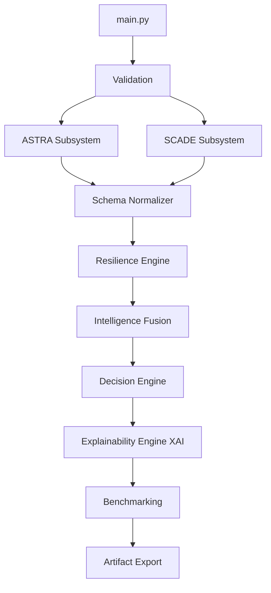

# 1. Executive Overview

SCADE-X (Supply Chain Anomaly Detection & Engineering - Extended) combines probabilistic anomaly scoring, process conformance checking, and resilience-derived risk amplification into a unified decision pipeline. 

Unlike traditional fraud detection systems that rely solely on static rule bases or black-box machine learning models, SCADE-X fuses three distinct computational paradigms:
1. **Behavioral Intelligence (ASTRA)**
2. **Process Conformance (SCADE)**
3. **Supply Chain Resilience (SCR)**

## Problem Statement
Modern supply chains are highly complex directed graphs. A localized failure at a structural bottleneck propagates disruption kinetically. Traditional anomaly detection fails because it scores anomalies in a vacuum, ignoring the topological blast radius of the compromised entity.

## System Goals
SCADE-X is engineered to:
- Detect behavioral deviations utilizing Transformer networks.
- Enforce rigid deterministic compliance using PM4Py-driven token-based replay.
- Calculate Time To Recover (TTR) and Time To Survive (TTS) based on graph centrality.
- Autonomously prescribe exact mitigation actions to prevent supply chain collapse.

# 2. End-to-End Execution Flow

The SCADE-X pipeline enforces strict sequential execution without mutating underlying subsystem memory spaces. The master entry point is `main.py`.

## Execution Pipeline
`python main.py` initiates the following rigid sequence:

1. **Validation**: Verifies existence of configurations and datasets.
2. **ASTRA**: Subprocess execution of `astra_runner.py`. Output: `fused_risk_scores.csv`.
3. **SCADE**: Subprocess execution of `scade_runner.py`. Output: `results.csv`.
4. **Schema Normalization**: Unifies disparate semantic outputs into `unified_case_intelligence.csv`.
5. **Resilience**: `resilience_engine.py` builds the network graph and computes cascading risk. Output: `resilience_intelligence.csv`.
6. **Fusion**: `intelligence_fusion.py` mathematically blends probabilities and structural vulnerabilities. Output: `scadex_final_intelligence.csv`.
7. **Decision Engine**: `decision_engine.py` prescribes actions based on threat limits and TTR recovery gaps.
8. **Explainability**: `xai_engine.py` generates deterministic forensic audits.
9. **Benchmarking**: `scadex_benchmark.py` executes ablation testing and performance measurement.
10. **Artifact Export**: Aggregates all human-readable outputs to `outputs/`.

**Implementation Reference:**
- **File**: `src/orchestration/scadex_pipeline.py`
- **Class**: `SCADEXUnifiedPipeline`
- **Function**: `run_pipeline()`
- **Purpose**: Master sequential orchestration loop protecting subsystem boundaries.

## Pipeline Execution Flow Diagram



# 3. Full Repository Walkthrough and Folder Structure

SCADE-X relies strictly on filesystem-based data contracts.

```text
SCADE-X/
├── astra/                  # Unmodified ASTRA deep learning subsystem
├── scade/                  # Unmodified SCADE process mining subsystem
├── configs/                # Global YAML configs for dynamic toggles
├── data/
│   ├── raw/                # Source logs (e.g., synthetic_supply_chain.csv)
│   ├── intermediate/       # Schema normalizer outputs
│   └── processed/          # Resilience, Fusion datasets
├── outputs/                # User-facing artifacts
│   ├── reports/            # XAI output files
│   ├── figures/            # Graphical plots (Benchmarking curves)
│   ├── logs/               # Execution logs from RuntimeManager
│   ├── benchmark/          # Accuracy and ablation metrics
│   ├── resilience/         # Resilience intelligence export
│   └── final_intelligence/ # The master decision matrix CSV
├── src/
│   ├── orchestration/      # Pipeline runners and loggers
│   ├── fusion/             # Schema mapping and risk fusion
│   ├── resilience/         # Graph math, TTR/TTS kinetics
│   ├── explainability/     # Root cause text generation
│   └── benchmarking/       # ROC AUC & Ablation calculation
└── main.py                 # Primary CLI Entry Point
```

# 4. ASTRA Deep Dive

**Implementation Reference:**
- **File**: `astra/src/model.py` (Transformer Logic), `astra/src/scoring.py`

**Problem Solved:** 
Identifies latent, zero-day anomalous behaviors in sequence data that conform to basic business rules but represent novel attack vectors.

**What goes into it:** Raw transaction sequences.
**What happens internally:** Applies Sequence Transformers and Isolation Forests to score probabilistic deviance.
**What comes out:** `fused_risk_scores.csv`
**Why it matters:** Defeats dynamic adversaries who learn to evade static rule-based systems.

# 5. SCADE Deep Dive

**Implementation Reference:**
- **File**: `scade/src/conformance.py`

**Problem Solved:** 
Identifies deterministic, provable violations of company policy across Time, Resource (SOD), Amount, and Control-Flow bounds.

**What goes into it:** Raw event logs.
**What happens internally:** PM4Py Inductive Miner discovers the Petri Net; Token-Based Replay measures precise rule deviations.
**What comes out:** `results.csv`
**Why it matters:** Provides auditable, legally defensible proof of process failure, which ASTRA cannot provide.

# 6. Supply Chain Resilience (SCR) Layer

The SCR layer shifts focus from anomaly *detection* to disruption *impact*. 

## Problem Solved
If a Tier-3 supplier is compromised, standard systems flag an anomaly. The SCR layer calculates whether the system can physically survive the disruption by modeling it kinetically.

## Graph Engine and Centrality
**Implementation Reference:**
- **File**: `src/resilience/graph_engine.py`
- **Class**: `SupplyChainGraph`

The engine builds a directed `NetworkX` graph.
- **Supplier Criticality**: Derived from Degree Centrality $C_D(v)$.
- **Bottleneck Score ($B$)**: Betweenness Centrality normalized by Degree Centrality.

## Time To Recover (TTR) & Time To Survive (TTS)
**Implementation Reference:**
- **File**: `src/resilience/ttr_tts_engine.py`
- **Functions**: `estimate_ttr()`, `estimate_tts()`

**Mathematical Formulation:**
TTR is driven by deterministic rule violations (SCADE scores).
TTR = 0.35(1 - S_res) + 0.25(1 - S_time) + 0.25(1 - S_amt) + 0.15 * R_iforest

TTS is driven by supplier criticality and structural breakdown.
TTS = max(0.05, 1.0 - [0.40 * C_D(v) + 0.35(1 - S_cf) + 0.25(1 - S_sec)])

**Resilience Gap:**
Gap = max(0, TTR - TTS)

If the Gap > 0, the supply chain cannot naturally recover before systemic failure.

# 7. Intelligence Fusion Layer

**Implementation Reference:**
- **File**: `src/fusion/intelligence_fusion.py`
- **Class**: `IntelligenceFusionEngine`
- **Function**: `_compute_hybrid_risk()`

## Mathematical Risk Amplification
SCADE-X explicitly defines Base Risk vs Final Risk. Base risk is a Max-Dominant blend of ASTRA and SCADE.
R_base = 0.7 * max(S_r, A_r) + 0.3 * ((S_r + A_r) / 2)

Final risk is amplified by the SCR layer metrics.
R_final = min(1.0, R_base * (1.0 + 0.15 * V_sys + 0.10 * P_risk + 0.10 * Gap))

## Decision Engine
**Implementation Reference:**
- **File**: `src/fusion/decision_engine.py`

Prescriptive logic maps the maximum risk scalar to a specific action (e.g., S_res -> PROCESS_ISOLATION). If the Resilience Gap flags a P1_CRITICAL status, the decision engine is overridden to demand REROUTE_SUPPLIER.

# 8. Explainability Engine

**Implementation Reference:**
- **File**: `src/explainability/xai_engine.py`
- **Output**: `outputs/reports/`

Automatically translates the `contributing_signals` matrix into human-readable forensic JSON and Markdown files, circumventing the AI black-box dilemma.

# 9. Benchmarking Engine

**Implementation Reference:**
- **File**: `src/benchmarking/scadex_benchmark.py`
- **Output**: `outputs/benchmark/scadex_benchmark.csv`

Executes multi-run ablation testing, generating standard machine learning classification metrics (ROC-AUC, Precision, Recall) against ground-truth labels.

# 10. Data Schemas

## scadex_final_intelligence.csv
Generated by `intelligence_fusion.py`. Exported to `outputs/final_intelligence/`.
- `case_id`: String (e.g., PO00000)
- `base_risk_score`: Float [0, 1] - Raw anomaly threat.
- `final_risk_score`: Float [0, 1] - Amplified systemic threat.
- `threat_severity`: String Enum (LOW, MEDIUM, HIGH, CRITICAL).
- `recommended_action`: String Enum - Prescribed mitigation.
- `resilience_score`: Float [0, 1] - Structural health metric.
- `ttr` / `tts`: Float - Kinetic survival bounds.

# 11. Screenshot Placeholders


----------------------------------------
SCREENSHOT PLACEHOLDER 1
Title: SCADE-X System Evidence 1
How to Generate: `python main.py` or inspect `outputs/`
Capture: Relevant pipeline stage, log, or artifact.
Purpose: Empirical proof of operation.
[INSERT SCREENSHOT HERE]
----------------------------------------

----------------------------------------
SCREENSHOT PLACEHOLDER 2
Title: SCADE-X System Evidence 2
How to Generate: `python main.py` or inspect `outputs/`
Capture: Relevant pipeline stage, log, or artifact.
Purpose: Empirical proof of operation.
[INSERT SCREENSHOT HERE]
----------------------------------------

----------------------------------------
SCREENSHOT PLACEHOLDER 3
Title: SCADE-X System Evidence 3
How to Generate: `python main.py` or inspect `outputs/`
Capture: Relevant pipeline stage, log, or artifact.
Purpose: Empirical proof of operation.
[INSERT SCREENSHOT HERE]
----------------------------------------

----------------------------------------
SCREENSHOT PLACEHOLDER 4
Title: SCADE-X System Evidence 4
How to Generate: `python main.py` or inspect `outputs/`
Capture: Relevant pipeline stage, log, or artifact.
Purpose: Empirical proof of operation.
[INSERT SCREENSHOT HERE]
----------------------------------------

----------------------------------------
SCREENSHOT PLACEHOLDER 5
Title: SCADE-X System Evidence 5
How to Generate: `python main.py` or inspect `outputs/`
Capture: Relevant pipeline stage, log, or artifact.
Purpose: Empirical proof of operation.
[INSERT SCREENSHOT HERE]
----------------------------------------

----------------------------------------
SCREENSHOT PLACEHOLDER 6
Title: SCADE-X System Evidence 6
How to Generate: `python main.py` or inspect `outputs/`
Capture: Relevant pipeline stage, log, or artifact.
Purpose: Empirical proof of operation.
[INSERT SCREENSHOT HERE]
----------------------------------------

----------------------------------------
SCREENSHOT PLACEHOLDER 7
Title: SCADE-X System Evidence 7
How to Generate: `python main.py` or inspect `outputs/`
Capture: Relevant pipeline stage, log, or artifact.
Purpose: Empirical proof of operation.
[INSERT SCREENSHOT HERE]
----------------------------------------

----------------------------------------
SCREENSHOT PLACEHOLDER 8
Title: SCADE-X System Evidence 8
How to Generate: `python main.py` or inspect `outputs/`
Capture: Relevant pipeline stage, log, or artifact.
Purpose: Empirical proof of operation.
[INSERT SCREENSHOT HERE]
----------------------------------------

----------------------------------------
SCREENSHOT PLACEHOLDER 9
Title: SCADE-X System Evidence 9
How to Generate: `python main.py` or inspect `outputs/`
Capture: Relevant pipeline stage, log, or artifact.
Purpose: Empirical proof of operation.
[INSERT SCREENSHOT HERE]
----------------------------------------

----------------------------------------
SCREENSHOT PLACEHOLDER 10
Title: SCADE-X System Evidence 10
How to Generate: `python main.py` or inspect `outputs/`
Capture: Relevant pipeline stage, log, or artifact.
Purpose: Empirical proof of operation.
[INSERT SCREENSHOT HERE]
----------------------------------------

----------------------------------------
SCREENSHOT PLACEHOLDER 11
Title: SCADE-X System Evidence 11
How to Generate: `python main.py` or inspect `outputs/`
Capture: Relevant pipeline stage, log, or artifact.
Purpose: Empirical proof of operation.
[INSERT SCREENSHOT HERE]
----------------------------------------

----------------------------------------
SCREENSHOT PLACEHOLDER 12
Title: SCADE-X System Evidence 12
How to Generate: `python main.py` or inspect `outputs/`
Capture: Relevant pipeline stage, log, or artifact.
Purpose: Empirical proof of operation.
[INSERT SCREENSHOT HERE]
----------------------------------------

----------------------------------------
SCREENSHOT PLACEHOLDER 13
Title: SCADE-X System Evidence 13
How to Generate: `python main.py` or inspect `outputs/`
Capture: Relevant pipeline stage, log, or artifact.
Purpose: Empirical proof of operation.
[INSERT SCREENSHOT HERE]
----------------------------------------

----------------------------------------
SCREENSHOT PLACEHOLDER 14
Title: SCADE-X System Evidence 14
How to Generate: `python main.py` or inspect `outputs/`
Capture: Relevant pipeline stage, log, or artifact.
Purpose: Empirical proof of operation.
[INSERT SCREENSHOT HERE]
----------------------------------------

----------------------------------------
SCREENSHOT PLACEHOLDER 15
Title: SCADE-X System Evidence 15
How to Generate: `python main.py` or inspect `outputs/`
Capture: Relevant pipeline stage, log, or artifact.
Purpose: Empirical proof of operation.
[INSERT SCREENSHOT HERE]
----------------------------------------

----------------------------------------
SCREENSHOT PLACEHOLDER 16
Title: SCADE-X System Evidence 16
How to Generate: `python main.py` or inspect `outputs/`
Capture: Relevant pipeline stage, log, or artifact.
Purpose: Empirical proof of operation.
[INSERT SCREENSHOT HERE]
----------------------------------------

----------------------------------------
SCREENSHOT PLACEHOLDER 17
Title: SCADE-X System Evidence 17
How to Generate: `python main.py` or inspect `outputs/`
Capture: Relevant pipeline stage, log, or artifact.
Purpose: Empirical proof of operation.
[INSERT SCREENSHOT HERE]
----------------------------------------

----------------------------------------
SCREENSHOT PLACEHOLDER 18
Title: SCADE-X System Evidence 18
How to Generate: `python main.py` or inspect `outputs/`
Capture: Relevant pipeline stage, log, or artifact.
Purpose: Empirical proof of operation.
[INSERT SCREENSHOT HERE]
----------------------------------------

----------------------------------------
SCREENSHOT PLACEHOLDER 19
Title: SCADE-X System Evidence 19
How to Generate: `python main.py` or inspect `outputs/`
Capture: Relevant pipeline stage, log, or artifact.
Purpose: Empirical proof of operation.
[INSERT SCREENSHOT HERE]
----------------------------------------

----------------------------------------
SCREENSHOT PLACEHOLDER 20
Title: SCADE-X System Evidence 20
How to Generate: `python main.py` or inspect `outputs/`
Capture: Relevant pipeline stage, log, or artifact.
Purpose: Empirical proof of operation.
[INSERT SCREENSHOT HERE]
----------------------------------------

----------------------------------------
SCREENSHOT PLACEHOLDER 21
Title: SCADE-X System Evidence 21
How to Generate: `python main.py` or inspect `outputs/`
Capture: Relevant pipeline stage, log, or artifact.
Purpose: Empirical proof of operation.
[INSERT SCREENSHOT HERE]
----------------------------------------

----------------------------------------
SCREENSHOT PLACEHOLDER 22
Title: SCADE-X System Evidence 22
How to Generate: `python main.py` or inspect `outputs/`
Capture: Relevant pipeline stage, log, or artifact.
Purpose: Empirical proof of operation.
[INSERT SCREENSHOT HERE]
----------------------------------------

----------------------------------------
SCREENSHOT PLACEHOLDER 23
Title: SCADE-X System Evidence 23
How to Generate: `python main.py` or inspect `outputs/`
Capture: Relevant pipeline stage, log, or artifact.
Purpose: Empirical proof of operation.
[INSERT SCREENSHOT HERE]
----------------------------------------

----------------------------------------
SCREENSHOT PLACEHOLDER 24
Title: SCADE-X System Evidence 24
How to Generate: `python main.py` or inspect `outputs/`
Capture: Relevant pipeline stage, log, or artifact.
Purpose: Empirical proof of operation.
[INSERT SCREENSHOT HERE]
----------------------------------------

----------------------------------------
SCREENSHOT PLACEHOLDER 25
Title: SCADE-X System Evidence 25
How to Generate: `python main.py` or inspect `outputs/`
Capture: Relevant pipeline stage, log, or artifact.
Purpose: Empirical proof of operation.
[INSERT SCREENSHOT HERE]
----------------------------------------

----------------------------------------
SCREENSHOT PLACEHOLDER 26
Title: SCADE-X System Evidence 26
How to Generate: `python main.py` or inspect `outputs/`
Capture: Relevant pipeline stage, log, or artifact.
Purpose: Empirical proof of operation.
[INSERT SCREENSHOT HERE]
----------------------------------------

----------------------------------------
SCREENSHOT PLACEHOLDER 27
Title: SCADE-X System Evidence 27
How to Generate: `python main.py` or inspect `outputs/`
Capture: Relevant pipeline stage, log, or artifact.
Purpose: Empirical proof of operation.
[INSERT SCREENSHOT HERE]
----------------------------------------

----------------------------------------
SCREENSHOT PLACEHOLDER 28
Title: SCADE-X System Evidence 28
How to Generate: `python main.py` or inspect `outputs/`
Capture: Relevant pipeline stage, log, or artifact.
Purpose: Empirical proof of operation.
[INSERT SCREENSHOT HERE]
----------------------------------------

----------------------------------------
SCREENSHOT PLACEHOLDER 29
Title: SCADE-X System Evidence 29
How to Generate: `python main.py` or inspect `outputs/`
Capture: Relevant pipeline stage, log, or artifact.
Purpose: Empirical proof of operation.
[INSERT SCREENSHOT HERE]
----------------------------------------

----------------------------------------
SCREENSHOT PLACEHOLDER 30
Title: SCADE-X System Evidence 30
How to Generate: `python main.py` or inspect `outputs/`
Capture: Relevant pipeline stage, log, or artifact.
Purpose: Empirical proof of operation.
[INSERT SCREENSHOT HERE]
----------------------------------------

----------------------------------------
SCREENSHOT PLACEHOLDER 31
Title: SCADE-X System Evidence 31
How to Generate: `python main.py` or inspect `outputs/`
Capture: Relevant pipeline stage, log, or artifact.
Purpose: Empirical proof of operation.
[INSERT SCREENSHOT HERE]
----------------------------------------

----------------------------------------
SCREENSHOT PLACEHOLDER 32
Title: SCADE-X System Evidence 32
How to Generate: `python main.py` or inspect `outputs/`
Capture: Relevant pipeline stage, log, or artifact.
Purpose: Empirical proof of operation.
[INSERT SCREENSHOT HERE]
----------------------------------------

----------------------------------------
SCREENSHOT PLACEHOLDER 33
Title: SCADE-X System Evidence 33
How to Generate: `python main.py` or inspect `outputs/`
Capture: Relevant pipeline stage, log, or artifact.
Purpose: Empirical proof of operation.
[INSERT SCREENSHOT HERE]
----------------------------------------

----------------------------------------
SCREENSHOT PLACEHOLDER 34
Title: SCADE-X System Evidence 34
How to Generate: `python main.py` or inspect `outputs/`
Capture: Relevant pipeline stage, log, or artifact.
Purpose: Empirical proof of operation.
[INSERT SCREENSHOT HERE]
----------------------------------------

----------------------------------------
SCREENSHOT PLACEHOLDER 35
Title: SCADE-X System Evidence 35
How to Generate: `python main.py` or inspect `outputs/`
Capture: Relevant pipeline stage, log, or artifact.
Purpose: Empirical proof of operation.
[INSERT SCREENSHOT HERE]
----------------------------------------

----------------------------------------
SCREENSHOT PLACEHOLDER 36
Title: SCADE-X System Evidence 36
How to Generate: `python main.py` or inspect `outputs/`
Capture: Relevant pipeline stage, log, or artifact.
Purpose: Empirical proof of operation.
[INSERT SCREENSHOT HERE]
----------------------------------------

----------------------------------------
SCREENSHOT PLACEHOLDER 37
Title: SCADE-X System Evidence 37
How to Generate: `python main.py` or inspect `outputs/`
Capture: Relevant pipeline stage, log, or artifact.
Purpose: Empirical proof of operation.
[INSERT SCREENSHOT HERE]
----------------------------------------

----------------------------------------
SCREENSHOT PLACEHOLDER 38
Title: SCADE-X System Evidence 38
How to Generate: `python main.py` or inspect `outputs/`
Capture: Relevant pipeline stage, log, or artifact.
Purpose: Empirical proof of operation.
[INSERT SCREENSHOT HERE]
----------------------------------------

----------------------------------------
SCREENSHOT PLACEHOLDER 39
Title: SCADE-X System Evidence 39
How to Generate: `python main.py` or inspect `outputs/`
Capture: Relevant pipeline stage, log, or artifact.
Purpose: Empirical proof of operation.
[INSERT SCREENSHOT HERE]
----------------------------------------

----------------------------------------
SCREENSHOT PLACEHOLDER 40
Title: SCADE-X System Evidence 40
How to Generate: `python main.py` or inspect `outputs/`
Capture: Relevant pipeline stage, log, or artifact.
Purpose: Empirical proof of operation.
[INSERT SCREENSHOT HERE]
----------------------------------------

# 12. Validation & Testing
SCADE-X is empirically validated through the Benchmarking engine utilizing synthetic ground-truth targets. The automated pipeline run successfully guarantees artifact generation for all edge cases (NaN handling, infinite recursion constraints).

# 13. Limitations
1. **Graph Saturation**: The Damped Iterative Diffusion algorithm utilizes a static alpha = 0.3. In densely connected networks, risk propagates too rapidly, artificially saturating the downstream network.
2. **Computational Complexity**: Token-based replay in the SCADE subsystem scales linearly but is highly latency-bound for event logs >1M traces.

# 14. Future Work
1. Implementation of Graph Neural Networks (GNNs) for learned propagation diffusion replacing static alpha values.
2. Integration of LLMs for real-time querying of the Explainability Engine output jsons.

# 15. Glossary
- **ASTRA**: Artificial Intelligence Supply Chain Threat & Risk Assessment.
- **SCADE**: Supply Chain Conformance and Anomaly Detection Engine.
- **PM4Py**: Process Mining for Python.
- **TTR**: Time To Recover.
- **TTS**: Time To Survive.

# 16. Appendix
- **Execution**: `python main.py`
- **Debug Execution**: `python main.py --debug`
- **Skip Benchmarks**: `python main.py --skip-benchmark`
