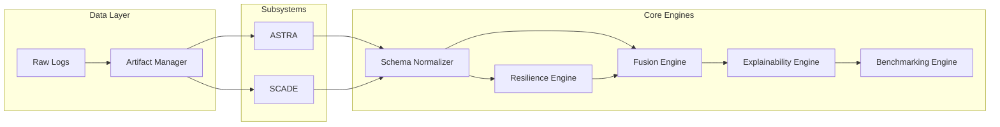

# SCADE-X System Architecture

## 1. Architectural Philosophy
SCADE-X is designed with an "Outside-In" Orchestration pattern. Rather than rewriting the independent logic of ASTRA (Latent Behavioral Modeling) and SCADE (Deterministic Conformance Modeling), SCADE-X treats them as immutable microservices.

## 2. Component Architecture



## 3. The Orchestration Layer (`src/orchestration/`)
The beating heart of SCADE-X is the orchestration wrapper.
- **`scadex_pipeline.py`**: The master loop.
- **`config_manager.py`**: Ingests `configs/scadex_config.yaml` to dynamically toggle subsystems.
- **`astra_runner.py` / `scade_runner.py`**: Employs `subprocess.run(cwd=...)` to sandbox subsystem execution. This guarantees zero `sys.path` collision between ASTRA's `src` and SCADE's `src`.
- **`runtime_manager.py`**: Tracks stage completion, durations, and state.

## 4. Data Contracts
SCADE-X relies strictly on filesystem-based data contracts.
1. **ASTRA Contract**: Must produce `fused_risk_scores.csv` alongside intermediate topological and statistical outputs.
2. **SCADE Contract**: Must produce `results.csv` containing cross-perspective conformance bounds.
3. **Canonical Contract**: `unified_case_intelligence.csv` acts as the universal adapter, aligning `case_id` via an outer join and enforcing strict $[0, 1]$ bounding.

## 5. Folder Structure
```text
SCADE-X/
├── astra/                  # Unmodified subsystem
├── scade/                  # Unmodified subsystem
├── configs/                # Global YAML configs
├── data/
│   ├── raw/                # Input logs
│   ├── intermediate/       # Schema normalizer outputs
│   └── processed/          # Resilience, Fusion, Benchmarking datasets
├── outputs/                # User-facing artifacts (Logs, Figures, Reports)
├── src/
│   ├── orchestration/      # Pipeline management & Runners
│   ├── fusion/             # Schema mapping & Decision making
│   ├── resilience/         # Disruption propagation math
│   ├── explainability/     # Root cause text generation
│   └── benchmarking/       # ROC AUC & Ablation calculation
└── main.py                 # CLI Entry point
```
