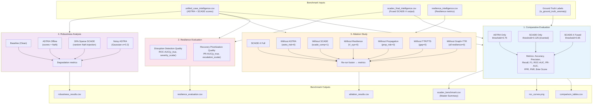

i wa# Benchmarking Evaluation Pipeline

```mermaid
flowchart TB
    subgraph Inputs["Benchmark Inputs"]
        INTEL["unified_case_intelligence.csv<br/>(ASTRA + SCADE scores)"]
        FINAL["scadex_final_intelligence.csv<br/>(Fused SCADE-X output)"]
        RESIL["resilience_intelligence.csv<br/>(Resilience metrics)"]
        GT["Ground Truth Labels<br/>(is_ground_truth_anomaly)"]
    end

    subgraph Comparison["1. Comparative Evaluation"]
        direction TB
        CMP_A["ASTRA Only<br/>threshold=0.75"]
        CMP_S["SCADE Only<br/>threshold=0.125 (inverted)"]
        CMP_X["SCADE-X Fused<br/>threshold=0.65"]
        CMP_M["Metrics: Accuracy, Precision,<br/>Recall, F1, ROC-AUC, PR-AUC,<br/>FPR, FNR, Brier Score"]
        CMP_A --> CMP_M
        CMP_S --> CMP_M
        CMP_X --> CMP_M
    end

    subgraph Resilience_Eval["2. Resilience Evaluation"]
        direction TB
        DDQ["Disruption Detection Quality<br/>ROC-AUC(y_true, severity_scalar)"]
        RPQ["Recovery Prioritization Quality<br/>PR-AUC(y_true, escalation_scalar)"]
    end

    subgraph Ablation["3. Ablation Study"]
        direction TB
        AB_FULL["SCADE-X Full"]
        AB_NO_A["Without ASTRA<br/>(astra_risk=0)"]
        AB_NO_S["Without SCADE<br/>(scade_comp=1)"]
        AB_NO_R["Without Resilience<br/>(V_sys=0)"]
        AB_NO_P["Without Propagation<br/>(prop_risk=0)"]
        AB_NO_T["Without TTR/TTS<br/>(gap=0)"]
        AB_NO_ALL["Without Graph+TTR<br/>(all resilience=0)"]
        AB_RE["Re-run fusion → metrics"]
        AB_FULL --> AB_RE
        AB_NO_A --> AB_RE
        AB_NO_S --> AB_RE
        AB_NO_R --> AB_RE
        AB_NO_P --> AB_RE
        AB_NO_T --> AB_RE
        AB_NO_ALL --> AB_RE
    end

    subgraph Robustness["4. Robustness Analysis"]
        direction TB
        RB_BASE["Baseline (Clean)"]
        RB_ASTRA["ASTRA Offline<br/>(scores = NaN)"]
        RB_SPARSE["30% Sparse SCADE<br/>(random NaN injection)"]
        RB_NOISE["Noisy ASTRA<br/>(Gaussian σ=0.2)"]
        RB_M["Degradation metrics"]
        RB_BASE --> RB_M
        RB_ASTRA --> RB_M
        RB_SPARSE --> RB_M
        RB_NOISE --> RB_M
    end

    subgraph Outputs["Benchmark Outputs"]
        OUT1["comparison_tables.csv"]
        OUT2["resilience_evaluation.csv"]
        OUT3["ablation_results.csv"]
        OUT4["robustness_results.csv"]
        OUT5["roc_curves.png"]
        OUT6["scadex_benchmark.csv<br/>(Master Summary)"]
    end

    INTEL --> Comparison
    FINAL --> Comparison
    GT --> Comparison
    INTEL --> Resilience_Eval
    FINAL --> Resilience_Eval
    INTEL --> Ablation
    RESIL --> Ablation
    INTEL --> Robustness

    Comparison --> OUT1
    Comparison --> OUT5
    Resilience_Eval --> OUT2
    Ablation --> OUT3
    Robustness --> OUT4
    Comparison --> OUT6

    style Comparison fill:#e8f4fd
    style Resilience_Eval fill:#fce4ec
    style Ablation fill:#fff3e0
    style Robustness fill:#f3e5f5
```
