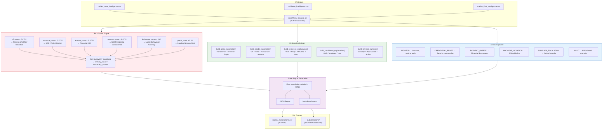

# Explainability (XAI) Workflow

```mermaid
flowchart TB
    subgraph Inputs["XAI Inputs"]
        IN1["unified_case_intelligence.csv"]
        IN2["resilience_intelligence.csv"]
        IN3["scadex_final_intelligence.csv"]
        MERGE["Inner Merge on case_id<br/>(all three datasets)"]
        IN1 --> MERGE
        IN2 --> MERGE
        IN3 --> MERGE
    end

    subgraph RootCause["Root Cause Engine"]
        direction TB
        RC_CF["cf_score < 0.875?<br/>→ Process Workflow Deviation"]
        RC_RE["resource_score < 0.875?<br/>→ SOD / Role Violation"]
        RC_AM["amount_score < 0.875?<br/>→ Financial Drift"]
        RC_SE["security_score < 0.875?<br/>→ SIEM Credential Compromise"]
        RC_BH["behavioral_score > 0.8?<br/>→ Latent Behavioral Anomaly"]
        RC_GR["graph_score > 0.8?<br/>→ Supplier Network Risk"]
        RC_SORT["Sort by severity magnitude<br/>→ primary_cause + secondary_causes"]
        RC_CF --> RC_SORT
        RC_RE --> RC_SORT
        RC_AM --> RC_SORT
        RC_SE --> RC_SORT
        RC_BH --> RC_SORT
        RC_GR --> RC_SORT
    end

    subgraph ExplBuilder["Explanation Builder"]
        direction TB
        EB_A["build_astra_explanation()<br/>Transformer + IForest + Graph"]
        EB_S["build_scade_explanation()<br/>CF + Time + Resource + Amount"]
        EB_R["build_resilience_explanation()<br/>Vuln + Prop + TTR/TTS + Gap"]
        EB_C["build_confidence_explanation()<br/>High / Moderate / Low"]
        EB_F["build_forensic_summary()<br/>Severity + Root Cause + Action"]
    end

    subgraph ActionEngine["Action Explainer"]
        direction TB
        AE_MON["MONITOR → Low risk, routine audit"]
        AE_CRD["CREDENTIAL_RESET → Security compromise"]
        AE_PAY["PAYMENT_FREEZE → Financial discrepancy"]
        AE_PRO["PROCESS_ISOLATION → SOD violation"]
        AE_SUP["SUPPLIER_ESCALATION → Critical supplier"]
        AE_AUD["AUDIT → Multi-domain anomaly"]
    end

    subgraph Reports["Case Report Generation"]
        direction TB
        RPT_FILTER["Filter: escalation_priority != NONE"]
        RPT_JSON["JSON Report"]
        RPT_MD["Markdown Report"]
        RPT_FILTER --> RPT_JSON
        RPT_FILTER --> RPT_MD
    end

    subgraph Outputs["XAI Outputs"]
        OUT_CSV["scadex_explanations.csv<br/>(all cases)"]
        OUT_RPT["outputs/reports/<br/>(escalated cases only)"]
    end

    MERGE --> RootCause
    MERGE --> ExplBuilder
    MERGE --> ActionEngine

    RootCause --> Reports
    ExplBuilder --> Reports
    ActionEngine --> Reports

    Reports --> OUT_CSV
    Reports --> OUT_RPT

    style RootCause fill:#ffebee,stroke:#c62828
    style ExplBuilder fill:#e8f5e9,stroke:#2e7d32
    style ActionEngine fill:#e3f2fd,stroke:#1565c0
    style Reports fill:#f3e5f5,stroke:#6a1b9a
```
