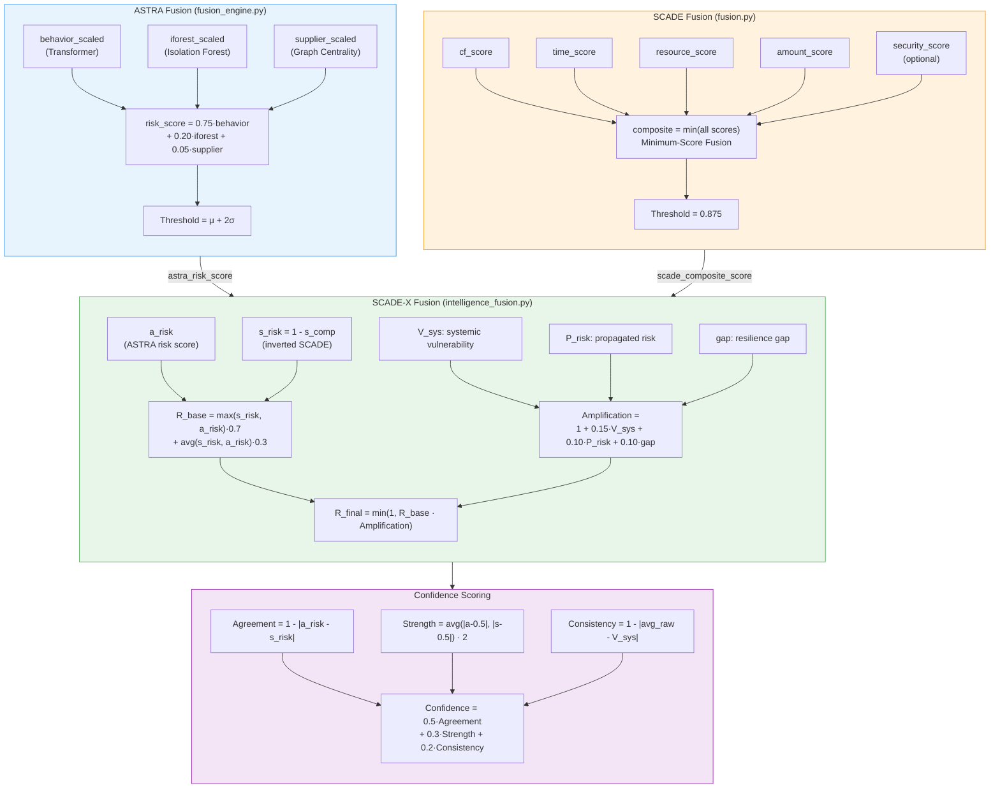

# Fusion Strategy Comparison

```mermaid
flowchart TB
    subgraph ASTRA_Fusion["ASTRA Fusion (fusion_engine.py)"]
        direction TB
        AF_B["behavior_scaled<br/>(Transformer)"]
        AF_I["iforest_scaled<br/>(Isolation Forest)"]
        AF_S["supplier_scaled<br/>(Graph Centrality)"]
        AF_W["risk_score = 0.75·behavior<br/>+ 0.20·iforest + 0.05·supplier"]
        AF_T["Threshold = μ + 2σ"]
        AF_B --> AF_W
        AF_I --> AF_W
        AF_S --> AF_W
        AF_W --> AF_T
    end

    subgraph SCADE_Fusion["SCADE Fusion (fusion.py)"]
        direction TB
        SF_CF["cf_score"]
        SF_TI["time_score"]
        SF_RE["resource_score"]
        SF_AM["amount_score"]
        SF_SE["security_score<br/>(optional)"]
        SF_MIN["composite = min(all scores)<br/>Minimum-Score Fusion"]
        SF_TH["Threshold = 0.875"]
        SF_CF --> SF_MIN
        SF_TI --> SF_MIN
        SF_RE --> SF_MIN
        SF_AM --> SF_MIN
        SF_SE --> SF_MIN
        SF_MIN --> SF_TH
    end

    subgraph SCADEX_Fusion["SCADE-X Fusion (intelligence_fusion.py)"]
        direction TB
        XF_AR["a_risk<br/>(ASTRA risk score)"]
        XF_SC["s_risk = 1 - s_comp<br/>(inverted SCADE)"]
        XF_BASE["R_base = max(s_risk, a_risk)·0.7<br/>+ avg(s_risk, a_risk)·0.3"]
        XF_AMP["Amplification =<br/>1 + 0.15·V_sys + 0.10·P_risk + 0.10·gap"]
        XF_FINAL["R_final = min(1, R_base · Amplification)"]

        XF_RV["V_sys: systemic vulnerability"]
        XF_PR["P_risk: propagated risk"]
        XF_GAP["gap: resilience gap"]

        XF_AR --> XF_BASE
        XF_SC --> XF_BASE
        XF_BASE --> XF_FINAL
        XF_AMP --> XF_FINAL
        XF_RV --> XF_AMP
        XF_PR --> XF_AMP
        XF_GAP --> XF_AMP
    end

    subgraph Confidence["Confidence Scoring"]
        direction TB
        C_AGR["Agreement = 1 - |a_risk - s_risk|"]
        C_STR["Strength = avg(|a-0.5|, |s-0.5|) · 2"]
        C_CON["Consistency = 1 - |avg_raw - V_sys|"]
        C_FIN["Confidence = 0.5·Agreement<br/>+ 0.3·Strength + 0.2·Consistency"]
        C_AGR --> C_FIN
        C_STR --> C_FIN
        C_CON --> C_FIN
    end

    ASTRA_Fusion -->|"astra_risk_score"| SCADEX_Fusion
    SCADE_Fusion -->|"scade_composite_score"| SCADEX_Fusion
    SCADEX_Fusion --> Confidence

    style ASTRA_Fusion fill:#e8f4fd,stroke:#2196f3
    style SCADE_Fusion fill:#fff3e0,stroke:#ff9800
    style SCADEX_Fusion fill:#e8f5e9,stroke:#4caf50
    style Confidence fill:#f3e5f5,stroke:#9c27b0
```
