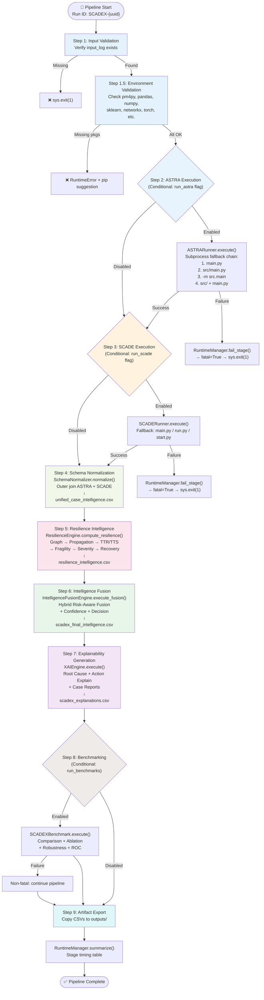

# SCADE-X End-to-End Pipeline Flow

```mermaid
flowchart TD
    START(["🚀 Pipeline Start<br/>Run ID: SCADEX-{uuid}"]) --> S1

    S1["Step 1: Input Validation<br/>Verify input_log exists"]
    S1 -->|Missing| ABORT1["❌ sys.exit(1)"]
    S1 -->|Found| S1_5

    S1_5["Step 1.5: Environment Validation<br/>Check pm4py, pandas, numpy,<br/>sklearn, networkx, torch, etc."]
    S1_5 -->|Missing pkgs| ABORT2["❌ RuntimeError + pip suggestion"]
    S1_5 -->|All OK| S2

    S2{"Step 2: ASTRA Execution<br/>(Conditional: run_astra flag)"}
    S2 -->|Enabled| S2A["ASTRARunner.execute()<br/>Subprocess fallback chain:<br/>1. main.py<br/>2. src/main.py<br/>3. -m src.main<br/>4. src/ + main.py"]
    S2A -->|Success| S3
    S2A -->|Failure| S2F["RuntimeManager.fail_stage()<br/>→ fatal=True → sys.exit(1)"]
    S2 -->|Disabled| S3

    S3{"Step 3: SCADE Execution<br/>(Conditional: run_scade flag)"}
    S3 -->|Enabled| S3A["SCADERunner.execute()<br/>Fallback: main.py / run.py / start.py"]
    S3A -->|Success| S4
    S3A -->|Failure| S3F["RuntimeManager.fail_stage()<br/>→ fatal=True → sys.exit(1)"]
    S3 -->|Disabled| S4

    S4["Step 4: Schema Normalization<br/>SchemaNormalizer.normalize()<br/>Outer join ASTRA + SCADE<br/>↓<br/>unified_case_intelligence.csv"]
    S4 --> S5

    S5["Step 5: Resilience Intelligence<br/>ResilienceEngine.compute_resilience()<br/>Graph → Propagation → TTR/TTS<br/>→ Fragility → Severity → Recovery<br/>↓<br/>resilience_intelligence.csv"]
    S5 --> S6

    S6["Step 6: Intelligence Fusion<br/>IntelligenceFusionEngine.execute_fusion()<br/>Hybrid Risk-Aware Fusion<br/>+ Confidence + Decision<br/>↓<br/>scadex_final_intelligence.csv"]
    S6 --> S7

    S7["Step 7: Explainability Generation<br/>XAIEngine.execute()<br/>Root Cause + Action Explain<br/>+ Case Reports<br/>↓<br/>scadex_explanations.csv"]
    S7 --> S8

    S8{"Step 8: Benchmarking<br/>(Conditional: run_benchmarks)"}
    S8 -->|Enabled| S8A["SCADEXBenchmark.execute()<br/>Comparison + Ablation<br/>+ Robustness + ROC"]
    S8A -->|Failure| S8R["Non-fatal: continue pipeline"]
    S8 -->|Disabled| S9
    S8A --> S9
    S8R --> S9

    S9["Step 9: Artifact Export<br/>Copy CSVs to outputs/"]
    S9 --> S10

    S10["RuntimeManager.summarize()<br/>Stage timing table"]
    S10 --> DONE(["✅ Pipeline Complete"])

    style S1 fill:#e3f2fd
    style S1_5 fill:#e3f2fd
    style S2 fill:#e8f4fd
    style S3 fill:#fff3e0
    style S4 fill:#f1f8e9
    style S5 fill:#fce4ec
    style S6 fill:#e8f5e9
    style S7 fill:#f3e5f5
    style S8 fill:#efebe9
    style S9 fill:#e0f7fa
```
