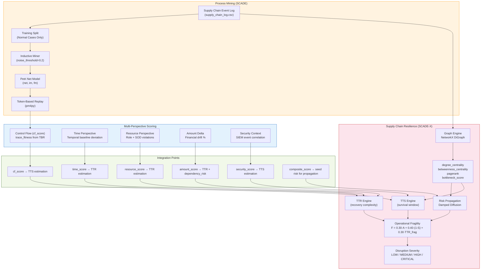

# Process Mining + Supply Chain Resilience Interaction

```mermaid
flowchart TB
    subgraph PM["Process Mining (SCADE)"]
        direction TB
        LOG["Supply Chain Event Log<br/>(supply_chain_log.csv)"]
        TRAIN["Training Split<br/>(Normal Cases Only)"]
        IM["Inductive Miner<br/>(noise_threshold=0.2)"]
        PETRI["Petri Net Model<br/>(net, im, fm)"]
        TBR["Token-Based Replay<br/>(pm4py)"]

        LOG --> TRAIN
        TRAIN --> IM
        IM --> PETRI
        PETRI --> TBR
    end

    subgraph Perspectives["Multi-Perspective Scoring"]
        direction TB
        CF["Control Flow (cf_score)<br/>trace_fitness from TBR"]
        TI["Time Perspective<br/>Temporal baseline deviation"]
        RE["Resource Perspective<br/>Role + SOD violations"]
        AM["Amount Delta<br/>Financial drift %"]
        SE["Security Context<br/>SIEM event correlation"]
    end

    subgraph SCR["Supply Chain Resilience (SCADE-X)"]
        direction TB
        GE["Graph Engine<br/>NetworkX DiGraph"]
        METRICS["degree_centrality<br/>betweenness_centrality<br/>pagerank<br/>bottleneck_score"]
        PROP["Risk Propagation<br/>Damped Diffusion"]
        TTR_E["TTR Engine<br/>(recovery complexity)"]
        TTS_E["TTS Engine<br/>(survival window)"]
        FRAG["Operational Fragility<br/>F = 0.30·A + 0.40·(1-S) + 0.30·TTR_frag"]
        SEV["Disruption Severity<br/>LOW / MEDIUM / HIGH / CRITICAL"]
    end

    subgraph Integration["Integration Points"]
        direction TB
        I1["cf_score → TTS estimation"]
        I2["security_score → TTS estimation"]
        I3["resource_score → TTR estimation"]
        I4["time_score → TTR estimation"]
        I5["amount_score → TTR + dependency_risk"]
        I6["composite_score → seed risk for propagation"]
    end

    LOG --> GE

    TBR --> CF
    CF --> I1
    SE --> I2
    RE --> I3
    TI --> I4
    AM --> I5

    I1 --> TTS_E
    I2 --> TTS_E
    I3 --> TTR_E
    I4 --> TTR_E
    I5 --> TTR_E

    GE --> METRICS
    METRICS --> PROP
    METRICS --> TTS_E
    PROP --> FRAG
    TTR_E --> FRAG
    TTS_E --> FRAG
    FRAG --> SEV
    I6 --> PROP

    style PM fill:#fff3e0,stroke:#ff9800
    style Perspectives fill:#e3f2fd,stroke:#1565c0
    style SCR fill:#fce4ec,stroke:#c62828
    style Integration fill:#f1f8e9,stroke:#33691e
```
