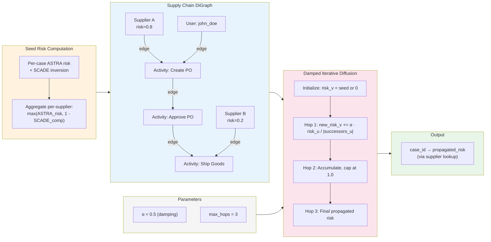

# Cascading Risk Propagation

## Mathematical Formulation

The propagation follows damped iterative diffusion over a directed graph $G = (V, E)$:

**Per-hop update:**

$$\text{new\_risk}(v) = \sum_{u \in \text{predecessors}(v)} \frac{\alpha \cdot \text{risk}(u)}{|\text{successors}(u)|}$$

**Accumulation with cap:**

$$\text{risk}(v) \leftarrow \min\left(1.0, \; \text{risk}(v) + \text{new\_risk}(v)\right)$$

where $\alpha = 0.5$ and the process runs for $k = 3$ hops.
