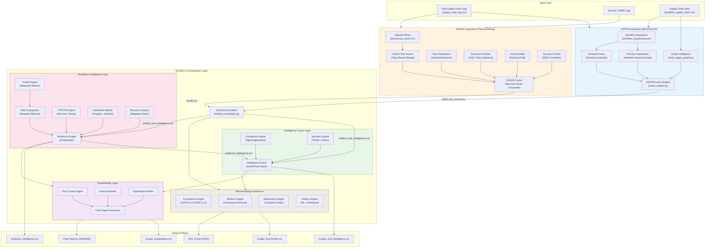

# SCADE-X System Architecture

```mermaid
graph TB
    subgraph Input["Input Layer"]
        RAW["Raw Supply Chain Logs<br/>(supply_chain_log.csv)"]
        SEC["Security / SIEM Logs"]
        SC["Supply Chain Data<br/>(synthetic_supply_chain.csv)"]
    end

    subgraph ASTRA["ASTRA Subsystem (Behavioral AI)"]
        direction TB
        A1["Workflow Sequencer<br/>(workflow_sequences.json)"]
        A2["Process Transformer<br/>(Attention-based Anomaly)"]
        A3["Isolation Forest<br/>(Statistical Anomaly)"]
        A4["Graph Intelligence<br/>(build_supply_graph.py)"]
        A5["ASTRA Fusion Engine<br/>(fusion_engine.py)"]
        A1 --> A2
        A1 --> A3
        SC --> A4
        A2 --> A5
        A3 --> A5
        A4 --> A5
    end

    subgraph SCADE["SCADE Subsystem (Process Mining)"]
        direction TB
        S0["Inductive Miner<br/>(discover.py, noise=0.2)"]
        S1["Control Flow Scorer<br/>(Token-Based Replay)"]
        S2["Time Perspective<br/>(Temporal Baseline)"]
        S3["Resource Checker<br/>(SOD / Role Violations)"]
        S4["Amount Delta<br/>(Financial Drift)"]
        S5["Security Context<br/>(SIEM Correlation)"]
        S6["SCADE Fusion<br/>(Minimum-Score Composite)"]
        S0 --> S1
        S2 --> S6
        S1 --> S6
        S3 --> S6
        S4 --> S6
        S5 --> S6
    end

    subgraph SCADEX["SCADE-X Orchestration Layer"]
        direction TB
        N["Schema Normalizer<br/>(schema_normalizer.py)"]
        
        subgraph Resilience["Resilience Intelligence Layer"]
            direction TB
            G["Graph Engine<br/>(NetworkX Metrics)"]
            P["Risk Propagation<br/>(Damped Diffusion)"]
            T["TTR/TTS Engine<br/>(Recovery Timing)"]
            M["Resilience Models<br/>(Fragility + Severity)"]
            REC["Recovery Analysis<br/>(Mitigation Rules)"]
            RE["Resilience Engine<br/>(Orchestrator)"]
            G --> P
            P --> RE
            T --> RE
            M --> RE
            REC --> RE
        end

        subgraph Fusion["Intelligence Fusion Layer"]
            direction TB
            CE["Confidence Engine<br/>(Signal Agreement)"]
            DE["Decision Engine<br/>(Threat + Action)"]
            IF["Intelligence Fusion<br/>(Hybrid Risk-Aware)"]
            CE --> IF
            DE --> IF
        end

        subgraph XAI["Explainability Layer"]
            direction TB
            RC["Root Cause Engine"]
            AE["Action Explainer"]
            EB["Explanation Builder"]
            CRG["Case Report Generator"]
            RC --> CRG
            AE --> CRG
            EB --> CRG
        end

        subgraph BENCH["Benchmarking Framework"]
            direction TB
            CMP["Comparison Engine<br/>(ASTRA vs SCADE vs X)"]
            ABL["Ablation Engine<br/>(Component Removal)"]
            ROB["Robustness Engine<br/>(Corruption Tests)"]
            MET["Metrics Engine<br/>(ML + Resilience)"]
        end
    end

    subgraph Output["Output Artifacts"]
        O1["scadex_final_intelligence.csv"]
        O2["resilience_intelligence.csv"]
        O3["scadex_explanations.csv"]
        O4["scadex_benchmark.csv"]
        O5["Case Reports (JSON/MD)"]
        O6["ROC Curves (PNG)"]
    end

    RAW --> ASTRA
    RAW --> SCADE
    SEC --> SCADE
    SC --> ASTRA

    A5 -->|"fused_risk_scores.csv"| N
    S6 -->|"results.csv"| N
    N -->|"unified_case_intelligence.csv"| RE
    RE -->|"resilience_intelligence.csv"| IF
    N -->|"unified_case_intelligence.csv"| IF
    IF --> XAI
    RE --> XAI
    IF --> BENCH
    N --> BENCH

    IF --> O1
    RE --> O2
    XAI --> O3
    BENCH --> O4
    XAI --> O5
    BENCH --> O6

    style ASTRA fill:#e8f4fd,stroke:#2196f3
    style SCADE fill:#fff3e0,stroke:#ff9800
    style Resilience fill:#fce4ec,stroke:#e91e63
    style Fusion fill:#e8f5e9,stroke:#4caf50
    style XAI fill:#f3e5f5,stroke:#9c27b0
    style BENCH fill:#efebe9,stroke:#795548
```
