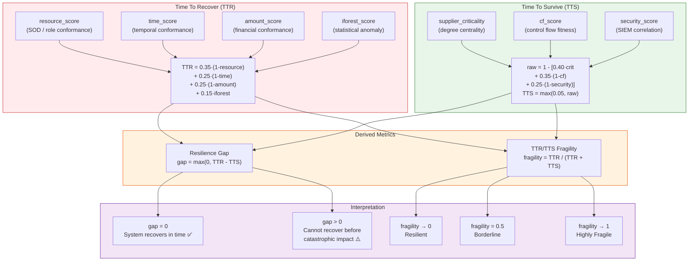

# TTR / TTS Relationship Concept

```mermaid
graph TB
    subgraph TTR["Time To Recover (TTR)"]
        direction TB
        TTR_IN1["resource_score<br/>(SOD / role conformance)"]
        TTR_IN2["time_score<br/>(temporal conformance)"]
        TTR_IN3["amount_score<br/>(financial conformance)"]
        TTR_IN4["iforest_score<br/>(statistical anomaly)"]
        TTR_CALC["TTR = 0.35·(1-resource)<br/>+ 0.25·(1-time)<br/>+ 0.25·(1-amount)<br/>+ 0.15·iforest"]
        TTR_IN1 --> TTR_CALC
        TTR_IN2 --> TTR_CALC
        TTR_IN3 --> TTR_CALC
        TTR_IN4 --> TTR_CALC
    end

    subgraph TTS["Time To Survive (TTS)"]
        direction TB
        TTS_IN1["supplier_criticality<br/>(degree centrality)"]
        TTS_IN2["cf_score<br/>(control flow fitness)"]
        TTS_IN3["security_score<br/>(SIEM correlation)"]
        TTS_CALC["raw = 1 - [0.40·crit<br/>+ 0.35·(1-cf)<br/>+ 0.25·(1-security)]<br/>TTS = max(0.05, raw)"]
        TTS_IN1 --> TTS_CALC
        TTS_IN2 --> TTS_CALC
        TTS_IN3 --> TTS_CALC
    end

    subgraph Derived["Derived Metrics"]
        direction TB
        GAP["Resilience Gap<br/>gap = max(0, TTR - TTS)"]
        FRAG["TTR/TTS Fragility<br/>fragility = TTR / (TTR + TTS)"]
    end

    subgraph Interpretation["Interpretation"]
        direction TB
        SAFE["gap = 0<br/>System recovers in time ✅"]
        DANGER["gap > 0<br/>Cannot recover before<br/>catastrophic impact ⚠️"]
        FRAG_LOW["fragility → 0<br/>Resilient"]
        FRAG_MID["fragility = 0.5<br/>Borderline"]
        FRAG_HIGH["fragility → 1<br/>Highly Fragile"]
    end

    TTR_CALC --> GAP
    TTS_CALC --> GAP
    TTR_CALC --> FRAG
    TTS_CALC --> FRAG

    GAP --> SAFE
    GAP --> DANGER
    FRAG --> FRAG_LOW
    FRAG --> FRAG_MID
    FRAG --> FRAG_HIGH

    style TTR fill:#ffebee,stroke:#c62828
    style TTS fill:#e8f5e9,stroke:#2e7d32
    style Derived fill:#fff3e0,stroke:#e65100
    style Interpretation fill:#f3e5f5,stroke:#6a1b9a
```
