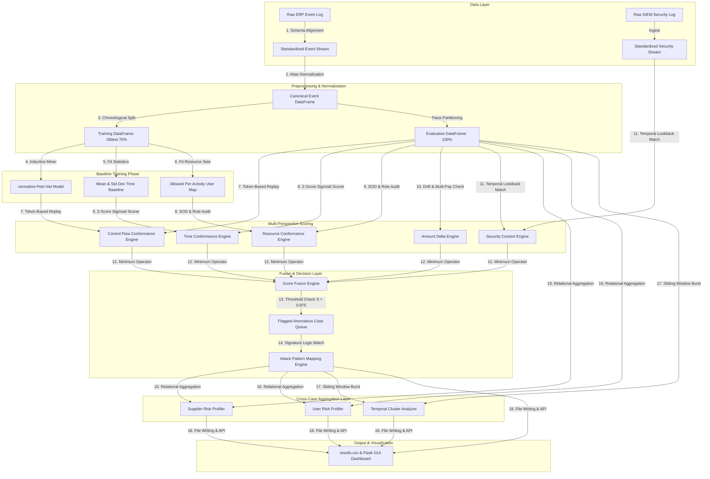

# SCADE: Supply Chain Anomaly Detection Engine
## Complete, End-to-End Architectural Specification & Technical Reference Document
### Document Version: 1.0.0
### Target Audience: Senior ML Researchers, Systems Architects, and Process Mining Engineers

---

## TABLE OF CONTENTS
1. [PART 1 — SYSTEM PURPOSE & DESIGN PHILOSOPHY](#part-1--system-purpose--design-philosophy)
2. [PART 2 — COMPLETE SYSTEM ARCHITECTURE](#part-2--complete-system-architecture)
3. [PART 3 — DATA MODEL & INPUT SPECIFICATION](#part-3--data-model--input-specification)
4. [PART 4 — PREPROCESSING ENGINE](#part-4--preprocessing-engine)
5. [PART 5 — PROCESS DISCOVERY ENGINE](#part-5--process-discovery-engine)
6. [PART 6 — CONTROL FLOW CONFORMANCE](#part-6--control-flow-conformance)
7. [PART 7 — TIME PERSPECTIVE ENGINE](#part-7--time-perspective-engine)
8. [PART 8 — RESOURCE PERSPECTIVE ENGINE](#part-8--resource-perspective-engine)
9. [PART 9 — AMOUNT DELTA ENGINE](#part-9--amount-delta-engine)
10. [PART 10 — SECURITY CONTEXT ENGINE](#part-10--security-context-engine)
11. [PART 11 — SCORE FUSION ENGINE](#part-11--score-fusion-engine)
12. [PART 12 — ATTACK MAPPING ENGINE](#part-12--attack-mapping-engine)
13. [PART 13 — CROSS-CASE ANALYSIS](#part-13--cross-case-analysis)
14. [PART 14 — EXPLAINABILITY LAYER](#part-14--explainability-layer)
15. [PART 15 — PERFORMANCE & COMPLEXITY](#part-15--performance--complexity)
16. [PART 16 — LIMITATIONS OF SCADE](#part-16--limitations-of-scade)
17. [PART 17 — WHAT SHOULD BE IMPROVED](#part-17--what-should-be-improved)
18. [PART 18 — SCADE TO SCADE-X MIGRATION ANALYSIS](#part-18--scade-to-scade-x-migration-analysis)

---

## PART 1 — SYSTEM PURPOSE & DESIGN PHILOSOPHY

### 1.1 The Procurement Anomaly Problem
In modern enterprise resource planning (ERP) systems, procurement transactions involve trillions of dollars annually. Because of the volume and complexity, procurement processes are highly vulnerable to occupational fraud, compliance violations, data entry errors, and cyber-attacks. The Supply Chain Anomaly Detection Engine (SCADE) is designed to detect operational leakage, unauthorized transaction paths, timing anomalies, resource violations, and credential hijacking in these high-volume event streams.

### 1.2 Tabular Fraud Detection vs. Process Mining
Traditional fraud detection engines model procurement data as **static, flat transaction tables**. They search for individual outliers using point-in-time rules or statistical techniques (e.g., standard deviation bounds on invoice amounts). This approach is fundamentally limited because it is **blind to sequence and state**. 

Procurement is not a collection of isolated events; it is a **structured, stateful sequence of business activities** with strict causal and temporal relationships (e.g., a three-way match requiring that `Create Purchase Order` happens before `Goods Receipt`, which in turn must precede `Invoice Verification` and `Payment Release`). A transaction that appears completely normal when audited in isolation can represent a catastrophic control failure if its steps are executed out of order or bypassed entirely. 

SCADE uses **Process Mining** to model transactions as a state transition system. By discovering the true process flow and checking conformance, SCADE evaluates not only *what* was done, but *how*, *when*, *by whom*, and in *what order* it was executed.

### 1.3 Design Philosophy of SCADE
The design philosophy of SCADE is centered on the principle of **conformance as a security framework**. A secure process is one that adheres strictly to its normative model. SCADE is designed under several core assumptions:
* **Normative Baseline Assumption**: The organization's historical process contains a stable, reliable core that can be learned automatically. By training on the oldest chronological subset of logs (assumed to represent standard operations), the engine discovers a normative process model without requiring manual, rule-based process mapping.
* **Multi-Perspective Completeness**: Anomalies rarely manifest in a single dimension. An adversary might bypass process constraints (Control Flow) but be forced to act in a hurried manner (Time), use a compromised account with abnormal organizational privileges (Resource), alter payment targets to extract funds (Amount), or access the system from an unexpected network location (Security).
* **The Weakest Link Principle (Minimum-Score Fusion)**: In process security, a chain is only as strong as its weakest link. Combining multiple operational scores using a weighted average allows a highly conforming score in one dimension (e.g., a perfect sequence) to mask a failure in another (e.g., an unauthorized approver acting on a compromised account). SCADE utilizes **minimum-score fusion** to ensure that any single perspective failure flags the entire case for manual audit.
* **Actionable Explainability**: Audit logs must be diagnostic, not just predictive. A simple binary alert ("This case is 95% anomalous") is not useful to a forensic investigator. The engine must provide explicit, decomposed explanations detailing the exact steps skipped, the timing deviations, the role violations, and the correlated security events that triggered the flag.

---

## PART 2 — COMPLETE SYSTEM ARCHITECTURE

SCADE is structured as a multi-stage linear pipeline with feedback branches for cross-case aggregation. The following architecture diagram shows the system layout from raw data source files to final forensic dashboards.



### 2.1 Detailed Pipeline Stage Specification

#### Stage 1: Data Ingestion & Schema Alignment
* **Input**: Heterogeneous CSV/Excel file of raw procurement records.
* **Output**: Standardized DataFrame containing `case_id`, `activity`, `timestamp`, `user`, `amount`, and `supplier_id`.
* **Transforms**: Column headers are mapped using heuristic regular expressions. Missing optional columns are initialized to default values (`user` to `"unknown"`, `amount` to `0.0`, `supplier_id` to `"unknown"`).
* **Algorithms**: Rule-based regex header matcher.
* **Dependencies**: Pandas, NumPy.
* **Failure Modes**: Missing required columns (`case_id`, `activity`, `timestamp`) aborts execution.

#### Stage 2: Preprocessing & Normalization
* **Input**: Standardized DataFrame.
* **Output**: Canonicalized, chronologically sorted event stream.
* **Transforms**: Activity names are mapped to 8 canonical procurement phases using user-defined alias configurations. Timestamps are parsed to unified microsecond-resolution `datetime64[ns]` formats.
* **Algorithms**: Text alias matching dictionary mapping.
* **Dependencies**: `config/activity_map.json`.
* **Failure Modes**: If timestamps contain unparseable dates, ingestion fails. If canonical steps like `Manager Approval` are completely unmapped, subsequent scoring engines yield flat, noisy scores.

#### Stage 3: Chronological Split
* **Input**: Canonical Event DataFrame.
* **Output**: Training DataFrame (oldest 70% of cases by start time) and Evaluation DataFrame (100% of cases).
* **Transforms**: Computes the minimum timestamp for each case, sorts cases chronologically, and partitions them.
* **Algorithms**: Median partition split calculation.
* **Failure Modes**: Small datasets (e.g., < 10 cases) result in empty training sets or division-by-zero errors.

#### Stage 4: Process Discovery
* **Input**: Training EventLog.
* **Output**: Serialized Petri Net structure `(net, initial_marking, final_marking)`.
* **Transforms**: Extracts directly-follows relations, prunes relationships falling below a 20% frequency cut, and converts the resulting process tree to a sound Workflow Net.
* **Algorithms**: Inductive Miner (noise threshold = 0.2).
* **Dependencies**: PM4Py.
* **Failure Modes**: Discovered models can experience deadlock if loops are highly irregular.

#### Stage 5: Time Conformance Scoring
* **Input**: Evaluation DataFrame, Time Baseline Model.
* **Output**: DataFrame of case-level `time_score` and `n_fast_steps`.
* **Transforms**: Computes step durations, calculates Z-scores against baseline mean/standard deviations, and applies an algebraic sigmoid penalty to excess Z-scores.
* **Algorithms**: Algebraic Sigmoid Mapping.
* **Failure Modes**: Extreme training outliers inflate standard deviations, making the model blind to rushed steps.

#### Stage 6: Resource Conformance Scoring
* **Input**: Evaluation DataFrame, Resource Baseline Model.
* **Output**: DataFrame of case-level `resource_score`, `wrong_role_count`, and `sod_violation_count`.
* **Transforms**: Evaluates each activity performer against the allowed user set, and performs hardcoded audits for Segregation of Duties.
* **Algorithms**: Set inclusion checks.
* **Failure Modes**: High organizational turnover triggers false positive wrong-role flags.

#### Stage 7: Amount Delta Engine
* **Input**: Evaluation DataFrame.
* **Output**: DataFrame of case-level `amount_score`, `amount_drift_pct`, and `duplicate_payment` status.
* **Transforms**: Compares `Create Purchase Order` values to `Payment Release` values. Detects duplicate `Payment Release` occurrences.
* **Algorithms**: Dynamic threshold drift calculation.
* **Failure Modes**: Missing `Create Purchase Order` activities bypass drift detection.

#### Stage 8: Security Context Engine
* **Input**: Evaluation DataFrame, Raw SIEM Security Log.
* **Output**: DataFrame of case-level `security_score`, `security_events` count, and `security_signals` list.
* **Transforms**: Filters security events within a 2-hour sliding lookback window prior to critical procurement steps, matching on `user`.
* **Algorithms**: Temporal interval intersection.
* **Failure Modes**: Clock skew between servers shifts events outside the 2-hour window.

#### Stage 9: Score Fusion & Attack Pattern Mapping
* **Input**: Merged scores from all perspective engines.
* **Output**: DataFrame with composite anomaly score, flagged status, and mapped fraud signature details.
* **Transforms**: Evaluates the minimum score across all active perspectives, applies a 0.875 threshold, and scores traces against predefined attack signatures.
* **Algorithms**: Non-linear minimum operator, signature matching logic.
* **Failure Modes**: Single noisy dimensions generate high rates of false alarms in production.

#### Stage 10: Cross-Case Analysis
* **Input**: Attack mapping output.
* **Output**: Aggregated data files `data/supplier_risk.csv` and `data/user_risk.csv`.
* **Transforms**: Aggregates anomalies by supplier, user, and temporal clusters (72-hour sliding window).
* **Algorithms**: Relational groupings, temporal sliding window clusters.
* **Failure Modes**: Scale issues when processing millions of cases.

---

## PART 3 — DATA MODEL & INPUT SPECIFICATION

### 3.1 Input Specifications and Schema Constraints

SCADE expects two raw files inside `data/uploads/`: `current.csv` (Procurement Event Log) and `security.csv` (Security Log). Both files can be formatted as CSV or Excel spreadsheets.

#### Required Columns (Procurement Log)
* `case_id`: Primary trace key. Uniquely groups events belonging to a single transaction sequence. Must be represented as a non-empty string.
* `activity`: Name of the step executed. Must map to canonical names via activity setup.
* `timestamp`: Precise execution timestamp. Must be parseable to standard datetime formats.

#### Optional Columns (Procurement Log)
* `user`: The system account identifier performing the action. If omitted, default is `"unknown"`.
* `amount`: Transaction value. If omitted, default is `0.0`.
* `supplier_id`: Target vendor code. If omitted, default is `"unknown"`.

```
  Procurement Log DataFrame Schema
  ┌────────────────────────────────────────────────────────────┐
  │ Column Name   │ Type      │ Nullable? │ Default Value      │
  ├───────────────┼───────────┼───────────┼────────────────────┤
  │ case_id       │ String    │ No        │ [FAIL]             │
  │ activity      │ String    │ No        │ [FAIL]             │
  │ timestamp     │ DateTime  │ No        │ [FAIL]             │
  │ user          │ String    │ Yes       │ "unknown"          │
  │ amount        │ Float64   │ Yes       │ 0.0                │
  │ supplier_id   │ String    │ Yes       │ "unknown"          │
  └────────────────────────────────────────────────────────────┘
```

#### Expected Procurement Process Semantics
The engine is optimized for standard procurement cycles. While custom steps are preserved, SCADE evaluates conformance by mapping system-specific events to the following canonical sequences:

$$\text{Create PR} \to \text{Manager Approval} \to \text{Send RFQ} \to \text{Receive Quote} \to \text{Create PO} \to \text{Goods Receipt} \to \text{Invoice Verification} \to \text{Payment Release}$$

---

### 3.2 Dynamic Error & Anomaly Recovery Strategies

To operate robustly on dirty ERP logs, the ingestion layer implements several automated recovery strategies:

#### Missing/Null Data Recovery
* **Null Users**: During resource conformance scoring, any step performed by `"unknown"` is skipped for wrong-role checks but is still audited for Segregation of Duties.
* **Null Amounts**: Defaults to `0.0`. This disables amount drift scoring for that case, preventing false positive alarms from missing price records.
* **Null Supplier IDs**: Mapped to `"unknown"`. Aggregates all such cases under a generic supplier profile, preventing cross-case risk profile crashes.

#### Duplicate Handling
If identical rows exist (same `case_id`, `activity`, `timestamp`, and `user`), SCADE prunes the duplicates during preprocessing:
```python
df = df.drop_duplicates(subset=["case_id", "activity", "timestamp", "user"]).copy()
```
This is critical because duplicate entries fire the same transition twice, causing token-based replay to fail and drop the control flow score on otherwise conforming transactions.

#### Ordering and Timestamp Corruption
If timestamps are corrupted (e.g., out-of-order records due to parallel processing delays), the preprocessing engine sorts the log strictly by `timestamp` within each `case_id`. If multiple events share the exact same timestamp, the engine preserves their insertion order from the raw file.

---

## PART 4 — PREPROCESSING ENGINE

The preprocessing engine (`src/preprocess.py`) prepares raw transactional data for discovery and evaluation.

### 4.1 Step-by-Step Execution Mechanics
The pipeline executes these operations in order:

1. **Schema Renaming**: Maps raw user columns to standardized names using `config/column_map.json`:
   $$\text{case\_id} \to \text{case:concept:name}$$
   $$\text{activity} \to \text{concept:name}$$
   $$\text{timestamp} \to \text{time:timestamp}$$
   $$\text{user} \to \text{org:resource}$$
2. **Text Normalization and Alias Resolution**: Resolves ERP-specific variations into canonical names using `config/activity_map.json`. It builds a case-insensitive reverse-lookup index:
   ```json
   {
     "me51n": "Create Purchase Requisition",
     "pr open": "Create Purchase Requisition",
     "migo": "Goods Receipt",
     "miro": "Invoice Verification"
   }
   ```
3. **Chronological Reordering**: Sorts the log in ascending chronological order:
   ```python
   df = df.sort_values(by=["case:concept:name", "time:timestamp"]).reset_index(drop=True)
   ```
4. **Calculated Feature Extraction**: Computes the duration (in hours) since the previous event in the same case. For the $i$-th event $e_i$ in case $c$:
   $$d(e_i) = \begin{cases} 0.0 & \text{if } i = 1 \\ \frac{t(e_i) - t(e_{i-1})}{3600} & \text{if } i > 1 \end{cases}$$
   This feature is appended to the DataFrame as `duration_hours` for duration modeling.

---

### 4.2 Mathematical Formalization of Chronological Partitioning

Let $C$ be the set of unique case IDs. For each case $c \in C$, we compute its start time $T_{\text{start}}(c)$ as the minimum timestamp among all its events:
$$T_{\text{start}}(c) = \min_{e \in c} t(e)$$

We define a sorted sequence of case IDs:
$$\mathcal{S}_C = \langle c_1, c_2, \dots, c_{|C|} \rangle$$
Such that:
$$\forall i, j \in [1, |C|] \quad \text{where} \quad i < j \implies T_{\text{start}}(c_i) \le T_{\text{start}}(c_j)$$

Let $k$ be the split boundary index calculated as:
$$k = \lfloor |C| \cdot 0.70 \rfloor$$

The training and evaluation sets are partitioned as:
$$C_{\text{train}} = \{ c_i \in \mathcal{S}_C \mid i \le k \}$$
$$C_{\text{eval}} = \{ c_i \in \mathcal{S}_C \mid i > k \}$$

```
Log Timeline ────►
├──────────────────────────────────────────┼──────────────────────────────┤
│      Training Set (Earliest 70%)         │  Evaluation Set (Latest 30%) │
│      - Learn Normative Behaviors         │  - Run Conformance Audit     │
└──────────────────────────────────────────┴──────────────────────────────┘
```

#### Why Chronological Partitioning Instead of Random Split?
A randomized split is standard in machine learning but fails in process mining for security:
* **Information Leakage**: If fraud is injected at a specific point in time, a random split leaks fraudulent traces into the training set. The discovery engine will model these fraudulent steps as normal process paths, preventing the system from flagging them in the evaluation set.
* **Process Drift Modeling**: In real production environments, processes naturally evolve over time. By training on historical data and evaluating on newer data, we simulate actual production deployments where models are trained on past runs to score future transactions.

#### Preprocessing Failure Modes & Edge Cases
* **Timestamp Collision**: If all events in a case share the exact same timestamp (e.g., due to batch uploads that omit execution times), the elapsed duration drops to $0.0$. This bypasses time conformance checks and can cause token replay to evaluate parallel steps incorrectly.
* **Case Interleaving**: If a long-running case started before the 70% split index but continues into the evaluation period, parts of the case will exist in both partitions. This can cause the training set to only see a partial trace, resulting in an incomplete discovered Petri net.

---

## PART 5 — PROCESS DISCOVERY ENGINE

SCADE uses the **Inductive Miner (IM)** algorithm via the PM4Py framework to discover the normative process model.

### 5.1 Mathematical Formalization of Petri Net Soundness

A Petri Net is a bipartite graph defined as a 3-tuple:
$$N = (P, T, F)$$
Where:
* $P$ is a finite set of **places** (circles).
* $T$ is a finite set of **transitions** (rectangles), with $P \cap T = \emptyset$.
* $F \subseteq (P \times T) \cup (T \times P)$ is a set of directed **arcs**.

A **marking** $M$ is a multisubset of $P$, denoting the distribution of **tokens** across places:
$$M: P \to \mathbb{N}_0$$

A transition $t \in T$ is **enabled** in marking $M$ (denoted as $M \xrightarrow{t}$) if each input place $p \in \bullet t$ contains at least one token:
$$\forall p \in \bullet t: M(p) \ge 1$$

Firing an enabled transition $t$ transitions the system to a new marking $M'$:
$$M' = M - \bullet t + t\bullet$$
Where $\bullet t$ is the set of input places of $t$, and $t\bullet$ is the set of output places of $t$.

SCADE discovers a **Workflow net (WF-net)**. A WF-net is a Petri net with:
* A unique source place $i \in P$ such that $\bullet i = \emptyset$.
* A unique sink place $o \in P$ such that $o\bullet = \emptyset$.
* A path from $i$ to $o$ passing through every place and transition.

A WF-net is **sound** if it satisfies three structural guarantees:
1. **Option to Complete**: From any marking $M$ reachable from the initial marking $M_0 = [i]$, there exists a firing sequence leading to the final marking $M_f = [o]$:
   $$\forall M \in [N, M_0\rangle, \quad M \implies^* M_f$$
2. **Proper Completion**: When the final marking $M_f$ is reached, no tokens remain in any other place:
   $$\forall M \in [N, M_0\rangle, \quad M \ge [o] \implies M = [o]$$
3. **No Dead Transitions**: Every transition $t \in T$ can be enabled at least once starting from $M_0$:
   $$\forall t \in T, \quad \exists M \in [N, M_0\rangle \quad \text{such that} \quad M \xrightarrow{t}$$

---

### 5.2 The Inductive Miner Discovery Algorithm

The Inductive Miner converts an event log into a process tree by recursively partitioning the Directly-Follows Graph (DFG) based on cuts. A process tree is a hierarchical tree structure where leaf nodes represent activities and operator nodes represent control relationships:
*   Sequence ($\rightarrow$)
*   Exclusive Choice ($\times$)
*   Parallelism ($\wedge$)
*   Redo Loop ($\circlearrowleft$)

```
             Process Tree: Loop (↺)
                   ┌───┴───┐
                   │       │
              Sequence (→) 𝜏 (Silent)
            ┌──────┴──────┐
     Manager Approval  Send RFQ
```

The algorithm constructs this tree using the following steps:
1.  **DFG Generation**: Build a graph where edges represent sequential events in the log.
2.  **Cut Detection**: Identify partition points in the graph:
    *   *Sequence Cut*: The DFG can be split into sequential sub-graphs with no backward edges.
    *   *Exclusive Choice Cut*: The DFG can be partitioned into sub-graphs with no cross-edges.
    *   *Parallel Cut*: Nodes partition into sets $A$ and $B$ with bidirectional edges between all elements of both sets.
    *   *Loop Cut*: The DFG can be partitioned into start, redo, and exit nodes.
3.  **Recursive Fallback**: If no clean cut is found, the algorithm applies a noise filter to prune low-frequency edges in the DFG until a cut is resolved.

#### Calibration of the Noise Threshold ($0.2$)
SCADE configures the noise threshold to $0.2$. This parameter filters out directly-follows relationships that occur in less than 20% of the traces.
*   **Impact of Lower Threshold (e.g., $0.05$)**: The engine attempts to model rare, non-standard execution paths. This results in a complex, unreadable process model (a "spaghetti net") that decreases control flow sensitivity by allowing almost any sequence to conform.
*   **Impact of Higher Threshold (e.g., $0.40$)**: The engine prunes standard process variations. This results in an overly restrictive model that flags legitimate, common variations as anomalies (high false positive rate).

---

### 5.3 Comparative Discovery Algorithm Analysis

| Discovery Algorithm | Soundness Guarantee | Discovered Representation | Primary Tradeoffs |
| :--- | :--- | :--- | :--- |
| **Alpha Miner ($\alpha$)** | None. Frequently produces unsafe or deadlocking nets. | Petri Net | Fast, but highly sensitive to noise and cannot handle duplicate activities. |
| **Heuristics Miner** | None. Discovers causal graphs but lacks formal Petri net execution semantics. | Causal Net / Dependency Graph | Robust to noise, but cannot be used directly for token-based replay without heuristic approximations. |
| **Inductive Miner** | **Guaranteed**. Models are structurally sound and deadlock-free. | Process Tree $\to$ Petri Net | Highly structured and guarantees soundness, but can over-generalize rare paths under high noise thresholds. |

---

## PART 6 — CONTROL FLOW CONFORMANCE

The Control Flow Conformance Engine (`src/conformance/control_flow.py`) uses **Token-Based Replay (TBR)** to measure the alignment between evaluation traces and the discovered Petri net model.

### 6.1 Mathematical Formulation of Token-Based Replay

Let $N = (P, T, F)$ be a sound Workflow Net, with initial marking $M_0 = [i]$ and final marking $M_f = [o]$.

For a given trace $\sigma = \langle a_1, a_2, \dots, a_k \rangle$:

1. Initialize the Petri net marking to $M = M_0$. Set the tracking counters to zero:
   $$\text{consumed } c = 0, \quad \text{produced } p = 0, \quad \text{missing } m = 0, \quad \text{remaining } r = 0$$
2. When the source place $i$ is initialized with a token:
   $$p = p + 1$$
3. For each activity $a_j$ in the trace $\sigma$:
   * Find the corresponding transition $t \in T$ labeled $a_j$.
   * Identify the input places of the transition: $\bullet t$.
   * For each place $p_{in} \in \bullet t$, verify if a token is present:
     * If $M(p_{in}) == 0$:
       *Artificially force-create a token in place $p_{in}$ to enable the transition*:
       $$M(p_{in}) = M(p_{in}) + 1$$
       $$m = m + 1$$
   * Fire the transition $t$:
     * Consume tokens from input places:
       $$\forall p_{in} \in \bullet t: M(p_{in}) = M(p_{in}) - 1$$
       $$c = c + |\bullet t|$$
     * Produce tokens in output places:
       $$\forall p_{out} \in t\bullet: M(p_{out}) = M(p_{out}) + 1$$
       $$p = p + |t\bullet|$$
4. Once all activities in the trace have been replayed, evaluate the final marking $M$ against $M_f$:
   * If a token is present in the sink place $o$, consume it:
     $$c = c + 1$$
   * If no token is present in $o$, record it as missing to reach the final state:
     $$m = m + 1$$
   * For any other places containing leftover tokens, consume them and record them as remaining tokens:
     $$\forall p_{rem} \in P \setminus \{o\} \text{ where } M(p_{rem}) > 0:$$
     $$r = r + M(p_{rem})$$
     $$c = c + M(p_{rem})$$

#### Trace Fitness Equation
The Control Flow Score ($CF\_Score$) of a trace $\sigma$ is computed as its token replay fitness:

$$CF\_Score(\sigma) = 1 - \frac{m + r}{c + p}$$

```python
# Replay evaluation from src/conformance/control_flow.py
cf_score = round(result["trace_fitness"], 4)
missing_tokens = result["missing_tokens"]
remaining_tokens = result["remaining_tokens"]
```

---

### 6.2 Structural Deviations & Adversarial Scenarios

#### 1. Step Skipping (Approval Bypass)
* **Trace**: $\sigma_{bypass} = \langle \text{Create PR}, \text{Create PO}, \text{Goods Receipt}, \text{Invoice Verification}, \text{Payment Release} \rangle$
* **Mechanics**: Transition `Create PO` requires a token in place $p_{approve\_out}$ (which is produced only when the `Manager Approval` transition fires). Replay finds $M(p_{approve\_out}) == 0$, force-creates a token, and increments $m = 1$. The remaining steps match the model path, running to completion.
* **Replay Trace Counters**: $m = 1, r = 0, c = 8, p = 8$
* **Resulting Score**:
  $$CF\_Score = 1 - \frac{1 + 0}{8 + 8} = 1 - 0.0625 = 0.9375$$
  This score remains above the $0.875$ threshold, showing how a critical bypass can be masked on long traces when evaluated using control flow in isolation.

#### 2. Process Reordering (Payment Fraud)
* **Trace**: $\sigma_{fraud} = \langle \dots, \text{Create PO}, \text{Payment Release} \rangle$ (skipping `Goods Receipt` and `Invoice Verification`).
* **Mechanics**: Transition `Payment Release` requires a token in place $p_{iv\_out}$. Replay finds $M(p_{iv\_out}) == 0$, force-creates a token, and increments $m = 1$. When the case finishes, a token remains stranded in place $p_{po\_out}$ because `Goods Receipt` never fired to consume it. Replay registers a remaining token: $r = 1$.
* **Replay Trace Counters**: $m = 1, r = 1, c = 6, p = 6$
* **Resulting Score**:
  $$CF\_Score = 1 - \frac{1 + 1}{6 + 6} = 1 - 0.1667 = 0.8333$$
  This score drops below the $0.875$ threshold and flags the anomaly.

---

### 6.3 Topological Weaknesses of Token-Based Replay
* **Silent Transition Exploitation ($\tau$-steps)**: The Inductive Miner frequently injects unlabelled "silent" transitions ($\tau$-steps) into the Petri net to represent optional paths (e.g., skip paths for optional steps like `Send RFQ`). A trace that skips `RFQ` does not trigger a missing token because the token-based replay engine can fire the silent transition $\tau_{rfq\_skip}$ without consuming a trace event. Smart adversaries can exploit these paths.
* **Fitness Inflation on Long Traces**: The fitness metric is structurally dependent on trace length. A very long trace (e.g., 20 events) containing a critical bypass (e.g., skipping approval) will have high values of $c$ and $p$. Consequently, the fraction $\frac{m}{c+p}$ becomes small, resulting in a high fitness score (e.g., $0.95$), which remains safely above the $0.875$ anomaly threshold.
* **The Duplication Ambiguity Problem**: If an activity appears multiple times in a case (e.g., multiple goods receipts), token replay can get stuck in loop sub-nets. It may exhaustively fire loops, resulting in high numbers of remaining tokens ($r$) that degrade the score of a operationally normal case.

---

## PART 7 — TIME PERSPECTIVE ENGINE

The Time Conformance Engine (`src/conformance/time_perspective.py`) measures temporal deviations in transition velocities using a statistical outlier model.

### 7.1 Mathematical Formulation of the Scoring Model

For each event $e_i$ in trace $\sigma$, we compute its duration $\Delta t(e_i)$ as the elapsed time in hours since the previous event in the same case:
$$\Delta t(e_i) = \frac{\text{timestamp}(e_i) - \text{timestamp}(e_{i-1})}{3600}$$
For the initial event of any case ($e_1$), the duration is defined as $0$ and ignored from statistics.

During the training phase, the engine learns two parameters for each activity $a$:
1.  **Mean Duration** ($\mu_a$):
    $$\mu_a = \frac{1}{|E_a|} \sum_{e \in E_a} \Delta t(e)$$
2.  **Standard Deviation** ($\sigma_a$):
    $$\sigma_a = \sqrt{\frac{1}{|E_a| - 1} \sum_{e \in E_a} (\Delta t(e) - \mu_a)^2}$$
Where $E_a$ is the set of all non-initial events of activity $a$ in the training set. If $\sigma_a == 0$, it defaults to $1.0$ to prevent division-by-zero errors.

During inference, for each event $e_i$ in case $c$, we compute its Z-score against the baseline:
$$z_i = \frac{|\Delta t(e_i) - \mu_{a_i}|}{\sigma_{a_i}}$$

We apply a standard deviation threshold $Z_{\text{threshold}} = 2.0$. If $z_i \le Z_{\text{threshold}}$, no penalty is applied. For values above the threshold, we calculate the excess deviation:
$$\text{excess}_i = \max(0.0, \, z_i - Z_{\text{threshold}})$$

The excess deviation is mapped to a smooth 0-to-1 penalty curve using a algebraic sigmoid:
$$\text{penalty}_i = 1 - \frac{1}{1 + \text{excess}_i}$$

This penalty curve responds as follows:

```
  Penalty Value
   1.0 ┼                                              * * *
       │                                          *
   0.8 ┼                                     *
       │                                 *
   0.5 ┼                             *
       │                         *
   0.0 ┼─────────* * * * * * * *
       └─────────┴─────────┴─────────┴─────────┴─────────┴─────►
                0.0       2.0       3.0       4.0       5.0   Z-Score
```

The final case-level **Time Score** is calculated as the complement of the average event penalties:
$$Time\_Score = 1 - \frac{1}{K} \sum_{i=1}^{K} \text{penalty}_i$$
Where $K$ is the number of events in the case that have statistical baselines.

---

### 7.2 Comparative Anomaly Detection Analysis

| Method | Mathematical Basis | Sensitivity to Skew | Real-time Scoring Overhead |
| :--- | :--- | :--- | :--- |
| **Gaussian Z-Score** | Assumes normal distribution: $\mathcal{N}(\mu, \sigma^2)$ | High. Right-skewed data generates extreme false positive alerts. | $\mathcal{O}(1)$ |
| **Median Absolute Deviation (MAD)** | Uses median and absolute deviation: $\text{MAD} = \text{median}(|x_i - \text{median}(x)|)$ | Moderate. Robust to outliers, but sensitive to multi-modal distributions. | $\mathcal{O}(1)$ |
| **Temporal VAE** | Reconstruction loss of sequential latent dimensions. | Low. Learns complex, non-linear distributions. | $\mathcal{O}(D)$ (High GPU inference overhead) |

#### Failure Modes of the Gaussian Z-Score Model
Procurement durations are highly right-skewed, typically following log-normal or Weibull distributions due to operational patterns (e.g., weekend delays, batch processing). 

Assuming a normal distribution causes significant failure modes:
* **The Weekend False Positive**: A step that takes 4 hours on average ($\mu=4$, $\sigma=2$) is delayed over a weekend, taking 72 hours. The computed Z-score is $z = \frac{72 - 4}{2} = 34.0$, generating an extreme penalty of $0.97$ that flags a normal operational delay as a critical anomaly.
* **Outlier Masking (Sigma Inflation)**: If the training set contains a few legitimate but long delays (e.g., a purchase order stuck in legal review for 3 months), the standard deviation $\sigma_a$ becomes heavily inflated. This inflation dilutes the Z-score for all subsequent events, masking actual "rushing" anomalies (e.g., an unauthorized payment released 5 minutes after PO creation).

---

## PART 8 — RESOURCE PERSPECTIVE ENGINE

The Resource Conformance Engine (`src/conformance/resource.py`) implements security boundaries at the organizational level by auditing the actors who perform activities.

### 8.1 Mathematical Formalization of Resource Scoring

Let $A$ be the set of unique activities, and $U$ be the set of all user identifiers.

During training, we learn the set of allowed performers for each activity $a \in A$:
$$\mathcal{U}_{allowed}(a) = \{ u \in U \mid \exists e \in \text{Training Log} \text{ where } \text{activity}(e) == a \text{ and } \text{user}(e) == u \}$$

During evaluation, for each event $e_i = (a_i, u_i)$ in trace $\sigma$, we verify if the executing user is present in the allowed set:
$$\text{Violation}_{Role}(e_i) = \begin{cases} 1 & \text{if } u_i \notin \mathcal{U}_{allowed}(a_i) \\ 0 & \text{otherwise} \end{cases}$$

#### Segregation of Duties (SOD) Rules
SCADE enforces strict Segregation of Duties rules to prevent internal fraud. We define a set of prohibited pairs:
$$\mathcal{P}_{SOD} = \Big\{ (\text{"Create Purchase Requisition"}, \text{"Manager Approval"}), \, (\text{"Create Purchase Requisition"}, \text{"Create Purchase Order"}) \Big\}$$

Let $User(a, \sigma)$ be the user who executed activity $a$ within the trace $\sigma$. An SOD violation is registered if:
$$\exists (a_x, a_y) \in \mathcal{P}_{SOD} \quad \text{such that} \quad a_x \in \sigma, \, a_y \in \sigma \quad \text{and} \quad User(a_x, \sigma) == User(a_y, \sigma)$$

Let $N_{SOD}(\sigma)$ be the total number of active SOD violations in the trace:
$$N_{SOD}(\sigma) = \sum_{(a_x, a_y) \in \mathcal{P}_{SOD}} \mathbb{I}\Big(User(a_x, \sigma) == User(a_y, \sigma)\Big)$$

#### Resource Score Calculation
The final **Resource Score** is computed as:
$$Resource\_Score(\sigma) = \max\left(0.0, \, 1 - \frac{\sum_{e \in \sigma} \text{Violation}_{Role}(e) + N_{SOD}(\sigma)}{N_{\text{checkable\_events}} + |\mathcal{P}_{SOD}|}\right)$$
Where $N_{\text{checkable\_events}}$ is the number of events in the trace that map to activities present in the resource model.

```python
# Resource score implementation from src/conformance/resource.py
total_violations = wrong_role + sod_violations
max_possible = max(n_checkable + len(SOD_PAIRS), 1)
resource_score = round(1.0 - total_violations / max_possible, 4)
resource_score = max(0.0, resource_score)
```

---

### 8.2 Fraud Detection Logic & Limitations
* **Insider Threat Protection**: This engine directly prevents "self-approving" transactions where an employee creates a purchase requisition and then approves it using their own account.
* **Static Role Limitations**: Set inclusion checks are binary and static. They do not account for dynamic business patterns, such as temporary delegations of authority (e.g., a manager delegating approval authority during vacation). This causes a high rate of false positives during standard operational shifts.
* **Departmental Overfitting**: If a small team has only one employee trained to do a specific task (e.g., `Heidi` in `Warehouse` doing `Goods Receipt`), the learned allowed set becomes a singleton: $\mathcal{U}_{allowed}(\text{GR}) = \{\text{"Heidi"}\}$. If Heidi is sick and `Alice` steps in to do a single goods receipt, it will be flagged as an anomaly.

---

## PART 9 — AMOUNT DELTA ENGINE

The Amount Delta Engine (`src/conformance/amount_delta.py`) monitors transaction values to detect financial leaks, fraud, and billing errors.

### 9.1 Mathematical Formulation of Amount Drift

Let $A_{PO}$ be the monetary value authorized when the purchase order is created:
$$A_{PO} = \text{amount}(e_{po}) \quad \text{where} \quad \text{activity}(e_{po}) == \text{"Create Purchase Order"}$$
Let $A_{Pay}$ be the monetary value released in the final step of the case:
$$A_{Pay} = \text{amount}(e_{pay}) \quad \text{where} \quad \text{activity}(e_{pay}) == \text{"Payment Release"}$$

The amount drift percentage is defined as:
$$\text{drift\_pct} = \frac{|A_{Pay} - A_{PO}|}{A_{PO}}$$

#### Penalty Logic & Tolerance
Minor pricing variations are common due to taxes, shipping, conversion rates, and handling fees. SCADE establishes a strict tolerance threshold:
$$\text{Tolerance} = 0.15 \quad (15\%)$$

The drift penalty is defined as:
$$\text{penalty}_{drift} = \begin{cases} 0.0 & \text{if } \text{drift\_pct} \le 0.15 \\ \min\left(\frac{\text{drift\_pct} - 0.15}{0.5}, \, 1.0\right) & \text{if } \text{drift\_pct} > 0.15 \end{cases}$$

This linear penalty scales from $0.0$ (at 15% drift) to $1.0$ (when drift reaches or exceeds 65% of the original PO value).

#### Duplicate Payment Check
If the `Payment Release` activity is executed more than once within a single case:
$$\text{is\_duplicate} = \text{True}$$
A duplicate payment triggers an absolute, non-negotiable penalty of $1.0$.

The final **Amount Score** is calculated as:
$$\text{penalties} = [\,] \quad \text{and populate with active penalties}$$
$$Amount\_Score = \max(0.0, \, 1.0 - \text{mean}(\text{penalties}))$$

---

### 9.2 Strategic Limitations & Adversarial Evasion
* **Invoice Splitting (Structuring Fraud)**: An adversary can bypass amount thresholds by splitting a single large transaction into multiple small invoices under separate cases (different POs). Because SCADE scores each case in isolation, it will evaluate these split cases as conforming.
* **Missing Initial steps**: If a trace skips `Create Purchase Order` entirely, $A_{PO}$ is undefined. SCADE handles this by setting the drift percentage to $0.0$, effectively bypassing drift verification.

---

## PART 10 — SECURITY CONTEXT ENGINE

The Security Context Engine (`src/conformance/security_context.py`) integrates network and authentication events into the process engine.

### 10.1 SIEM Correlation & Temporal Lookback
For any event in the procurement log representing a **critical transaction step**:
$$a_c \in \mathcal{C}_{critical} = \big\{ \text{"Manager Approval"}, \, \text{"Create Purchase Order"}, \, \text{"Payment Release"} \big\}$$

Let $u_c$ be the executing user and $t_{proc}$ be the timestamp of this step. The engine queries the security log for all events $s$ satisfying:
$$\text{user}(s) == u_c \quad \text{and} \quad s \in [t_{proc} - 2\text{ hours}, \, t_{proc}]$$

The sliding correlation window is fixed to a **2-hour lookback window**. This window is calibrated to capture host-level security anomalies (e.g., brute force attempts, suspicious logins) occurring immediately prior to a critical step, while preventing unrelated daily security events from generating noise.

---

### 10.2 Penalty Scoring Model

Each security event is assigned a static risk penalty based on its threat severity:

| Event Type | Physical Threat Vector | Penalty ($P_s$) |
| :--- | :--- | :--- |
| `brute_force` | Automated password guessing attempts on the account | 0.85 |
| `privilege_escalation` | Account granted administrative roles immediately prior to action | 0.75 |
| `foreign_ip_login` | Session initiated from a suspicious geofenced IP or Tor exit node | 0.65 |
| `concurrent_session` | User logged in from two geographic locations simultaneously | 0.45 |
| `password_reset` | Administrative password override executed immediately before transaction | 0.35 |
| `after_hours_access` | Action executed outside standard working hours (7:00 AM - 7:00 PM) | 0.30 |
| `file_access_sensitive` | User accessed critical system directories or shadow files | 0.20 |
| `login_failed` | Single authentication failure (accumulative penalty) | 0.08 |

For `login_failed` events, the penalty scales with the number of failures $N_{failed}$:
$$\text{penalty}_{failed} = \min(N_{failed} \cdot 0.08, \, 0.50)$$

#### Score Formulation
The case-level security score is determined by the worst security violation detected across all critical steps:
$$\text{worst\_penalty} = \max_{e \in E_{crit}} \left( \, \max_{s \in \text{SecurityLogs}(e)} P_s \right)$$
$$Security\_Score = 1.0 - \text{worst\_penalty}$$

If no critical steps are present in the case, or if no security logs are correlated within the lookback window, the score defaults to a neutral $1.0$.

---

### 10.3 Adversarial Threat Models & Failure Cases
* **Insider Attack with Clean Credentials**: If an employee performs an unauthorized action within standard working hours from their standard office workstation, the security score remains $1.0$. The engine cannot detect insider threats that do not trigger host-level alerts.
* **Shared Administrative Accounts**: In large enterprises, automated system accounts (e.g., `BATCH_USER`) perform bulk operations. These accounts do not map to individual human security profiles. If administrative accounts are not filtered, standard batch jobs will trigger persistent, false positive security alerts.

---

## PART 11 — SCORE FUSION ENGINE

The Score Fusion Engine (`src/conformance/fusion.py`) combines the individual perspective scores into a single **Composite Anomaly Score** ($S_{composite}$).

### 11.1 The Mathematical Failure of Weighted Average Fusion

Weighted average is the naive approach:
$$S_{weighted} = w_1 \cdot S_{CF} + w_2 \cdot S_{Time} + w_3 \cdot S_{Res} + w_4 \cdot S_{Amt} + w_5 \cdot S_{Sec}$$

This approach is fundamentally flawed for process security. Consider a sophisticated payment fraud transaction where the attacker has compromised an executive's credentials:
* The steps are replayed in the correct sequence: $S_{CF} = 1.0$
* The durations match normal time baselines: $S_{Time} = 1.0$
* The executing role is authorized (Manager): $S_{Res} = 1.0$
* The invoice amount matches the PO: $S_{Amt} = 1.0$
* However, the approval was preceded by a brute-force attack and a foreign IP login: $S_{Sec} = 0.15$

If we apply standard weights ($w = [0.40, 0.20, 0.25, 0.15, 0.10]$):
$$S_{weighted} = 0.40(1.0) + 0.20(1.0) + 0.25(1.0) + 0.15(1.0) + 0.10(0.15) = 0.40 + 0.20 + 0.25 + 0.15 + 0.015 = 1.015 \implies 1.0$$
The critical anomaly is masked by the high conformance scores of the other dimensions, allowing the fraudulent transaction to pass undetected.

---

### 11.2 Minimum-Score Fusion Formulation
SCADE uses the minimum instead:
$$S_{composite} = \min\big(S_{CF}, \, S_{Time}, \, S_{Res}, \, S_{Amt}, \, S_{Sec}\big)$$

This design is rooted in **decision theory and risk mitigation**: a process control chain is only as secure as its weakest link. Any single perspective drop immediately pulls the composite score down, flagging the transaction for audit.

```python
# Composite score selection from src/conformance/fusion.py
score_cols = ["cf_score", "time_score", "resource_score", "amount_score"]
if has_security:
    score_cols.append("security_score")
merged["composite_score"] = merged[score_cols].min(axis=1).round(4)
```

---

### 11.3 Alternative Fusion Strategies Comparison

| Fusion Paradigm | Mathematical Basis | Robustness to High Noise | Security Viability |
| :--- | :--- | :--- | :--- |
| **Weighted Average** | Linear combination of scores: $\sum w_i S_i$ | High. Filters out transient noise in single dimensions. | **Poor**. Vulnerable to outlier masking where anomalies go undetected. |
| **Bayesian Fusion** | Posterior probability estimation: $P(A \mid S_1, \dots, S_n)$ | Moderate. Requires accurate conditional probability tables. | **Moderate**. Highly complex to calibrate in dynamic environments. |
| **Minimum-Score** | Non-linear minimum operator: $\min(S_i)$ | **Poor**. A single noisy dimension triggers false positive alerts. | **Excellent**. Guarantees that any single anomaly is flagged. |

#### Minimum Fusion Vulnerability to Noise
Because minimum-score fusion is highly sensitive to noise in any single scoring engine, a single noisy data point (e.g., an invoice delayed by 3 weeks due to a simple administrative typo, resulting in a Time Score of $0.40$) is enough to pull the composite score down to $0.40$. This triggers a false positive alert in the fraud queue.

---

## PART 12 — ATTACK MAPPING ENGINE

Flagged anomalous cases are processed by the **Attack Mapping Engine** (`src/attack_mapper.py`) to categorize the deviation into a known fraud pattern.

### 12.1 Signature Matching Logic
The mapping engine matches the case against a set of predefined fraud patterns:

```
                  Anomalous Trace Input
                            │
            ┌───────────────┼───────────────┐
            │               │               │
      [CF Signature]  [Time Signature]  [Res Signature]
            │               │               │
            └───────────────┼───────────────┘
                            │
               Rule Score Evaluation Matrix
              (Highest Score Mapped to Pattern)
```

For each pattern signature, the engine evaluates a set of heuristic rules:

$$\text{Pattern\_Score} = \sum \text{satisfied signature rules}$$

* **Missing Activity Rule**: $+2$ if any mandated step is absent from the replayed trace.
* **Duplicate Payment Rule**: $+2$ if the `Payment Release` step occurs multiple times.
* **Rushed Execution Rule**: $+1$ if any step duration triggers the rushing threshold.
* **Wrong Resource Rule**: $+1$ if any step triggers a role or SOD violation.
* **Security Telemetry Rule**: $+3$ if the case has correlated security alerts.

The pattern that generates the highest matching score is mapped to the case. If all pattern scores are zero, the case is categorized as an `unknown_anomaly` with **MEDIUM** risk.

---

### 12.2 Signature Rules Matrix

| Attack Pattern Name | Diagnostic Rule Signatures | Risk Level | Target Recommendation |
| :--- | :--- | :--- | :--- |
| **payment\_fraud** | • Omission of `Goods Receipt` or `Invoice Verification`<br>• Suspiciously fast execution | **CRITICAL** | Freeze payment immediately. Audit approver account. Verify physical receipt of goods. |
| **approval\_bypass**| • Missing `Manager Approval`<br>• SOD violation (requester did PO step) | **HIGH** | Reverse transaction. Investigate employee security roles and check for privilege escalation. |
| **duplicate\_payment**| • Multiple `Payment Release` events<br>• Drift amount $> 0.0$ | **CRITICAL** | Halt pending payments to supplier. Audit accounts payable team. Initiate recovery procedures. |
| **unauthorized\_supplier**| • Missing `RFQ` and `Supplier Quote` steps<br>• Vendor ID outside normal pool | **HIGH** | Verify supplier registration status. Escalate to compliance. Audit bidding process. |
| **credential\_compromise**| • Correlated security alerts (brute force, foreign IP) | **CRITICAL** | Revoke user session tokens. Reset passwords. Audit approvals made in the last 48 hours. |

---

## PART 13 — CROSS-CASE ANALYSIS

The Cross-Case Correlation Engine (`src/cross_case.py`) aggregates anomalies across cases to uncover systemic fraud, collusive actors, and coordinated attacks.

### 13.1 Relational Graph Logic

```
   Case PO-001 (Flagged) ──┐
                           ├─► Associated with Supplier: SUP-021 (Risk Flagged)
   Case PO-002 (Flagged) ──┘
                           │
   Case PO-003 (Flagged) ──┼─► Executed by User: Eve (Risk Flagged)
                           │
   Case PO-001 & PO-002 ───┴─► Grouped in 72-Hour Temporal Cluster
```

#### 1. Supplier Risk Aggregation
For each supplier $s \in S$, we aggregate the number of anomalous cases associated with them:
$$\text{Supplier\_Risk}(s) = \sum_{c \in \text{FlaggedCases}} \mathbb{I}(\text{supplier}(c) == s)$$
If $\text{Supplier\_Risk}(s) \ge 2$, the supplier is marked with a `risk_flag`. This surfaces rogue vendors who are repeatedly linked to transaction anomalies across different departments.

#### 2. User Risk Aggregation
Aggregates all flagged cases by the users involved in execution:
$$\text{User\_Risk}(u) = \sum_{c \in \text{FlaggedCases}} \mathbb{I}(u \in \text{Actors}(c))$$
If $\text{User\_Risk}(u) \ge 2$, the user is marked with a `risk_flag`. This identifies insider threats or compromised accounts that are being used to execute multiple suspicious transactions.

#### 3. Temporal Clustering
Groups flagged cases that were initiated within a narrow time window.
Let $T_{start}(c)$ be the timestamp of the first event in case $c$. The cases are sorted chronologically by start time. A sliding window of size $W_{cluster} = 72\text{ hours}$ is applied. A cluster is registered if:
$$\text{Cluster} = \{ c \in \text{FlaggedCases} \mid T_{start}(c) \in [t_{anchor}, \, t_{anchor} + 72\text{ hours}] \} \quad \text{where} \quad |\text{Cluster}| \ge 2$$

---

### 13.2 Complexity Analysis & Feasibility
Cross-case calculations require multiple passes over the dataset. In large enterprise environments with millions of transactions, these aggregations generate significant overhead:
$$\text{Time Complexity}: \mathcal{O}(|C_{flagged}| \log |C_{flagged}| + N_{\text{events}})$$
This requires caching mechanisms and incremental database indexing to run efficiently at scale.

---

## PART 14 — EXPLAINABILITY LAYER

The explainability layer translates low-level mathematical anomalies into structured, human-readable forensic evidence. This avoids generic "black box" anomaly scores, providing investigators with clear, actionable context:

1. **Control-Flow Explanations**: Lists the exact activities that triggered replay violations (e.g., `"Goods Receipt was skipped"`).
2. **Time Explanations**: Details the exact steps that violated temporal baselines, including their actual durations and computed Z-scores (e.g., `"Payment Release was executed in 1.2 hours (normal mean: 24.5 hours, Z-score: 4.8)"`).
3. **Resource Explanations**: Highlights Segregation of Duties violations and unauthorized roles (e.g., `"SOD Violation: Alice created the requisition and approved it within the same case"`).
4. **Amount Explanations**: Explains invoice pricing drift and duplicate payments (e.g., `"Payment amount of $15,000 drifted from PO amount of $10,000 by 50% (tolerance: 15%)"`).
5. **Security Explanations**: Correlates and displays security events within the critical lookback window (e.g., `"Account Eve experienced 6 failed login attempts followed by a successful login from a foreign IP within 45 minutes of executing Manager Approval"`).

### 14.1 Explainability Limitations
SCADE's explainability model relies on static templates and rule mappings. It cannot capture non-linear, multi-dimensional correlations (e.g., a case that is flagged not because of a single severe deviation, but because of a subtle combination of minor temporal and resource shifts).

---

## PART 15 — PERFORMANCE & COMPLEXITY

### 15.1 Computational Complexity by Module

| Module Name | Time Complexity (Worst-Case) | Space Complexity (Worst-Case) | Computational Bottlenecks |
| :--- | :--- | :--- | :--- |
| **Ingest & Mapping** | $\mathcal{O}(N \log N)$ | $\mathcal{O}(N)$ | Large CSV reads and text normalizations. |
| **Process Discovery** | $\mathcal{O}(|A|^2 \cdot N_{\text{train}})$ | $\mathcal{O}(|P| + |T|)$ | Building the Directly-Follows Graph. |
| **Control Flow TBR** | $\mathcal{O}(|C| \cdot |P| \cdot |T|)$ | $\mathcal{O}(|P| \cdot |T|)$ | State space traversal during token replay. |
| **Time Engine** | $\mathcal{O}(N)$ | $\mathcal{O}(|A|)$ | Linear trace processing. |
| **Resource Engine** | $\mathcal{O}(N)$ | $\mathcal{O}(|A| \cdot |U|)$ | Allowed set checks. |
| **Amount Engine** | $\mathcal{O}(N)$ | $\mathcal{O}(1)$ | Linear trace audits. |
| **Security Engine** | $\mathcal{O}(|C_{\text{crit}}| \cdot |S|)$ | $\mathcal{O}(|S|)$ | Un-indexed security log searches. |

---

### 15.2 Enterprise-Scale Feasibility
At scale (e.g., > 1,000,000 cases), the state space traversal required for **Token-Based Replay** causes significant CPU bottlenecks. Additionally, un-indexed sliding-window security queries over large SIEM streams can cause system latency or out-of-memory crashes.

---

## PART 16 — LIMITATIONS OF SCADE

*   **Deterministic Rigidity**: SCADE relies on deterministic rules and static baselines. Real-world supply chains are highly dynamic and subject to frequent operational shifts. Because SCADE does not learn latent behavioral representations (such as embeddings), it cannot adapt to normal variations, resulting in high false positive rates when minor operational updates occur.
*   **Spaghetti Petri Nets & Noise Sensitivity**: If the noise threshold parameter ($0.2$) is misconfigured, or if the training data is highly variable, the Inductive Miner will discover a highly complex, unreadable Petri net (known as a "spaghetti model"). In these models, almost any trace can be replayed by exploiting silent transition loops. This inflates control-flow fitness scores and allows actual bypasses to go undetected, rendering the primary conformance metric useless.
*   **Over-Reliance on Activity Alias Mappings**: SCADE's detection capability is entirely dependent on the quality of its activity alias mappings. If an ERP system renames a single activity (e.g., changing `"Goods Receipt"` to `"GR Rec"`), and the alias configuration is not updated manually in the UI, the engine will fail to map the step. Consequently, every case containing this step will trigger control-flow violations and time scoring failures, flooding the dashboard with false positives.
*   **Minimum-Score Fusion Brittleness**: While minimum-score fusion is highly effective at capturing critical anomalies, it is extremely brittle in production environments. A single noisy data point in one dimension (e.g., an automated bulk upload that causes a temporary resource warning) is enough to pull the composite score down to $0.0$, flagging a perfectly normal transaction as a critical threat.

---

## PART 17 — WHAT SHOULD BE IMPROVED

To transition to SCADE-X, the system must replace static rules with advanced deep learning models:

*   **Process-Graph Transformers (PGT)**: Rather than relying on Petri Net discovery and token-based replay, PGTs model the event log as a sequence of graph snapshots. A sequence transformer trained on these snapshots can compute true trace likelihoods in real-time, scaling linearly with log size.
*   **Heterogeneous Graph Neural Networks (GNNs)**: A GNN can model the entire procurement network (Cases, Suppliers, Users, Items, Security Nodes) as a unified graph. This allows the system to learn low-dimensional embeddings for these entities, automatically exposing structural anomalies, supplier collusion, and fraud rings that are invisible to case-level models.
*   **Temporal Variational Autoencoders (VAEs)**: Replacing Z-scores with a VAE allows the system to learn complex, non-linear, multi-modal temporal baselines. This prevents false positive alerts from legitimate delays (e.g., weekends).
*   **Agentic Explainable AI (XAI)**: Hardcoded signature templates can be replaced with an intelligent agentic reasoning layer. When an anomaly is detected, a specialized local LLM agent analyzes the trace, queries relevant security logs, and generates a structured, natural-language forensic report detailing the precise mechanics of the threat and recommended mitigation strategies.

---

## PART 18 — SCADE TO SCADE-X MIGRATION ANALYSIS

### 18.1 Component Upgrade Matrix

| Component Name | Status | Upgrade Path / Target Technology |
| :--- | :--- | :--- |
| **Ingestion Pipeline** | **Modify** | Integrate **LLM Semantic Aligners** to automatically map ERP logs without manual configuration. |
| **Inductive Miner** | **Replace** | Transition from Petri net conformance to a **Process-Graph Transformer (PGT)**. |
| **Z-Score Time Scorer**| **Replace** | Replace with a temporal **Variational Autoencoder (VAE)**. |
| **SOD Resource Scorer**| **Replace** | Upgrade to a **Heterogeneous GNN Embedding model**. |
| **Score Fusion** | **Replace** | Replace the static minimum formula with a **Neural Meta-Classifier (e.g., Random Forest or XGBoost)**. |
| **Explainability** | **Replace** | Replace static templates with an **Agentic LLM Explainability layer**. |

---

### 18.2 Evolution Roadmap
SCADE-X will evolve from a retrospective, rule-based diagnostic engine into a predictive, graph-intelligent system. By replacing static thresholds with learned latent representations, the next-generation architecture will eliminate the scalability constraints and false-positive sensitivity of the original SCADE design, providing a robust platform for modern enterprise process intelligence.
